# jutsu-ai-dlc

AI-DLC 2026 methodology plugin for [Han](https://github.com/TheBushidoCollective/han). Provides iterative AI-driven development with convention-based artifacts, hat-based workflows, and automatic context preservation.

## Overview

AI-DLC (AI-Driven Development Lifecycle) is a methodology for collaborative human-AI software development. It addresses the fundamental challenge of maintaining productive AI sessions across context window limitations through **committed artifacts** and **ephemeral state**.

**Key Principles:**

- **Embrace context resets** - `/clear` is a feature, not a bug
- **Backpressure over prescription** - Quality gates that block, not checklists to check
- **Completion criteria enable autonomy** - Clear criteria = less human oversight needed
- **Artifacts are memory** - Intent and progress persist in committed files

> **Learn More:** Read the full [AI-DLC 2026 Paper](https://han.guru/papers/ai-dlc-2026) for the complete methodology, including runbooks for reimagining the SDLC, roles, and adoption paths.

## Installation

```bash
han plugin install jutsu-ai-dlc
```

## Terminology

| Term | Definition |
|------|------------|
| **Intent** | Top-level goal (e.g., "Add OAuth login") - the overall objective |
| **Unit** | Discrete work package within an Intent - a focused piece of the work |
| **Bolt** | A single iteration/session bounded by `/clear` cycles - one focused work period |
| **Hat** | Role/responsibility for a phase of work (e.g., Builder, Reviewer) |

### Operating Modes

Each hat operates in one of three modes that define the level of human oversight:

| Mode | Name | Description |
|------|------|-------------|
| **HITL** | Human-In-The-Loop | Human validates each significant step before AI proceeds. AI proposes, human reviews, AI executes. Used for novel, high-risk, or foundational work. |
| **OHOTL** | Observed Human-On-The-Loop | Human watches AI work in real-time with ability to intervene. Synchronous awareness with asynchronous control—progress isn't blocked waiting for approval. Used for creative, subjective, or training scenarios. |
| **AHOTL** | Autonomous Human-On-The-Loop | AI operates autonomously within defined boundaries until success criteria are met, alerting humans only when intervention is required. Human defines criteria and reviews output. Used for well-defined, programmatically verifiable work. |

## The Unit Model

AI-DLC organizes work into **Intents** and **Units**:

```
.ai-dlc/
└── add-oauth-login/              # Intent (slugified name)
    ├── INTENT.md                 # Intent definition (SOP format)
    ├── unit-01-setup-provider.md # Unit 1
    ├── unit-02-callback-handler.md
    └── unit-03-session-management.md
```

### Intent Files

Define what you're building with clear completion criteria:

```markdown
---
status: active
workflow: default
started_at: 2026-01-28T15:30:00Z
---

# Add OAuth Login

## Overview
Add Google OAuth authentication to the application.

## Completion Criteria
- [ ] OAuth flow redirects to Google
- [ ] Callback handles token exchange
- [ ] User session created on success
- [ ] Error states handled gracefully
- [ ] All tests pass
```

### Unit Files

Break work into discrete units with rich frontmatter:

```markdown
---
status: completed
branch: ai-dlc/add-oauth-login/01-setup-provider
ticket: PROJ-123
pr: 456
started_at: 2026-01-28T15:35:00Z
completed_at: 2026-01-28T16:20:00Z
bolts: 3
---

# Unit 01: Setup OAuth Provider

## Overview
Configure Google OAuth provider with credentials and scopes.

## Completion Criteria
- [x] OAuth client ID configured
- [x] Redirect URI registered
- [x] Required scopes defined

## Notes
Used environment variables for credentials as per security guidelines.
```

## Quick Start

### 1. Start with Elaboration

```
User: /elaborate
```

Work with the AI to define:

- **Workflow** - Which development pattern to use
- **Intent** - What you're building (saved to `.ai-dlc/{slug}/INTENT.md`)
- **Units** - How to break down the work
- **Completion Criteria** - How you'll know it's done

### 2. Run the Construction Loop

```
User: /construct
```

The AI autonomously:

- Creates a branch following conventions (`ai-dlc/{intent}/{unit-number}-{unit-slug}`)
- Executes the current hat's responsibilities
- Uses backpressure (tests, lint, types) to guide work
- Updates unit frontmatter as work progresses

### 3. Continue After Each Session

```
Stop hook: "Run /clear to continue"
User: /clear
User: /construct
```

Context is preserved across sessions:

- **Committed**: Intent, Units, progress in `.ai-dlc/`
- **Ephemeral**: Current hat, scratchpad in `han keep`

### 4. Complete or Reset

When all criteria are met:

```
AI: "All criteria satisfied! Unit complete."
```

Unit frontmatter is updated with completion timestamp and PR link.

## User Commands

| Command | Purpose |
|---------|---------|
| `/elaborate` | Mob elaboration - define intent, units, and criteria |
| `/construct` | Continue the autonomous build loop |
| `/reset` | Abandon current unit and clear ephemeral state |
| `/methodology [question]` | Ask questions about AI-DLC (spawns agent, doesn't bloat context) |

## Conventions

### Branch Naming

```
ai-dlc/{intent-slug}/{unit-number}-{unit-slug}
```

Examples:

- `ai-dlc/add-oauth-login/01-setup-provider`
- `ai-dlc/fix-memory-leak/01-identify-source`
- `ai-dlc/refactor-api/02-extract-service`

### File Naming

- Intent: `INTENT.md` (always uppercase)
- Units: `unit-{NN}-{slug}.md` (zero-padded number)

### Frontmatter Fields

| Field | Intent | Unit | Description |
|-------|--------|------|-------------|
| `status` | ✓ | ✓ | `active`, `completed`, `blocked`, `abandoned` |
| `workflow` | ✓ | | Workflow name (default, tdd, adversarial, hypothesis) |
| `started_at` | ✓ | ✓ | ISO 8601 timestamp |
| `completed_at` | | ✓ | ISO 8601 timestamp |
| `branch` | | ✓ | Git branch name |
| `ticket` | | ✓ | Issue/ticket reference |
| `pr` | | ✓ | Pull request number |
| `bolts` | | ✓ | Number of iterations to complete |

## Named Workflows

Select a workflow during `/elaborate`:

| Workflow | Description | Hats |
|----------|-------------|------|
| **default** | Standard development | elaborator → planner → builder → reviewer |
| **tdd** | Test-Driven Development | test-writer → implementer → refactorer |
| **adversarial** | Security-focused | builder → red-team → blue-team → reviewer |
| **hypothesis** | Scientific debugging | observer → hypothesizer → experimenter → analyst |

## Workflow Diagram

```mermaid
flowchart TB
    E["🎯 /elaborate"] --> I["📄 Create INTENT.md"]
    I --> U["📋 Define Units"]
    U --> C["🔨 /construct"]
    C --> B["🌿 Create branch"]
    B --> L["🔄 Hat rotation"]
    L --> |"✅ unit done"| PR["🔀 Create PR"]
    PR --> |"more units"| C
    PR --> |"all done"| Done["🎉 Intent Complete!"]
    L --> |"🔁 needs work"| S["🛑 Stop hook"]
    S --> CL["🧹 /clear"]
    CL --> C
```



## Hats

All hats follow the [Agent SOP format](https://github.com/strands-agents/agent-sop) with:

- **Overview** - What the hat does
- **Parameters** - Required inputs
- **Prerequisites** - Required context and state
- **Steps** - RFC 2119 keywords (MUST, SHOULD, MAY)
- **Success Criteria** - Checklist for completion
- **Error Handling** - Common issues and resolutions

### Default Workflow

| Hat | Mode | Focus |
|-----|------|-------|
| Elaborator | HITL | Define intent and criteria with user |
| Planner | HITL | Plan what to tackle this iteration |
| Builder | OHOTL | Implement according to plan and criteria |
| Reviewer | HITL | Verify implementation meets criteria |

### TDD Workflow

| Hat | Mode | Focus |
|-----|------|-------|
| Test Writer | OHOTL | Write failing tests first |
| Implementer | OHOTL | Make tests pass with minimal code |
| Refactorer | OHOTL | Improve code while keeping tests green |

### Adversarial Workflow

| Hat | Mode | Focus |
|-----|------|-------|
| Builder | OHOTL | Implement to spec |
| Red Team | OHOTL | Attack - find vulnerabilities |
| Blue Team | OHOTL | Defend - fix vulnerabilities |
| Reviewer | HITL | Final security review |

### Hypothesis Workflow

| Hat | Mode | Focus |
|-----|------|-------|
| Observer | OHOTL | Gather data about the bug |
| Hypothesizer | HITL | Form theories about the cause |
| Experimenter | OHOTL | Test hypotheses systematically |
| Analyst | HITL | Evaluate results and implement fix |

## State Management

### Committed Artifacts (`.ai-dlc/`)

Persisted across sessions, branches, and team members:

| File | Purpose |
|------|---------|
| `INTENT.md` | What we're building, overall completion criteria |
| `unit-{NN}-*.md` | Individual work units with their own criteria |

### Ephemeral State (`han keep`)

Session-scoped, cleared on `/reset`:

| Key | Purpose |
|-----|---------|
| `iteration.json` | Current hat, iteration count, status |
| `scratchpad.md` | Learnings and progress notes |
| `blockers.md` | Documented blockers |

> **Note:** Commands use `han_keep_save()` and `han_keep_load()` syntax which are **MCP tool calls**, not CLI commands. Claude executes these as MCP tool invocations. The hooks use `han keep` CLI commands directly.

## Customization

### Hat Resolution Order

Hats are resolved in this order:

1. **Project override**: `.ai-dlc/hats/{hat}.md` (in your repo)
2. **Plugin built-in**: `jutsu-ai-dlc/hats/{hat}.md`

This allows you to customize any hat while falling back to defaults.

### Custom Hats

Create `.ai-dlc/hats/` in your project to override or add hats:

```markdown
<!-- .ai-dlc/hats/researcher.md -->
---
name: "🔍 Researcher"
mode: HITL
---

# Researcher

## Overview

Investigate before implementing. Research existing solutions and make recommendations.

## Steps

1. Research existing solutions
   - You MUST search for prior art
   - You SHOULD document 3+ alternatives
   - **Validation**: Options documented

2. Evaluate trade-offs
   - You MUST compare against requirements
   - You SHOULD consider maintenance burden
   - **Validation**: Recommendation made

## Success Criteria

- [ ] Existing solutions documented
- [ ] Trade-offs analyzed
- [ ] Recommendation provided with rationale
```

### Custom Workflows

Create `.ai-dlc/workflows.yml` to define custom workflows:

```yaml
workflows:
  research-first:
    description: Research before building
    hats: [elaborator, researcher, planner, builder, reviewer]
```

## Skills

This plugin provides skills for understanding AI-DLC:

- `ai-dlc-fundamentals` - Core principles and philosophy
- `ai-dlc-completion-criteria` - Writing effective criteria
- `ai-dlc-mode-selection` - HITL vs OHOTL vs AHOTL
- `ai-dlc-backpressure` - Using quality gates effectively
- `ai-dlc-blockers` - Documenting blockers properly

## Error Recovery

### Common Issues

| Problem | Solution |
|---------|----------|
| **Invalid iteration.json** | Run `/reset` to clear corrupted state |
| **Stuck in wrong hat** | Edit `iteration.json` via `han keep load/save` or `/reset` |
| **Hook not injecting context** | Verify `han` and `jq` are installed and in PATH |
| **Missing hat instructions** | Check hat file exists in `.ai-dlc/hats/` or plugin's `hats/` |
| **Orphaned ephemeral state** | Run `/reset` to clear, recommit intent if needed |

### Manual State Inspection

```bash
# View current iteration state
han keep load --branch iteration.json

# View scratchpad
han keep load --branch scratchpad.md

# Clear all ephemeral state (same as /reset)
han keep clear --branch
```

### Recovery from Context Loss

If you `/clear` without running the stop hook:

1. Your committed artifacts (`.ai-dlc/`) are safe
2. Ephemeral state persists in `han keep`
3. Just run `/construct` to continue

## Integration with Han

### Recommended Plugin Stack

AI-DLC works best with backpressure from other jutsu plugins. Recommended combinations:

**Minimal (any project):**
```bash
han plugin install jutsu-ai-dlc
han plugin install jutsu-biome      # Lint + format backpressure
```

**TypeScript Projects:**
```bash
han plugin install jutsu-ai-dlc
han plugin install jutsu-typescript # Type checking backpressure
han plugin install jutsu-biome      # Lint backpressure
```

**Full TDD Stack:**
```bash
han plugin install jutsu-ai-dlc
han plugin install jutsu-typescript
han plugin install jutsu-biome
han plugin install jutsu-vitest     # Test backpressure (or jest, etc.)
```

### Backpressure Hooks

These plugins provide Stop hooks that block completion when quality gates fail:

### Memory System

Use Han's memory for cross-session learning:

```bash
han memory learn "OAuth: use httpOnly cookies for refresh tokens"
han memory query "OAuth patterns"
```

## Learn More

### The AI-DLC 2026 Paper

This plugin implements the [AI-DLC 2026 methodology](https://han.guru/papers/ai-dlc-2026). The paper covers:

- Core principles and philosophy
- Operating modes (HITL, OHOTL, AHOTL)
- Reimagining the SDLC for AI collaboration
- Adoption paths from Waterfall, Agile, or greenfield
- Building organizational trust

### Ask Questions Without Context Bloat

Use `/methodology` to ask questions about AI-DLC:

```
/methodology When should I use OHOTL vs HITL?
/methodology How do completion criteria enable autonomy?
```

This spawns a research agent that reads the paper and runbooks, returning only the answer. Your main conversation context stays lean.
