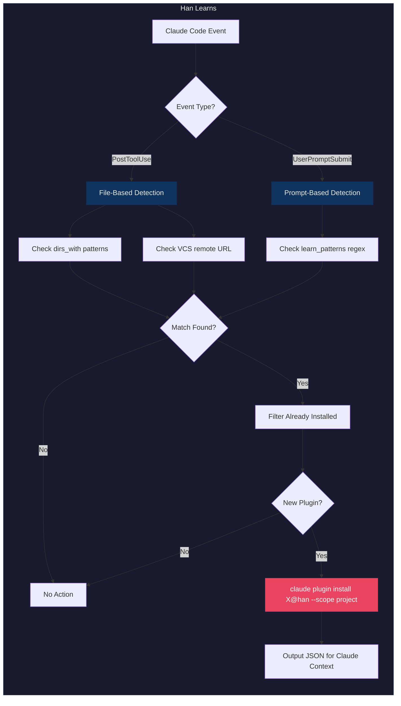
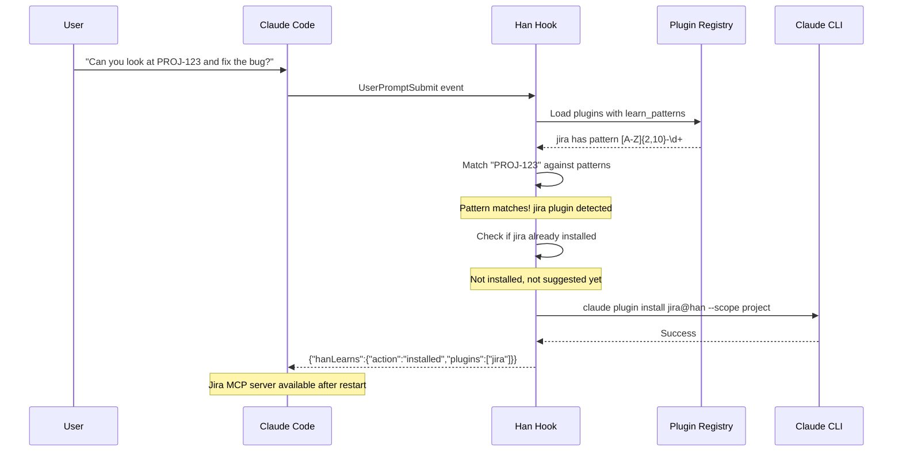
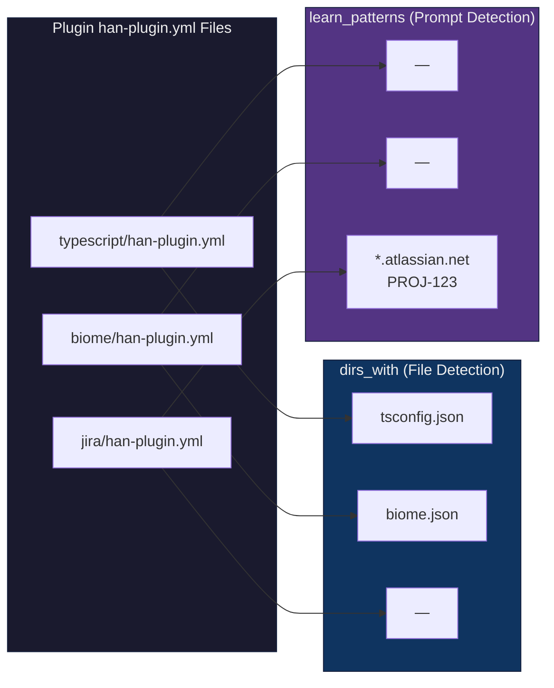
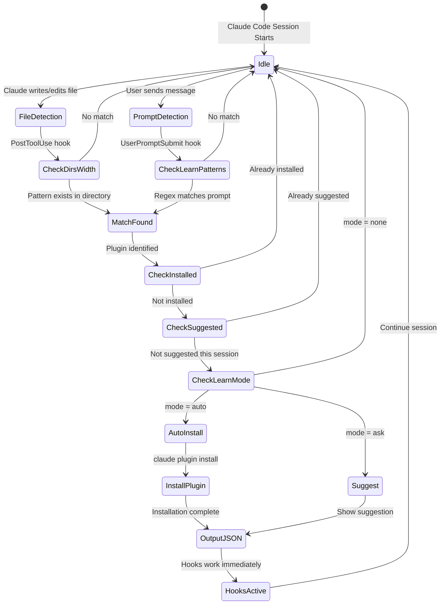

One of the biggest friction points with plugin systems is knowing what to install. You start a new project, type some code, and then... wait, do I need the TypeScript plugin? What about Biome? Is there a plugin for Relay?

Today we're introducing **Han Learns** - a feature that watches what you're building and automatically installs the right plugins for your project.

## The Problem with Manual Installation

When you start using Han, you typically run `han plugin install --auto` to detect what plugins your project needs. This works great for established projects with clear marker files.

But what about:

- **New projects** where you're still figuring out the stack?
- **Adding new tools** mid-project (like adding Playwright for E2E tests)?
- **Monorepos** where different packages use different technologies?

You'd have to remember to re-run the detection, or manually install plugins as you add dependencies. That's friction we wanted to eliminate.

## How Han Learns Works

Han Learns operates through two detection paths that run at different points in your workflow:



### File-Based Detection Flow

When Claude writes or edits a file, the PostToolUse hook triggers:

```mermaid
flowchart TD
    subgraph FileDetection["File-Based Detection (PostToolUse)"]
        A[Claude writes/edits file] --> B[PostToolUse Hook Triggered]
        B --> C[Extract file_path from tool_input]
        C --> D["Example: /project/packages/web/biome.json"]

        D --> E[Start at file's directory]
        E --> F[Walk up directory tree]

        F --> G{For each directory}
        G --> H[Load marketplace plugins]
        H --> I[Check dirs_with patterns]

        I --> J{"exists(dir + pattern)?"}
        J -->|Yes| K[Add to matches]
        J -->|No| L[Continue to parent]

        L --> G
        K --> M[Also check git remote URL]

        M --> N{Remote matches VCS?}
        N -->|github.com| O[Add github plugin]
        N -->|gitlab.com| P[Add gitlab plugin]
        N -->|No match| Q[Skip VCS]

        O --> R[Filter matches]
        P --> R
        Q --> R

        R --> S{Already installed?}
        S -->|Yes| T[Skip]
        S -->|No| U{Already suggested this session?}

        U -->|Yes| T
        U -->|No| V[Install plugin]

        V --> W["claude plugin install X@han --scope project"]
        W --> X[Output structured JSON]
    end

    style FileDetection fill:#1a1a2e,stroke:#16213e,color:#eee
    style V fill:#e94560,stroke:#16213e,color:#fff
    style W fill:#e94560,stroke:#16213e,color:#fff
```



1. **File change detected**: You write a `tsconfig.json` or add a `biome.json`
2. **Directory scan**: Han walks up the directory tree from the modified file
3. **Pattern matching**: Each directory is checked against plugin `dirs_with` patterns
4. **Automatic installation**: Matching plugins are installed to project scope

```
You write: packages/web/biome.json

Han detects:
  - packages/web/biome.json matches biome (dirs_with: ["biome.json"])

Han runs:
  claude plugin install biome@han --scope project

You see:
  ✓ Auto-installed Han plugin(s): biome
  These plugins were detected based on files in your project.
```

No AI involved - just fast, deterministic pattern matching against known plugin definitions.

## The dirs_with Pattern System

Every Han plugin can define marker files that indicate it should be used:

```yaml
# typescript/han-plugin.yml
hooks:
  typecheck:
    command: "npx -y --package typescript tsc --noEmit"
    dirs_with:
      - "tsconfig.json"
    if_changed:
      - "**/*.{ts,tsx,mts,cts}"
```

```yaml
# biome/han-plugin.yml
hooks:
  lint:
    command: "npx -y @biomejs/biome check --write"
    dirs_with:
      - "biome.json"
    if_changed:
      - "**/*.{js,jsx,ts,tsx,json,jsonc}"
```

```yaml
# relay/han-plugin.yml
hooks:
  codegen:
    command: "npx relay-compiler"
    dirs_with:
      - "relay.config.json"
      - "relay.config.js"
```

When you create any of these marker files, Han automatically knows what plugin to install.

## Smart Session Tracking

Han Learns is smart enough to not spam you with repeated suggestions. Once a plugin is suggested in a session:

1. It's recorded in session-specific storage
2. Won't be suggested again in that session
3. Fresh sessions get fresh detection

This means you can freely edit files without seeing the same suggestion repeatedly.

## Configuring Learn Mode

Not everyone wants fully automatic plugin installation. You can control this behavior in your `han.yml`:

```yaml
# han.yml (project root) or .claude/han.yml

learn:
  mode: auto  # "auto" | "ask" | "none"
```

**Available modes:**

- **`auto`** (default): Automatically install detected plugins
- **`ask`**: Suggest plugins but don't install - shows what would be installed with the command to run
- **`none`**: Disable auto-detection entirely

Example with "ask" mode:

```
Han detected plugin(s) that may be useful: biome, typescript
These plugins were detected based on files in your project.
To install, run: claude plugin install biome@han typescript@han --scope project
```

This gives you full control over what gets installed while still benefiting from Han's detection capabilities.

## Project Scope by Default

Auto-detected plugins install to **project scope** (`.claude/settings.json`), not user scope. This means:

- Plugins are specific to your project
- Team members get them when they clone your repo
- Different projects can have different plugin sets
- Your global settings stay clean

## Hooks Work Immediately

Here's the magic: because Claude Code discovers plugin hooks dynamically, newly installed plugin hooks work **immediately in the same session**.

When Han installs a plugin like `typescript`:

- **Hooks** (like typecheck on Stop) are active immediately - Claude Code dynamically discovers and runs them

What requires a restart:

- **MCP servers** - connections are established at Claude Code startup
- **Skills/Commands** - may require restart depending on how Claude Code caches plugin content

So when you see:

```
✓ Auto-installed Han plugin(s): biome
Hooks from these plugins are now active. MCP servers require a restart.
```

You can keep working - the validation hooks are already running. The biome linting will trigger on your next Stop event.

## Service URL Detection (Learn Wildcards)

Han Learns can detect when you mention service URLs in your prompts and automatically install the appropriate integration plugins. This uses "learn wildcards" - regex patterns that match URLs and identifiers.

### Prompt-Based Detection Flow

```mermaid
flowchart TD
    subgraph PromptDetection["Prompt-Based Detection (UserPromptSubmit)"]
        A[User sends message] --> B[UserPromptSubmit Hook Triggered]
        B --> C[Extract prompt text]

        C --> D[Load marketplace plugins]
        D --> E[Compile learn_patterns from plugins]

        E --> F["Each plugin defines patterns in han-plugin.yml"]
        F --> G["Example: jira has patterns for *.atlassian.net, PROJ-123"]

        G --> H{For each compiled pattern}
        H --> I["regex.match(prompt)"]

        I --> J{Pattern matches?}
        J -->|Yes| K[Add plugin to matches]
        J -->|No| L[Try next pattern]

        L --> H
        K --> M[Filter matches]

        M --> N{Already installed?}
        N -->|Yes| O[Skip]
        N -->|No| P{Already suggested this session?}

        P -->|Yes| O
        P -->|No| Q{Learn mode?}

        Q -->|auto| R[Install plugin]
        Q -->|ask| S[Suggest plugin]
        Q -->|none| O

        R --> T["claude plugin install X@han --scope project"]
        T --> U[Output JSON with action: installed]

        S --> V[Output JSON with action: suggested]
    end

    style PromptDetection fill:#1a1a2e,stroke:#16213e,color:#eee
    style R fill:#e94560,stroke:#16213e,color:#fff
    style T fill:#e94560,stroke:#16213e,color:#fff
```



### Example: Jira Detection



**Supported services:**

| Pattern | Plugin | Description |
|---------|--------|-------------|
| `*.atlassian.net`, `PROJ-123` | `jira` | Jira issue tracking |
| `app.clickup.com/*` | `clickup` | ClickUp project management |
| `linear.app/*` | `linear` | Linear issue tracking |
| `notion.so/*` | `notion` | Notion workspace |
| `figma.com/*` | `figma` | Figma design |
| `*.sentry.io/*` | `sentry` | Sentry error tracking |

**Example:**

```
User: Can you look at PROJ-123 and fix the bug?

Han detects:
  - "PROJ-123" matches Jira issue key pattern

Han runs:
  claude plugin install jira@han --scope project

You see:
  {"hanLearns":{"action":"installed","plugins":["jira"],...}}
```

This means when you paste a Jira URL or mention an issue key, Han automatically gives Claude access to your Jira instance.

## VCS Integration Detection

Han Learns also detects your version control system and automatically installs the appropriate integration plugin:

- **GitHub** remote → `github` (Issues, PRs, Actions, code search)
- **GitLab** remote → `gitlab` (Issues, MRs, CI/CD)

This happens automatically when Han detects your git remote URL:

```
You push to: git@github.com:myorg/myproject.git

Han detects:
  - Remote host github.com matches github plugin

Han runs:
  claude plugin install github@han --scope project

You see:
  ✓ Auto-installed Han plugin(s): github
```

This means your Claude session automatically gets access to your repo's issues, PRs, and other VCS features - no configuration needed.

## Real-World Example

Let's say you're starting a new Next.js project:

**Day 1**: You create `package.json` and `tsconfig.json`

```
✓ Auto-installed Han plugin(s): typescript
```

**Day 2**: You add `biome.json` for linting

```
✓ Auto-installed Han plugin(s): biome
```

**Day 3**: You create `playwright.config.ts` for E2E tests

```
✓ Auto-installed Han plugin(s): playwright
```

**Day 4**: You add `relay.config.json` for GraphQL

```
✓ Auto-installed Han plugin(s): relay
```

Each time you add a technology to your project, Han learns about it and installs the appropriate validation hooks. No manual intervention required.

## Under the Hood

The implementation is straightforward:

1. **PostToolUse hook** watches Edit/Write/NotebookEdit tools
2. **Directory walking** starts from the modified file's parent
3. **Pattern matching** checks each directory against marketplace plugins
4. **Claude CLI installation** ensures proper marketplace cloning

### Plugin Pattern Sources



### Complete Lifecycle



```typescript
// Walk up directory tree
while (currentDir.length >= projectRoot.length) {
  for (const plugin of plugins) {
    if (pluginMatchesDirectory(plugin, currentDir)) {
      installPlugin(plugin.name);
    }
  }
  currentDir = dirname(currentDir);
}
```

Using `claude plugin install` instead of just modifying settings ensures the marketplace is properly cloned and plugins are fully available.

## What's Next

Han Learns is just the beginning of making plugin management invisible. Future improvements might include:

- **Dependency detection**: Scanning `package.json` for dependencies that have Han plugins
- **Framework detection**: Understanding project structure beyond marker files
- **Plugin recommendations**: Suggesting related plugins based on what you've installed

For now, Han Learns solves the most common case: you add a config file, and the right plugin just appears.

## Try It Now

Han Learns is included in the latest Han core plugin. If you have Han installed, it's already working.

Create a new config file in your project and watch Han learn:

```bash
# In a new directory
echo '{}' > tsconfig.json
# Han will detect and install typescript

echo '{}' > biome.json
# Han will detect and install biome
```

Or just start building - Han will figure out the rest.

---

*The best plugin system is one you don't have to think about. Han Learns makes plugins invisible - they just appear when you need them.*
