# AI-Driven Development Lifecycle 2026 (AI-DLC 2026)

## A Methodology for the Age of Autonomous Agents

---

## Acknowledgments & Attribution

This methodology synthesizes foundational work from the AI development community with lessons learned from production deployments of autonomous AI systems.

### Foundational Work

**Raja SP, Amazon Web Services** — *AI-Driven Development Lifecycle (AI-DLC) Method Definition* (July 2025). The core concepts of Intent, Unit, Bolt, Mob Elaboration, and the philosophy of reimagining development methods rather than retrofitting AI into existing processes originate from this foundational work.

### Key Influences for 2026

**Geoffrey Huntley** — Creator of the Ralph Wiggum Software Development Technique. The philosophy of "deterministically bad in an undeterministic world" and autonomous loop patterns are central to AI-DLC 2026.

**Boris Cherny & Anthropic** — Ralph Wiggum plugin for Claude Code, demonstrating production viability of autonomous development loops.

**Steve Wilson (OWASP)** — Human-on-the-Loop governance frameworks and the articulation of HITL vs HOTL operating modes.

**paddo.dev** — Analysis of SDLC collapse, the "19-agent trap," and the insight that phase gates become friction rather than quality control in AI-driven workflows.

**HumanLayer** — 12 Factor Agents principles and context engineering research including the "dumb zone" phenomenon.

---

## Preface: The State of AI-Driven Development

Software development has undergone a fundamental transformation. What began as AI assistance for fine-grained tasks—code completion, bug detection, test generation—has evolved into AI autonomy for sustained, multi-hour reasoning and implementation. This shift demands new methodologies built from first principles rather than adaptations of existing processes.

The landscape of AI-driven development in 2026 differs dramatically from just two years prior:

| Dimension | 2024 | Jul '25 | Jan '26 |
|-----------|------|---------|---------|
| **Model Capability** | Code completion and simple tasks | Handle complete features with guidance | Sustain multi-hour autonomous reasoning |
| **Human Role** | Direct every step | Validate major decisions | Define success criteria; AI iterates to convergence |
| **Iteration Cycles** | Measured in days | Measured in hours | Measured in minutes |
| **Context Windows** | Limited (8K-32K tokens) | Expanding (100K-200K tokens) | Abundant but quality-sensitive (200K-1M tokens) |
| **Multi-Agent Orchestration** | Experimental research | Promising theoretical approach | Simple loops outperform complex swarms |
| **AI Reliability** | Requires constant supervision | Can complete bounded tasks | 40,000+ lines written by AI using AI monthly |
| **Memory Systems** | Basic conversation history | Conversation-based, ephemeral | File-based persistence, MCP-enabled organizational memory |

AI-DLC 2026 preserves foundational insights while incorporating lessons from production deployments: the Ralph Wiggum autonomous loop methodology, the emerging consensus that traditional SDLC phases are collapsing, the practical realization that simpler AI workflows outperform elaborate orchestrations, and the understanding that organizational knowledge—previously locked in tickets, documents, and runbooks—can now serve as memory for AI agents.

---

## I. Context

### The Evolution of Software Engineering

The evolution of software engineering has been a continuous quest to enable developers to focus on solving complex problems by abstracting away lower-level, undifferentiated tasks. From early machine code to high-level programming languages, from the adoption of APIs and libraries to cloud services, each step has significantly boosted developer productivity by moving humans further from implementation details and closer to problem expression.

The integration of Large Language Models marked a revolutionary shift, introducing conversational natural language interactions for tasks like code generation, bug detection, and test creation. This was the **AI-Assisted era**—AI enhancing fine-grained, specific tasks while humans retained full control of workflow and decisions.

We have now entered the **AI-Autonomous era**. Models capable of multi-hour sustained reasoning, combined with tools for autonomous development loops, enable workflows where humans define destinations and guardrails, then step back while AI iterates toward success. Independent evaluations estimate that frontier models can now complete tasks that take humans four to five hours. Anthropic's Claude Code lead reported writing 40,000 lines of production code *using Claude Code itself* in a single month.

### The Problem with Traditional Methods

Existing software development methods—Waterfall, Agile, Scrum—were designed for human-driven processes with long iteration cycles. Their reliance on manual workflows and rigid role definitions limits the ability to fully leverage AI capabilities. Retrofitting AI into these methods not only constrains its potential but reinforces outdated inefficiencies.

Traditional phase boundaries—requirements → design → implementation → testing → deployment—existed because iteration was expensive. When changing requirements meant weeks of rework, sequential phases with approval gates made economic sense. Each phase required:

- Handoffs between specialized roles
- Documentation to transfer context
- Approval gates to validate progress
- Wait times for reviews and decisions

With AI, iteration costs approach zero. You try something, it fails, you adjust, you try again—all in seconds, not weeks. The phases aren't just being augmented; **they're collapsing into continuous flow**.

> "Phase gates that once provided quality control now create friction."

### The New Reality

To fully leverage AI's transformative power, development methods need reimagination. This reimagination requires AI to be a central collaborator, with workflows, roles, and iterations aligned to enable faster decision-making, seamless task execution, and continuous adaptability.

This paper introduces AI-DLC 2026, a methodology that embraces both supervised and autonomous modes of AI collaboration, preserves human judgment where it matters most, and sets foundations for the next evolution in software engineering.

---

## II. Core Principles

The following principles form the foundation of AI-DLC 2026. They shape its phases, roles, artifacts, and rituals. These principles are critical for validating the methodology, as they provide the underpinning rationale behind its design.

### 1. Reimagine Rather Than Retrofit

We choose to reimagine a development method rather than keeping existing methods like Waterfall or Agile and retrofitting AI into them. Traditional methods were built for longer iteration durations—weeks and months—which led to rituals like daily standups, sprint planning, and retrospectives. These rituals assume a cadence that AI has rendered obsolete.

Proper application of AI leads to rapid cycles measured in hours or even minutes. This demands continuous, real-time validation and feedback mechanisms, rendering many traditional rituals less relevant:

**Would effort estimation (story points) be as critical** if AI diminishes the boundaries between simple, medium, and hard tasks? When an AI can implement a feature in minutes regardless of apparent complexity, human estimation becomes unreliable.

**Would velocity metrics be relevant**, or should we replace them with business value delivered? When the constraint shifts from implementation speed to requirement clarity, traditional productivity metrics miss the point.

**Would sequential phases help** when try-fail-adjust cycles take seconds? When iteration is nearly free, upfront design becomes a tax rather than an investment.

These new dynamics warrant reimagination based on first principles thinking rather than retrofitting. **We need automobiles, not faster horse chariots.**

### 2. Human-on-the-Loop, Not Just Human-in-the-Loop

AI-DLC 2026 introduces the concept of AI initiating and directing conversations, using the Google Maps analogy: humans set the destination, AI provides step-by-step directions, humans maintain oversight. This methodology distinguishes **two distinct operating modes**:

**Human-in-the-Loop (HITL):** Human judgment is directly involved in decision-making. AI proposes options, human validates, AI executes. The human approves each significant step before proceeding.

```mermaid
flowchart TB
    A0["🎯 Human Defines Task"] --> A1["🤖 AI Proposes"]
    A1 --> A2["🕵️ Human Validates"]
    A2 --> A3["🤖 AI Executes"]
    A3 --> A4["🕵️ Human Reviews"]
    A4 --> A1
```

This mode is essential for:

- **Novel domains** or first-time implementations where patterns aren't established
- **Architectural decisions** with long-term consequences that are difficult to reverse
- **Judgment-heavy work** including UX decisions, product strategy, and complex trade-offs
- **High-risk operations** involving production data, security-sensitive changes, or compliance requirements
- **Creative work** requiring taste, intuition, or subjective quality assessment

**Human-on-the-Loop (HOTL):** The system operates autonomously while humans monitor and intervene when needed. AI executes within defined boundaries until success criteria are met, alerting humans only when intervention is required.

```mermaid
flowchart TB
    B1["🎯 Human Defines Criteria"] --> B2["🤖 AI Iterates Autonomously"]
    B2 --> B3{"✅ Quality Gates Pass?<br/><i>Tests, types, lint, hooks</i>"}
    B3 -->|"No"| B2
    B3 -->|"Yes"| B4{"❓ Criteria Met?<br/><i>Work complete?</i>"}
    B3 -.->|"Stuck"| B6["🦸 Human Intervenes"]
    B4 -->|"No"| B2
    B4 -.->|"Yes"| B5["🧐 Human Reviews Output"]
    B4 -.->|"Blocked"| B6
    B6 --> B2

    linkStyle 2 stroke:#ef4444,stroke-width:2px
    linkStyle 4 stroke:#f59e0b,stroke-width:2px
    linkStyle 5 stroke:#ef4444,stroke-width:2px
    linkStyle 6 stroke:#22c55e,stroke-width:2px
    linkStyle 7 stroke:#f59e0b,stroke-width:2px
```

This mode is appropriate for:

- **Well-defined tasks** with clear, measurable acceptance criteria
- **Programmatically verifiable work** where tests, type checks, and linting can validate correctness
- **Batch operations** including migrations, refactors, and test coverage expansion
- **Background work** that can run overnight or during off-hours
- **Mechanical transformations** following established patterns

The Google Maps analogy extends: in HITL mode, you tell the GPS each turn to make, it confirms, you approve, it executes. In HOTL mode, you set the destination, define acceptable routes (no toll roads, avoid highways), and the navigation system handles the journey—alerting you only for unexpected detours or when intervention is required.

**The key insight:** The human doesn't disappear. The human's *function* changes—from micromanaging execution to defining outcomes and building quality gates.

### 3. Backpressure Over Prescription

Traditional methodologies prescribe *how* work should be done. Detailed process steps, code review checklists, and implementation patterns create rigid workflows that constrain AI's ability to leverage its full capabilities.

AI-DLC 2026 introduces a different approach: **backpressure**—quality gates that reject non-conforming work without dictating approach.

> "Don't prescribe how; create gates that reject bad work."
> — Geoffrey Huntley

Instead of specifying "first write the interface, then implement the class, then write unit tests, then integration tests," define the constraints that must be satisfied:

- All tests must pass
- Type checks must succeed
- Linting must be clean
- Security scans must clear
- Coverage must exceed threshold
- Performance benchmarks must be met

Let AI determine *how* to satisfy these constraints. This approach offers multiple benefits:

- **Leverages AI capabilities fully** — AI can apply its training and reasoning without artificial constraints
- **Reduces prompt complexity** — Success criteria are simpler to specify than step-by-step instructions
- **Makes success measurable** — Programmatic verification enables autonomous operation
- **Enables iteration** — Each failure provides signal; each attempt refines the approach

The philosophy can be summarized as: **"Better to fail predictably than succeed unpredictably."** Each failure is data. Each iteration refines the approach. The skill shifts from directing AI step-by-step to writing criteria and tests that converge toward correct solutions.

### 4. Embrace the Collapsing SDLC

Traditional SDLC phases existed because iteration was expensive. Each handoff between analyst → architect → developer → tester → operations lost context, added latency, and created opportunities for misalignment. Sequential phases with approval gates were an economic optimization for a world of expensive iteration.

With AI, that economic calculus inverts. Iteration is nearly free. Context loss from handoffs becomes the dominant cost. AI-DLC 2026 models development as **continuous flow** with strategic checkpoints rather than discrete phases.

#### ❌ Traditional Sequential Phases


Work stops completely at each handoff. Context transfers between specialized roles. Each new party must rebuild understanding.

#### ✅ AI-DLC 2026 Collapsed Flow

```mermaid
flowchart LR
    C1["🎯 Intent"] --> C2["🔄 Continuous<br/>Loop"]
    C2 --> C2
    C2 --> C3["🔍 Checkpoint"]
    C3 -->|"Continue"| C2
    C3 -->|"Done"| C4["🚀 Deploy"]
```

Work pauses briefly at checkpoints. Same agent continues with feedback. Context is preserved throughout.

**Checkpoints differ from handoffs:**

| Handoff (Traditional) | Checkpoint (AI-DLC 2026) |
|-----------------------|--------------------------|
| Work stops completely | Work pauses briefly |
| Context transfers to another party | Same agent continues with feedback |
| New party must rebuild understanding | Context is preserved |
| Documents carry knowledge | Files and git carry knowledge |
| Approval required to proceed | Review identifies needed adjustments |

This doesn't mean structure disappears. It means structure changes form—from sequential gates to parallel loops with human oversight at strategic moments.

### 5. Context Is Abundant—Use It Wisely

Modern language models offer context windows ranging from 200K tokens (Claude Opus 4.5) to over 1 million tokens (Claude Sonnet 4.5, Gemini). This abundance fundamentally changes how we think about AI workflows—but not in the ways that might be obvious.

**The 19-Agent Trap:** Early enthusiasm for AI led to complex multi-agent scaffolding that mapped AI agents to traditional org charts—an Analyst agent, PM agent, Architect agent, Developer agent, QA agent, and so on. This approach consistently **performs worse** than simpler alternatives because:

- Each handoff between agents loses context despite large windows
- More scaffolding creates more opportunities for misalignment
- Orchestration overhead consumes attention budget
- Debugging multi-agent failures is exponentially harder

> "As agents accumulate tools, they get dumber."

Research shows model performance degrades when context windows exceed 40-60% utilization—the "dumb zone." Information "lost in the middle" of large contexts receives less attention than information at the beginning or end.

**The Insight:** Abundant context windows don't mean we should fill them with everything. They mean we can be **selective about high-quality context** rather than compressed summaries. AI-DLC 2026 favors:

- **Small, focused agents** with relevant context over comprehensive agents with scattered information
- **Quality over quantity** in context selection
- **Strategic context engineering** rather than context stuffing
- **Simple loops** with clear objectives over complex orchestrations

The best workflows aren't complex orchestrations—they're simple loops with clear objectives and rich, relevant context.

### 6. Memory Providers Expand Knowledge

AI context windows reset between sessions. Modified files and git history provide persistence without complex memory infrastructure. AI-DLC 2026 extends this insight by recognizing that **existing organizational artifacts are memory providers** that AI agents can access.

Traditional SDLC processes created extensive documentation that often went unused:

- Product Requirements Documents (PRDs)
- Architecture Decision Records (ADRs)
- Technical design specifications
- Runbooks and operational procedures
- Tickets and issue histories
- Retrospectives and post-mortems

These artifacts represent institutional memory—decisions made, rationales documented, patterns established. Through modern integration protocols (MCP servers, API connectors, knowledge bases), AI agents can now access this memory directly.

```mermaid
flowchart TB
    subgraph Filesystem["💭 Working Memory"]
        F1["✏️ Rules<br/><i>(i.e. Claude rules)</i>"]
        F2["📂 Modified files"]
        F3["🕥 Git history"]
        F4["📝 Agent scratchpads"]
    end

    subgraph Organizational["🏛️ Institutional Memory"]
        O1["📋 Work Memory<br/><i>Tickets, requirements</i>"]
        O2["📝 Decision Memory<br/><i>PRDs, ADRs, design docs</i>"]
        O3["📚 Knowledge Memory<br/><i>Runbooks, standards</i>"]
        O4["📊 Runtime Memory<br/><i>Incidents, errors, metrics</i>"]
    end

    Agent["🤖 AI Agent"] --> Filesystem
    Agent --> Organizational
```

**Memory Layers in AI-DLC 2026:**

| Layer | Location | Speed | Purpose |
|-------|----------|-------|---------|
| **Rules** | Project rules files | Instant | Conventions, patterns, constraints |
| **Session** | Working files, scratchpads | Fast | Current task context, progress |
| **Project** | Git history, codebase | Indexed | What was tried, what worked |
| **Organizational** | Connected systems | Query | Institutional knowledge, decisions |
| **Runtime** | Monitoring systems | Query | Production behavior, incidents |

**Practical implications:**

- An agent implementing a feature can query the ticket system for acceptance criteria
- An agent making architectural decisions can retrieve relevant ADRs for precedent
- An agent debugging can access incident history for similar symptoms
- An agent writing documentation can query existing standards for style

The filesystem remains the simplest, most robust memory provider. Git history shows what was attempted. Modified files persist across iterations. But these aren't the only options—organizational memory, properly connected, dramatically expands what agents can know.

### 7. Completion Criteria Enable Autonomy

The key enabler of autonomous operation is **programmatic verification**. If success can be measured by machines, AI can iterate toward it without human intervention for each step.

Every work element in AI-DLC 2026 should have explicit **Completion Criteria**—programmatically verifiable conditions that define success:

**Good completion criteria are:**

- **Specific and measurable** — Not "code is good" but "TypeScript compiles with strict mode"
- **Programmatically verifiable** — Tests pass, linters succeed, benchmarks clear
- **Implementation-independent** — Define what, not how
- **Complete** — Cover functional requirements, quality attributes, and constraints

**Examples:**

| Bad Criteria | Good Criteria |
|--------------|---------------|
| "Code is well-tested" | "All tests pass with >80% coverage" |
| "API is performant" | "API responds in <200ms p95 under 1000 req/s load" |
| "Code is type-safe" | "TypeScript compiles with strict mode, no errors" |
| "Feature is complete" | "All acceptance tests in tests/feature/ pass" |
| "Security is addressed" | "Security scan passes with no critical/high findings" |

This transforms the human role from "validator of each step" to "definer of done." The human specifies what success looks like; the AI figures out how to achieve it.

### 8. Design Techniques Are Tools, Not Requirements

AI-DLC 2026 takes a pragmatic approach: design techniques like Domain-Driven Design (DDD), Test-Driven Development (TDD), and Behavior-Driven Development (BDD) are valuable tools to apply when appropriate, not mandatory steps in every workflow.

**Use structured design (DDD, TDD, BDD) when:**

- Domain complexity benefits from explicit modeling
- Multiple teams need shared understanding of boundaries
- Long-term maintainability is paramount
- Compliance requirements demand documentation

**Skip heavyweight upfront design when:**

- Task is well-defined and bounded
- Quick iteration will reveal the right structure faster than analysis
- Automated verification can validate correctness
- Design patterns are already established in the codebase

AI can apply design patterns during execution without requiring explicit design phases. When an AI generates code, it draws on its training to apply appropriate patterns—factory methods, dependency injection, repository patterns—without being told to do so.

**The test suite, not the architecture document, becomes the source of truth.** If the tests pass and the code meets non-functional requirements, the implementation is valid regardless of whether it matches a pre-specified design.

### 9. Streamline Responsibilities

AI's ability to perform task decomposition, code generation, testing, documentation, and deployment reduces the need for specialized roles. A single developer supervising AI can accomplish what previously required separate specialists for frontend, backend, infrastructure, testing, and documentation.

This doesn't eliminate human value—it **concentrates it** on activities where human judgment is essential:

- **Strategic direction** — Deciding what to build and why
- **Trade-off decisions** — Balancing competing concerns that require business context
- **Validation** — Ensuring work aligns with actual needs
- **Risk assessment** — Identifying and mitigating potential harms
- **Quality oversight** — Maintaining standards that automated checks can't capture

The role shifts from "doing the work" to **"defining what work matters and verifying it's done well."**

However, humans remain integral. Product owners ensure alignment with business objectives. Developers maintain design quality and handle judgment calls. These roles ensure that automation and human accountability remain balanced.

### 10. Platform Agnostic

AI-DLC 2026 is intentionally cloud-agnostic and platform-agnostic. The methodology applies regardless of infrastructure choices:

- **Container orchestration:** Kubernetes, ECS, Docker Swarm, Nomad
- **Serverless:** Lambda, Cloud Functions, Azure Functions, Cloudflare Workers
- **Traditional:** Virtual machines, bare metal servers
- **Edge:** IoT devices, edge computing platforms
- **Hybrid:** Any combination of the above

The methodology should be independent of vendor choices. Choose infrastructure based on requirements, cost constraints, and team expertise—not methodology constraints.

---

## III. Core Framework

This section outlines the core framework of AI-DLC 2026, detailing its artifacts, phases, rituals, and workflows.

```mermaid
graph TB
    subgraph "🎯 Inception Phase"
        I["💡 Intent"] --> U1["📦 Unit 1"]
        I --> U2["📦 Unit 2"]
        I --> Un["📦 Unit n"]
    end

    subgraph "🔨 Construction Phase"
        U1 --> B1["⚡ Bolt 1.1"]
        U1 --> B2["⚡ Bolt 1.2"]
        U2 --> B3["⚡ Bolt 2.1"]
        Un --> Bn["⚡ Bolt n.1"]

        B1 --> D1["📦 Deployment Unit"]
        B2 --> D1
        B3 --> D2["📦 Deployment Unit"]
        Bn --> Dn["📦 Deployment Unit"]
    end

    subgraph "🚀 Operations Phase"
        D1 --> P1["🌐 Production"]
        D2 --> P2["🌐 Production"]
        Dn --> Pn["🌐 Production"]
    end
```

### 1. Artifacts

#### Intent

An **Intent** is a high-level statement of purpose that encapsulates what needs to be achieved, whether a business goal, a feature, or a technical outcome (e.g., performance scaling, security improvement). It serves as the starting point for AI-driven decomposition into actionable tasks, aligning human objectives with AI-generated plans.

Every Intent includes explicit **Completion Criteria**—programmatically verifiable conditions that define success and enable autonomous execution.

**Example Intent:**

```
## Intent: User Authentication System

### Description
Add secure user authentication to the application supporting
email/password registration and OAuth providers for social login.

### Business Context
- Current system has no user accounts
- Need to support personalization features planned for Q2
- Must integrate with existing customer database

### Completion Criteria
- [ ] Users can register with email/password
- [ ] Users can log in and receive JWT tokens
- [ ] JWT tokens expire appropriately and can be refreshed
- [ ] OAuth flow works for Google and GitHub
- [ ] Password reset flow via email works
- [ ] All auth endpoints have >80% test coverage
- [ ] Security scan passes with no critical findings
- [ ] Load test: 100 concurrent logins complete in <2s p99
```

#### Unit

A **Unit** represents a cohesive, self-contained work element derived from an Intent, specifically designed to deliver measurable value. Units are analogous to Bounded Contexts in Domain-Driven Design or Epics in Scrum.

**Characteristics of well-defined Units:**

- **Cohesive:** User stories within the Unit are highly related
- **Loosely coupled:** Minimal dependencies on other Units
- **Independently deployable:** Can go to production without other Units
- **Clear boundaries:** Ownership and scope are unambiguous

Each Unit encompasses:
- User stories articulating functional scope
- Non-functional requirements specific to that Unit
- Completion criteria for verification
- Risk descriptions

The process of decomposing Intents into Units is driven by AI, with developers and Product Owners validating and refining the resulting Units to ensure alignment with business and technical objectives.

Units should be sized for parallel autonomous execution. If a Unit requires constant coordination with other Units, it's too tightly coupled and should be restructured.

#### Bolt

A **Bolt** is the smallest iteration cycle in AI-DLC 2026, designed for rapid implementation of a Unit or a set of tasks within a Unit. The term "Bolt" (analogous to Sprints in Scrum) emphasizes intense focus and high-velocity delivery, with build-validation cycles measured in hours or days rather than weeks.

**Bolts operate in two modes:**

#### 🧑‍💻 Supervised Bolt (HITL)

Human validates each major step before proceeding. AI proposes, human reviews, AI implements, human validates. Used for judgment-heavy, high-risk, or novel work.

```mermaid
flowchart LR
    S1["📝 Plan"] --> S2["✅ Human Approves"]
    S2 --> S3["⚡ Execute Step"]
    S3 --> S4["🔍 Human Reviews"]
    S4 --> S1
```

#### 🤖 Autonomous Bolt (HOTL)

AI iterates until completion criteria are met, using test results and quality gates as feedback. Human reviews final output. Used for well-defined tasks with programmatic verification.

```mermaid
flowchart LR
    A1["🎯 Define Criteria"] --> A2["🔄 AI Executes Loop"]
    A2 --> A3{"❓ Criteria<br/>Met?"}
    A3 -->|"No"| A2
    A3 -->|"Yes"| A4["🧐 Human Reviews<br/>Final Output"]
    A3 -->|"Blocked"| A5["📋 Document &<br/>Escalate"]

    linkStyle 2 stroke:#ef4444,stroke-width:2px
    linkStyle 3 stroke:#22c55e,stroke-width:2px
    linkStyle 4 stroke:#f59e0b,stroke-width:2px
```

**Autonomous Bolt characteristics:**
- Completion promise signal (e.g., `COMPLETE` or `BLOCKED`)
- Maximum iteration limit as safety net
- Backpressure through tests, types, and linting
- File-based progress persistence
- Blocker documentation when stuck

A Unit may be executed through one or more Bolts, which may run in parallel or sequentially. AI plans the Bolts; developers and Product Owners validate the plan.

#### Completion Criteria

**Completion Criteria** are explicit, programmatically verifiable conditions that define when work is done. They enable autonomous execution by giving AI clear targets to iterate toward.

Completion Criteria should be:

| Attribute | Description | Example |
|-----------|-------------|---------|
| **Specific** | Unambiguous and precise | "Coverage >80% for src/auth/" |
| **Measurable** | Quantifiable or binary | "Response time <200ms p95" |
| **Verifiable** | Can be checked programmatically | "TypeScript compiles with no errors" |
| **Independent** | Don't prescribe implementation | "Passwords are hashed" not "Use bcrypt" |

Completion Criteria can include:
- Test pass requirements
- Code quality thresholds
- Performance benchmarks
- Security scan results
- Documentation requirements
- Integration validation

#### Deployment Unit

**Deployment Units** are operational artifacts encompassing everything needed to run in production:

- **Code artifacts:** Container images, serverless function packages, compiled binaries
- **Configuration:** Helm charts, environment configs, feature flags
- **Infrastructure:** Terraform modules, CloudFormation stacks, Pulumi programs
- **Validation:** Test suites for functional, security, and performance verification

AI generates all associated tests, including:
- Functional acceptance tests validating business requirements
- Security scans (static analysis, dependency vulnerabilities, SAST/DAST)
- Performance and load tests against NFR thresholds
- Infrastructure validation and compliance checks

After human validation of test scenarios and cases, AI executes the test suites, analyzes results, and correlates failures with code changes, configurations, or dependencies. Deployment Units are tested for functional acceptance, security compliance, NFR adherence, and operational risk mitigation, ensuring readiness for seamless deployment.

Deployment Units should be independently deployable and include automated rollback procedures.

---

### 2. Phases & Rituals

AI-DLC 2026 organizes work into three phases, each with distinct rituals and human-AI interaction patterns.

```mermaid
flowchart TB
    subgraph Inception["🎯 INCEPTION PHASE"]
        direction TB
        I1["👤 Human provides Intent"]
        I2["🤖 AI clarifies & elaborates"]
        I3["📋 Decompose into Units"]
        I4["✅ Define Completion Criteria"]
        I5["⚡ Plan Bolts"]
        I1 --> I2 --> I3 --> I4 --> I5
    end

    subgraph Construction["🔨 CONSTRUCTION PHASE"]
        direction TB
        C1{"Select Mode"}
        C2["🧑‍💻 Supervised:<br/>Step-by-step validation"]
        C3["🤖 Autonomous:<br/>Loop until criteria met"]
        C4["🔍 Human Checkpoint"]
        C1 -->|"HITL"| C2
        C1 -->|"HOTL"| C3
        C2 --> C4
        C3 --> C4
    end

    subgraph Operations["📊 OPERATIONS PHASE"]
        direction TB
        O1["🚀 Deploy"]
        O2["📈 AI monitors telemetry"]
        O3["⚠️ AI detects anomalies"]
        O4["🔧 AI proposes/executes runbooks"]
        O5["👤 Human oversees & escalates"]
        O1 --> O2 --> O3 --> O4
        O4 --> O5
    end

    Inception --> Construction --> Operations
```

#### Inception Phase

The Inception Phase focuses on capturing Intents and translating them into Units with clear Completion Criteria for development.

**Mob Elaboration Ritual**

The central ritual of Inception is **Mob Elaboration**—a collaborative requirements elaboration and decomposition session. This happens with stakeholders and AI working together, either in a shared room with a screen or via collaborative tools.

During Mob Elaboration:

```mermaid
sequenceDiagram
    participant PO as 👤 Product Owner
    participant AI as 🤖 AI Agent
    participant Dev as 👩‍💻 Developers
    participant QA as 🧪 QA/Stakeholders

    PO->>AI: Articulates Intent
    AI->>PO: Clarifying questions
    Note over AI,PO: "Who are primary users?"<br/>"What key outcomes?"<br/>"Compliance requirements?"
    PO->>AI: Provides context & answers
    AI->>Dev: Proposes User Stories with acceptance criteria
    Dev->>AI: Refines technical aspects
    AI->>PO: Presents Units (cohesive groupings)
    PO->>AI: Validates business alignment, adjusts scope
    AI->>Dev: Generates Completion Criteria
    Dev->>AI: Validates technical feasibility
    AI->>QA: Proposes test scenarios
    QA->>AI: Refines edge cases, risk scenarios
    AI->>All: Final Plan with Bolts and mode recommendations
```

1. **AI asks clarifying questions** to minimize ambiguity in the original Intent
2. **AI elaborates** the clarified intention into user stories, NFRs, and risk descriptions
3. **AI composes Units** based on cohesion analysis, grouping highly related stories
4. **The team validates** these artifacts, providing corrections and adjustments
5. **AI generates Completion Criteria** for each Unit enabling autonomous execution
6. **The team validates criteria** ensuring they're verifiable and complete
7. **AI recommends Bolt structure** and mode (supervised vs autonomous) for each

**Mob Elaboration condenses weeks of sequential work into hours** while achieving deep alignment between stakeholders and AI.

**Outputs of Inception:**
- Well-defined Units with clear boundaries
- User stories with acceptance criteria
- Non-functional requirements (NFRs)
- Risk descriptions (aligned with organizational risk frameworks)
- Completion Criteria (tests, thresholds, checks)
- Measurement criteria traced to business intent
- Suggested Bolts with mode recommendations

#### Construction Phase

The Construction Phase transforms Units into tested, deployment-ready artifacts through Bolts. This phase progresses through domain modeling, logical design, code generation, and testing—though these steps may be implicit rather than explicit depending on complexity.

**Mode Selection**

The first decision in Construction is mode selection for each Bolt:

| Choose Supervised (HITL) When... | Choose Autonomous (HOTL) When... |
|----------------------------------|----------------------------------|
| Novel domain or architecture | Well-understood patterns |
| Complex trade-offs required | Clear acceptance criteria |
| High-risk changes | Programmatic verification available |
| Creative or UX-focused work | Mechanical transformations |
| Foundational decisions | Batch operations |

**Supervised Construction (HITL)**

For novel domains, architectural decisions, or high-judgment work:

1. Developer establishes session with AI
2. AI proposes domain model; developer validates business logic
3. AI proposes logical architecture; developer makes trade-off decisions
4. AI generates code; developer reviews for quality and alignment
5. AI generates tests; developer validates scenarios and edge cases
6. Iterate until acceptance criteria met with human checkpoint at each step

**Autonomous Construction (HOTL)**

For well-defined tasks with programmatic verification:

```
Implement the user authentication API endpoints.

Context:
- Specs in specs/auth-api.md
- Existing middleware in src/middleware/
- Database models in src/models/user.ts

Completion Criteria:
- All tests in tests/auth/ pass
- TypeScript compiles with strict mode: no errors
- ESLint passes with 0 warnings
- Coverage >85% for src/auth/
- Security scan: no critical/high findings
- Load test: 100 concurrent requests in <2s

Process:
1. Read all relevant specs and existing code
2. Write tests first based on acceptance criteria
3. Implement to pass tests
4. Run full verification suite
5. Fix any failures
6. Iterate until all criteria pass

Constraints:
- Maximum 50 iterations
- Only modify files in src/auth/, tests/auth/
- Commit after each working increment

If blocked after 10 attempts on same issue:
- Document in .agent/blockers.md
- Output BLOCKED

When all criteria pass:
- Output COMPLETE
```

**Human review of autonomous work:**
- Reviews generated code for architectural alignment
- Validates design decisions (e.g., caching strategy)
- Checks for edge cases not covered by tests
- Approves for integration or requests changes

**Mob Construction Ritual**

For complex systems requiring multiple Units built in parallel:

1. Teams collocate (physically or virtually) with AI agents
2. Each team takes ownership of a Unit
3. Teams exchange integration specifications (API contracts, event schemas)
4. Autonomous Bolts execute in parallel within each Unit
5. Human checkpoints coordinate cross-Unit concerns
6. Integration testing validates boundaries between Units

#### Operations Phase

The Operations Phase centers on deployment, observability, and maintenance of systems, leveraging AI for operational efficiency.

**Deployment:**
1. AI packages modules into Deployment Units (containers, functions, IaC)
2. Developers review deployment configuration
3. AI executes deployment to staging environment
4. Validation tests run against staging
5. Human approves promotion to production
6. AI deploys to production with rollback capability

**Observability and Monitoring:**

AI actively analyzes telemetry data:
- **Metrics:** CPU, memory, latency, error rates, business KPIs
- **Logs:** Error patterns, warning trends, anomaly detection
- **Traces:** Request flow analysis, bottleneck identification

**Anomaly Response:**

For well-defined operational scenarios with runbook coverage, AI operates autonomously (HOTL for operations). Humans monitor dashboards, receive alerts for novel situations, and intervene for edge cases outside runbook coverage.

**Autonomous Operations Boundaries Example:**

```yaml
autonomous_actions:
  allowed:
    - name: scale_horizontally
      trigger: "cpu > 80% for 5m"
      max_replicas: 10
      cooldown: 10m

    - name: restart_unhealthy
      trigger: "health_check_failures > 3"
      max_restarts: 3
      cooldown: 10m

    - name: rollback_deployment
      trigger: "error_rate > 5% for 10m"
      automatic: true

  requires_human_approval:
    - scale_vertically
    - database_migration
    - security_configuration_change
    - delete_any_resource
    - modify_network_rules
```

---

### 3. The Workflow

The complete AI-DLC 2026 workflow integrates all phases into a continuous flow:

```mermaid
flowchart TB
    W1["🎯 1. Capture Intent<br/><i>Human articulates goal</i>"]
    W2["💬 2. AI Elaborates<br/><i>Clarifies ambiguities</i>"]
    W3["📋 3. Decompose<br/><i>Break into Units</i>"]
    W4["✅ 4. Define Criteria<br/><i>Measurable success conditions</i>"]
    W5["⚡ 5. Execute Bolts<br/><i>Supervised or Autonomous</i>"]
    W6["🔄 6. Iterate<br/><i>Until criteria met</i>"]
    W7["🔍 7. Checkpoint<br/><i>Human reviews output</i>"]
    W8["🚀 8. Deploy<br/><i>To production</i>"]
    W9["📊 9. Operate<br/><i>Monitor & maintain</i>"]

    W1 --> W2 --> W3 --> W4 --> W5
    W5 --> W6 --> W7
    W7 -->|"More work"| W5
    W7 -->|"Adjustments"| W4
    W7 -->|"Ready"| W8
    W8 --> W9
    W9 -.->|"New Intent"| W1
```

**Key principles of the workflow:**

- **Each step enriches context for the next:** Artifacts build progressively, with each stage producing semantically richer context
- **Files are the memory:** Progress persists in modified files and commits, not in conversation
- **Checkpoints enable adjustment:** Human review points can redirect work without restarting from scratch
- **Flow replaces phases:** Rather than discrete handoffs, work flows continuously with human oversight at strategic moments
- **Traceability is maintained:** All artifacts link together, enabling forward and backward traceability

---

## IV. AI-DLC 2026 in Action: Greenfield Development

**Scenario:** Product Owner initiates development of a recommendation engine for cross-selling products.

### 1. Inception Phase (Mob Elaboration)

**Human provides Intent:**

```
## Intent: Product Recommendation Engine

Build a recommendation engine that suggests complementary products
based on purchase history and browsing behavior.

### Initial Context
- E-commerce platform with 50,000 products
- 1 million monthly active users
- Need real-time recommendations (<100ms)
- Must integrate with existing product catalog API
- GDPR compliance required for EU users
```

**AI asks clarifying questions:**

> "I'll help elaborate this Intent. Let me ask some clarifying questions:
> - What recommendation approaches should we consider? Collaborative filtering, content-based, or hybrid?
> - What's the expected personalization depth? User-specific recommendations or segment-based?
> - Where should recommendations appear? Product pages, cart, checkout, email?
> - What's the cold-start strategy for new users with no history?
> - Are there any products that should never be recommended together?"

**Team provides answers, AI elaborates into Units:**

**Unit 1: Data Collection & Processing**
Capture user behavior (views, clicks, purchases), build feature pipelines, create user and product embeddings.

Completion Criteria:
- Event tracking captures views, clicks, add-to-cart, purchases
- Events flow through pipeline with <30s latency
- User embeddings update nightly
- Data retention complies with GDPR (consent, deletion)

**Unit 2: Recommendation Model**
Train and serve ML model for product recommendations.

Completion Criteria:
- Model achieves >0.75 AUC on holdout set
- Inference latency <50ms p99
- A/B test framework integrated
- Model retraining pipeline automated

**Unit 3: API Integration**
Real-time serving API integrated with product catalog.

Completion Criteria:
- GET /recommendations/{userId} returns top 10 products
- Response time <100ms p99 under 1000 req/s load
- Integration tests pass against catalog API
- Rate limiting: 1000 req/min/user
- Authentication via existing JWT tokens

**Unit 4: Frontend Integration**
Display recommendations in product pages and cart.

Completion Criteria:
- Recommendation widget renders on product pages
- Widget handles loading, error, empty states
- Click tracking integrated with analytics
- A/B test variant support
- Accessibility: WCAG 2.1 AA compliant

**AI recommends Bolt modes:**

| Unit | Recommended Mode | Rationale |
|------|------------------|-----------|
| Data Collection | Autonomous (HOTL) | Clear criteria, established patterns |
| Recommendation Model | Supervised (HITL) | Novel ML decisions, trade-offs |
| API Integration | Autonomous (HOTL) | Standard REST patterns, clear criteria |
| Frontend Integration | Supervised (HITL) | UX decisions, accessibility judgment |

### 2. Construction Phase

**Unit 3 (API Integration) assigned for construction as Autonomous Bolt.**

Rationale for autonomous mode:
- Clear completion criteria (response time, test coverage, security)
- Well-understood domain (REST API development)
- Strong programmatic verification (tests, load tests, security scan)

**AI execution trace:**

1. Reads specs, existing code, understands context
2. Writes API endpoint tests for /recommendations/{userId}
3. Implements endpoint with basic recommendation logic
4. Tests fail—catalog integration missing
5. Implements catalog client integration
6. Tests pass
7. Load test fails at 800 req/s (target: 1000)
8. Adds Redis caching layer
9. Load test passes: 1200 req/s, 85ms p99
10. Security scan: SQL injection risk in query param
11. Fixes with parameterized queries
12. All criteria met
13. Outputs `COMPLETE`

**Human reviews autonomous output:**
- Code review finds good architectural decisions
- Caching strategy appropriate for use case
- Test coverage comprehensive
- Approves for integration

### 3. Operations Phase

**Deployment:**
- AI packages API service as container image
- Generates Kubernetes manifests with HPA configuration
- Creates Terraform for managed Redis cache
- Human reviews and approves deployment config
- Deploys to staging, runs integration tests
- Promotes to production with canary rollout

**Autonomous monitoring configured:**

```yaml
autonomous_actions:
  - alert: HighLatency
    condition: p99_latency > 150ms for 5m
    action: scale_replicas(current + 2)
    max_replicas: 10

  - alert: HighErrorRate
    condition: error_rate > 2% for 5m
    action: rollback_to_previous_version

  - alert: RecommendationQualityDrop
    condition: click_through_rate < baseline - 15%
    action: notify_team  # Requires human analysis
```

---

## V. AI-DLC 2026 in Action: Brownfield Development

**Scenario:** Adding a new wishlist feature to an existing e-commerce application.

### Key Difference: Context Building

Before Inception, AI must understand the existing codebase. This analysis can itself be an Autonomous Bolt:

**Autonomous context building:**

```
Analyze existing codebase and generate context models.

Tasks:
1. Identify major components in src/
2. Map dependencies between components
3. Document data flows for checkout and user profile
4. Identify integration points for new features
5. Note patterns and conventions used

Output:
- docs/architecture/static-model.md (components, responsibilities, relationships)
- docs/architecture/dynamic-model.md (key use case flows)
- docs/architecture/integration-points.md (where new features connect)
- docs/architecture/conventions.md (patterns to follow)

Output ANALYSIS_COMPLETE when done.
```

**Static Model** captures: components, descriptions, responsibilities, relationships
**Dynamic Model** captures: how components interact for significant use cases

After context building, Inception proceeds normally but with awareness of existing patterns and constraints. The AI's proposals align with established conventions, and completion criteria reference existing test patterns.

### Pre-Inception Artifacts

AI can also query organizational memory during brownfield work:

- **Query ticket history:** "What past issues relate to user preferences?"
- **Query ADRs:** "What decisions were made about data storage patterns?"
- **Query runbooks:** "What operational considerations exist for user-facing features?"

This context informs the Inception phase, ensuring new work aligns with existing decisions and avoids repeating past mistakes.

---

## VI. Decision Framework: Supervised vs. Autonomous

### Decision Tree

```mermaid
flowchart TD
    A["🆕 New Task"] --> B{"📋 Clear completion<br/>criteria?"}
    B -->|"No"| C["🧑‍💻 Supervised (HITL)"]
    B -->|"Yes"| D{"✅ Programmatic<br/>verification?"}
    D -->|"No"| C
    D -->|"Yes"| E{"⚠️ High risk?"}
    E -->|"Yes"| C
    E -->|"No"| F{"🔬 Novel domain?"}
    F -->|"Yes"| C
    F -->|"No"| G["🤖 Autonomous (HOTL)"]

    C --> H["🕵️ Human validates<br/>each step"]
    G --> I["🔄 AI iterates until<br/>criteria met"]

    H --> J["🧐 Human reviews<br/>output"]
    I --> J
```

For any new task, follow this decision process:

1. **Does the task have clear completion criteria?**
   - No → Use Supervised (HITL)
   - Yes → Continue

2. **Can success be verified programmatically?**
   - No → Use Supervised (HITL)
   - Yes → Continue

3. **Is this a high-risk change?**
   - Yes → Use Supervised (HITL)
   - No → Continue

4. **Is this a novel domain?**
   - Yes → Use Supervised (HITL)
   - No → Use Autonomous (HOTL)

### Quick Reference

| Scenario | Mode | Rationale |
|----------|------|-----------|
| Implement new algorithm | Supervised | Novel, requires judgment on approach |
| Add CRUD endpoints | Autonomous | Well-understood pattern, clear criteria |
| Database schema migration | Supervised | High risk, hard to reverse, data integrity |
| Expand test coverage | Autonomous | Clear criteria (coverage %), low risk |
| Design API contract | Supervised | Trade-off decisions, consumer impact |
| Refactor to new patterns | Autonomous | Clear target state, verifiable result |
| Production incident response | Supervised | High risk, context-dependent decisions |
| Documentation update | Autonomous | Clear criteria, low risk, verifiable |
| UI/UX implementation | Supervised | Creative judgment, accessibility |
| Dependency updates | Autonomous | Tests verify compatibility |

### Transitioning Between Modes

Work can transition between modes as understanding develops:

- **Autonomous → Supervised:** AI hits unexpected complexity, documents blocker, human takes over
- **Supervised → Autonomous:** Initial architecture established, remaining work is mechanical

The flexibility to switch modes mid-work is a key feature of AI-DLC 2026.

---

## VII. Implementing Autonomous Bolts

### The Ralph Wiggum Pattern

The Ralph Wiggum pattern, named after the Simpsons character, embraces the philosophy of "deterministically bad in an undeterministic world." Rather than trying to be perfect, the agent tries, fails, learns from failures, and iterates until success.

**Core components:**

1. **Completion Promise:** A signal that autonomous execution has finished
2. **Backpressure:** Quality gates that provide feedback
3. **Iteration Limit:** Safety net preventing infinite loops
4. **Blocker Documentation:** Graceful degradation when stuck

**Autonomous Bolt Template:**

```
[Task description with context]

Completion Criteria:
- [Specific, measurable criterion 1]
- [Specific, measurable criterion 2]
- [...]

Process:
1. Read relevant context (specs, existing code)
2. Write tests first where applicable
3. Implement to pass tests
4. Run verification suite
5. Fix failures and iterate
6. Repeat until all criteria pass

Constraints:
- Maximum [N] iterations
- Only modify files in [allowed paths]
- Commit after each working increment

If blocked after [M] attempts on same issue:
- Document in .agent/blockers.md:
  - What was attempted
  - Why it failed
  - What information would unblock
- Output BLOCKED

When all criteria pass:
- Verify by running: [verification commands]
- Output COMPLETE
```

### Backpressure Configuration

Quality gates provide the backpressure that enables autonomous operation:

```yaml
# .ai-dlc/quality-gates.yaml
gates:
  - name: tests
    command: npm test
    required: true

  - name: types
    command: npm run typecheck
    required: true

  - name: lint
    command: npm run lint
    required: true

  - name: security
    command: npm audit --audit-level=high
    required: true

  - name: coverage
    command: npm run test:coverage
    threshold: 80
    required: true

  - name: build
    command: npm run build
    required: true
```

### File-Based Memory

Progress persists in files, enabling resumption across sessions:

```markdown
# .agent/scratchpad.md

## Current Task
Implementing user authentication API

## Context
- Working on Unit 3: API Integration
- Using existing auth middleware pattern from src/middleware/

## Progress
- [x] Wrote tests for /login endpoint
- [x] Implemented /login with JWT generation
- [x] Wrote tests for /register endpoint
- [ ] Implementing /register
- [ ] Rate limiting

## Decisions Made
- Using bcrypt for password hashing (matches existing user service)
- JWT expiry: 1 hour access, 7 day refresh (per security requirements)

## Blockers
None currently

## Notes for Next Session
- Check if email verification is required (not in specs but mentioned in Slack)
```

### Safety Limits

Autonomous execution requires safety boundaries:

```yaml
# Autonomous Bolt safety configuration
limits:
  max_iterations: 50          # Prevent infinite loops
  max_runtime: 4h             # Time boundary
  allowed_paths:              # Scope of modifications
    - "src/"
    - "tests/"
    - "docs/"
  forbidden_paths:            # Never modify
    - ".env*"
    - "*.secret*"
    - "production/*"
  require_tests: true         # Must have test coverage
  require_commit: true        # Must commit working changes
```

---

## VIII. Adoption Path

### For Teams Already Using AI-Assisted Development

**Weeks 1-2: Foundation**
- Introduce Completion Criteria discipline on existing work
- Start writing explicit success conditions for tasks
- Run first Supervised Bolts with existing patterns
- Build CI quality gates (tests, types, lint, security)

**Weeks 3-4: First Autonomous Work**
- Identify low-risk, well-defined tasks for autonomous execution
- Run first Autonomous Bolts with conservative iteration limits
- Review results carefully, refine prompts and criteria
- Document patterns that work

**Month 2: Scaling**
- Expand Autonomous Bolts to more task types
- Develop team-specific prompt templates
- Build library of Completion Criteria patterns
- Establish mode selection guidelines

### For Teams New to AI-Driven Development

**Start with Mob Elaboration.** The ritual provides:
- Structured way to capture and decompose intent
- Collaborative refinement of requirements
- Natural introduction of AI into existing workflows
- Practice with AI interaction patterns

Then gradually introduce Construction phase patterns:
1. Start fully Supervised—AI proposes, human validates every step
2. As confidence builds, allow longer autonomous stretches
3. Define first Completion Criteria and test Autonomous Bolts
4. Expand autonomous scope based on success

### Organizational Considerations

**Governance:**
- Define acceptable Autonomous Bolt boundaries
- Establish review requirements for different risk levels
- Create audit trails for autonomous actions
- Define escalation paths when AI is blocked

**Skills Evolution:**

| Traditional Skill | AI-DLC 2026 Evolution |
|-------------------|----------------------|
| Writing code | Defining success criteria |
| Reviewing PRs | Designing quality gates |
| Manual testing | Test specification and scenario design |
| Debugging | Prompt refinement and blocker analysis |
| Architecture docs | Completion criteria that encode architecture |

**Metrics Shift:**

| Traditional Metric | AI-DLC 2026 Metric |
|-------------------|-------------------|
| Velocity (story points) | Value delivered |
| Code coverage | Criteria coverage |
| Cycle time | Time-to-value |
| Bugs found | Criteria escaped |
| Lines of code | Outcomes achieved |

---

## IX. Appendix: Prompt Patterns

### Setup Prompt

```
We're working on [PROJECT_NAME] using AI-DLC methodology.

Directory structure:
- specs/: Requirements and completion criteria
- src/: Source code
- tests/: Test files
- docs/: Documentation
- .agent/: AI working files (scratchpad, plans, blockers)

Before starting any task:
1. Read relevant specs in specs/
2. Check .agent/scratchpad.md for context from previous sessions
3. Review existing code patterns before writing new code
4. Create a plan in .agent/plans/[task-name].md for complex work

Quality gates (all must pass):
- npm test (all tests pass)
- npm run typecheck (TypeScript strict)
- npm run lint (ESLint clean)
- npm run build (successful build)

After completing work:
1. Update .agent/scratchpad.md with progress
2. Commit with descriptive message
3. Update relevant documentation if behavior changed
```

### Inception: Mob Elaboration

```
Role: Expert product manager and technical lead facilitating Mob Elaboration.

Task: Elaborate the following Intent into Units with Completion Criteria.

Intent: [DESCRIPTION]

For each Unit:
1. Write clear description of scope and boundaries
2. List user stories in "As a [user], I want [goal], so that [benefit]" format
3. Define non-functional requirements
4. Identify risks and dependencies on other Units
5. Generate Completion Criteria that are:
   - Programmatically verifiable
   - Specific and measurable
   - Independent of implementation approach

Output format:
- specs/units/[unit-name].md for each Unit
- specs/overview.md with Unit relationships and dependencies
- specs/risks.md with risk register

Ask clarifying questions before proceeding if the Intent is ambiguous.
```

### Construction: Supervised Bolt

```
Role: Senior software engineer.

Task: Implement [FEATURE].

Process:
1. Read specs in specs/[feature]/
2. Create implementation plan in .agent/plans/[feature].md
3. **STOP and wait for my review**
4. After approval, implement incrementally
5. After each significant component, **STOP for review**
6. Write tests alongside implementation
7. Run quality gates after each milestone
8. Update documentation for any API changes

Critical decisions requiring my approval:
- Architectural patterns or significant design choices
- External dependencies or service integrations
- Security-related implementations
- Performance trade-offs

Document any blockers or questions in .agent/blockers.md.
```

### Construction: Autonomous Bolt

```
Implement [FEATURE].

Context:
- Specs: specs/[feature].md
- Related code: [relevant paths]
- Patterns to follow: [existing examples]

Completion Criteria:
- [ ] [Criterion 1 - specific and measurable]
- [ ] [Criterion 2 - specific and measurable]
- [ ] All tests pass
- [ ] TypeScript compiles with no errors
- [ ] ESLint passes with no warnings
- [ ] Coverage >[threshold]% for new code

Process:
1. Read all relevant specs and existing code
2. Write tests first (TDD where applicable)
3. Implement to pass tests
4. Run full quality gate suite
5. Fix any failures
6. Iterate until all criteria pass

Constraints:
- Maximum [N] iterations
- Only modify files in [ALLOWED_PATHS]
- Commit working increments with clear messages

If blocked after [M] attempts on same issue:
- Document in .agent/blockers.md:
  - What was attempted
  - Why it failed
  - What information would unblock
- Output BLOCKED

When all criteria pass:
- Verify by running: [verification commands]
- Output COMPLETE
```

### Operations: Incident Analysis

```
Role: Site reliability engineer.

Task: Analyze incident and recommend remediation.

Incident Context:
[ALERT/INCIDENT DETAILS]

Analysis required:
1. Identify likely root cause based on symptoms
2. Assess blast radius (affected users, services, data)
3. Correlate with recent deployments or changes
4. Check for similar past incidents

Output:
1. Immediate actions (with risk assessment for each):
   - Actions safe to execute autonomously
   - Actions requiring human approval

2. Root cause analysis:
   - Most likely cause with evidence
   - Alternative hypotheses to investigate

3. Prevention recommendations:
   - Short-term mitigations
   - Long-term fixes to prevent recurrence

Do NOT execute any remediation without explicit approval.
Mark autonomous-safe actions clearly.
```

---

## X. Glossary

| Term | Definition |
|------|------------|
| **Backpressure** | Quality gates that automatically reject work not meeting criteria, providing feedback for iteration |
| **Bolt** | Smallest iteration unit in AI-DLC 2026; can operate in supervised (HITL) or autonomous (HOTL) mode |
| **Completion Criteria** | Programmatically verifiable conditions that define when work is successfully done |
| **Completion Promise** | Signal (e.g., COMPLETE, BLOCKED) that autonomous execution has finished |
| **Context Budget** | Available attention capacity in AI context window; quality degrades when overloaded |
| **HITL** | Human-in-the-Loop: human validates each significant step before AI proceeds |
| **HOTL** | Human-on-the-Loop: human defines criteria and monitors; AI operates autonomously within boundaries |
| **Intent** | High-level statement of purpose with completion criteria that serves as starting point for decomposition |
| **Memory Provider** | Source of persistent context (files, git, tickets, ADRs, runbooks) accessible to AI agents |
| **Mob Elaboration** | Collaborative ritual where humans and AI decompose Intent into Units with Completion Criteria |
| **Mob Construction** | Collaborative ritual where multiple teams build Units in parallel with AI assistance |
| **Quality Gate** | Automated check (tests, types, lint, security) that provides pass/fail feedback |
| **Ralph Wiggum Pattern** | Autonomous loop methodology: try, fail, learn, iterate until success criteria met |
| **Unit** | Cohesive, independently deployable work element derived from an Intent |

---

## XI. References

1. **Raja SP.** *AI-Driven Development Lifecycle (AI-DLC) Method Definition.* Amazon Web Services, July 2025. https://aws.amazon.com/blogs/devops/ai-driven-development-life-cycle/

2. **Geoffrey Huntley.** *Ralph Wiggum Software Development Technique.* 2025. https://ghuntley.com/ralph/

3. **Anthropic.** *Ralph Wiggum Plugin for Claude Code.* 2025.

4. **Steve Wilson.** *Human-on-the-Loop: The New AI Control Model That Actually Works.* The New Stack, August 2025.

5. **paddo.dev.** *The SDLC Is Collapsing.* 2025.

6. **paddo.dev.** *The 19-Agent Trap.* January 2026.

7. **HumanLayer.** *12 Factor Agents.* 2025.

8. **Anthropic.** *Claude Code: Best Practices for Agentic Coding.* 2025.

9. **Model Context Protocol (MCP).** *Specification and Server Implementations.* 2025.

10. **Karpathy, Andrej.** *LLMs in Software Development.* 2025.

---

*AI-DLC 2026 is an open methodology. Contributions and adaptations are welcome.*
