## Acknowledgments & Attribution

This methodology synthesizes foundational work from the AI development community with lessons learned from production deployments of autonomous AI systems.

### Foundational Work

**Raja SP, Amazon Web Services** — *AI-Driven Development Lifecycle (AI-DLC) Method Definition* (July 2025). The core concepts of Intent, Unit, Bolt, Mob Elaboration, and the philosophy of reimagining development methods rather than retrofitting AI into existing processes originate from this foundational work.

### Key Influences for 2026

**Geoffrey Huntley** — Creator of the Ralph Wiggum Software Development Technique. The philosophy of "deterministically bad in an undeterministic world" and autonomous loop patterns are central to AI-DLC 2026.

**Boris Cherny & Anthropic** — Ralph Wiggum plugin for Claude Code, demonstrating production viability of autonomous development loops.

**Steve Wilson (OWASP)** — Human-on-the-Loop governance frameworks and the articulation of HITL vs HOTL operating modes.

**paddo.dev** — Analysis of SDLC collapse, the "19-agent trap," and the insight that phase gates become friction rather than quality control in AI-driven workflows.

**HumanLayer** — 12 Factor Agents principles and context engineering research including the "dumb zone" phenomenon.

---

## Preface: The State of AI-Driven Development

Software development has undergone a fundamental transformation. What began as AI assistance for fine-grained tasks—code completion, bug detection, test generation—has evolved into AI autonomy for sustained, multi-hour reasoning and implementation. This shift demands new methodologies built from first principles rather than adaptations of existing processes.

The landscape of AI-driven development in 2026 differs dramatically from just two years prior:

| Dimension | 2024 | Jul '25 | Jan '26 |
|-----------|------|---------|---------|
| **Model Capability** | Code completion and simple tasks | Handle complete features with guidance | Sustain multi-hour autonomous reasoning |
| **Human Role** | Direct every step | Validate major decisions | Define success criteria; AI iterates to convergence |
| **Iteration Cycles** | Measured in days | Measured in hours | Measured in minutes |
| **Context Windows** | Limited (8K-32K tokens) | Expanding (100K-200K tokens) | Abundant but quality-sensitive (200K-1M tokens) |
| **Extensibility** | None | None | Skills, sub-agents, hooks, MCP servers |
| **Multi-Agent Orchestration** | Experimental research | Promising theoretical approach | Simple loops outperform complex swarms |
| **AI Reliability** | Requires constant supervision | Can complete bounded tasks | 40,000+ lines written by AI using AI monthly |
| **Memory Systems** | Basic conversation history | Conversation-based, ephemeral | File-based persistence, MCP-enabled organizational memory |

AI-DLC 2026 preserves foundational insights while incorporating lessons from production deployments: the Ralph Wiggum autonomous loop methodology, the emerging consensus that traditional SDLC phases are collapsing, the practical realization that simpler AI workflows outperform elaborate orchestrations, and the understanding that organizational knowledge—previously locked in tickets, documents, and runbooks—can now serve as memory for AI agents.

---

## Context

### The Evolution of Software Engineering

The evolution of software engineering has been a continuous quest to enable developers to focus on solving complex problems by abstracting away lower-level, undifferentiated tasks. From early machine code to high-level programming languages, from the adoption of APIs and libraries to cloud services, each step has significantly boosted developer productivity by moving humans further from implementation details and closer to problem expression.

The integration of Large Language Models marked a revolutionary shift, introducing conversational natural language interactions for tasks like code generation, bug detection, and test creation. This was the **AI-Assisted era**—AI enhancing fine-grained, specific tasks while humans retained full control of workflow and decisions.

We have now entered the **AI-Autonomous era**. The emergence of state-persistent orchestration and task-handoff techniques allows AI to maintain context and intent across multi-hour, multi-session workflows. Combined with tools for autonomous development loops, these techniques enable workflows where humans define destinations and guardrails, then step back while AI iterates toward success. Independent evaluations estimate that frontier models can now complete tasks that take humans four to five hours. Anthropic's Claude Code lead reported writing 40,000 lines of production code *using Claude Code itself* in a single month.

### The Problem with Traditional Methods

Existing software development methods—Waterfall, Agile, Scrum—were designed for human-driven processes with long iteration cycles. Their reliance on manual workflows and rigid role definitions limits the ability to fully leverage AI capabilities. Retrofitting AI into these methods not only constrains its potential but reinforces outdated inefficiencies.

Traditional phase boundaries—requirements → design → implementation → testing → deployment—existed because iteration was expensive. When changing requirements meant weeks of rework, sequential phases with approval gates made economic sense. Each phase required:

- Handoffs between specialized roles
- Documentation to transfer context
- Approval gates to validate progress
- Wait times for reviews and decisions

With AI, iteration costs approach zero. You try something, it fails, you adjust, you try again—all in seconds, not weeks. The phases aren't just being augmented; **they're collapsing into continuous flow**.

> "Phase gates that once provided quality control now create friction."

### The New Reality

To fully leverage AI's transformative power, development methods need reimagination. This reimagination requires AI to be a central collaborator, with workflows, roles, and iterations aligned to enable faster decision-making, seamless task execution, and continuous adaptability.

This paper introduces AI-DLC 2026, a methodology that embraces both supervised and autonomous modes of AI collaboration, preserves human judgment where it matters most, and sets foundations for the next evolution in software engineering.

### Why AI-DLC Over Ad-Hoc AI Assistance

Most teams today use AI for coding in an ad-hoc manner:

- Copy-paste code from chat interfaces
- Use autocomplete suggestions without verification
- No structured iteration toward defined goals
- Human still manages all workflow manually
- Context lost between sessions

**Problems with ad-hoc approaches:**

| Issue | Impact |
|-------|--------|
| **No backpressure** | AI errors propagate unchecked into production |
| **No completion criteria** | "Good enough" without verification |
| **No mode selection** | Using autonomous approaches for HITL-appropriate work (or vice versa) |
| **Context lost between sessions** | Rework and drift from original intent |
| **No metrics** | Can't tell if AI is helping or hurting |

**AI-DLC addresses these systematically:**

| Ad-Hoc AI | AI-DLC |
|-----------|--------|
| Chat-and-paste | Structured iteration loops |
| Hope it works | Backpressure verification |
| Vague "make it work" | Explicit completion criteria |
| One mode fits all | Mode selection (HITL/OHOTL/AHOTL) |
| Session-bound context | File-based persistent memory |
| No measurement | Metrics framework |
| AI as tool | AI as collaborator with governance |

**The Compounding Effect**

AI-DLC's value compounds over time:

- **Completion criteria get better** as teams learn to write them
- **Bolt success rate improves** as patterns are established
- **Mode selection becomes intuitive** with practice
- **Quality gates accumulate** creating robust backpressure
- **Memory providers expand** giving AI richer context

Ad-hoc approaches don't compound—each session starts fresh, each prompt is one-off, no organizational learning occurs. The team with AI-DLC gets better at working with AI; the team with ad-hoc AI starts over every time.

**Beyond Code: The Requirements Silo**

The same ad-hoc pattern exists upstream. Teams use AI to polish requirements documents—reformatting PRDs, summarizing meetings, making user stories "readable." This treats AI as a formatting tool rather than a thinking partner.

The opportunity is different: AI should **steer** the requirements conversation, asking probing questions to extract context humans didn't know they possessed. "What happens if the user cancels mid-checkout?" "How should this behave for EU users under GDPR?" These questions surface assumptions that would otherwise remain implicit until implementation—when they become expensive to address.

AI-DLC addresses this through Mob Elaboration: AI interrogates stakeholders until requirements are complete enough to express as verifiable completion criteria.

---

## Core Principles

The following principles form the foundation of AI-DLC 2026. They shape its phases, roles, artifacts, and rituals. These principles are critical for validating the methodology, as they provide the underpinning rationale behind its design.

### Reimagine Rather Than Retrofit

We choose to reimagine a development method rather than keeping existing methods like Waterfall or Agile and retrofitting AI into them. Traditional methods were built for longer iteration durations—weeks and months—which led to rituals like daily standups, sprint planning, and retrospectives. These rituals assume a cadence that AI has rendered obsolete.

Proper application of AI leads to rapid cycles measured in hours or even minutes. This demands continuous, real-time validation and feedback mechanisms, rendering many traditional rituals less relevant:

**Would effort estimation (story points) be as critical** if AI diminishes the boundaries between simple, medium, and hard tasks? When an AI can implement a feature in minutes regardless of apparent complexity, human estimation becomes unreliable.

**Would velocity metrics be relevant**, or should we replace them with business value delivered? When the constraint shifts from implementation speed to requirement clarity, traditional productivity metrics miss the point.

**Would sequential phases help** when try-fail-adjust cycles take seconds? When iteration is nearly free, upfront design becomes a tax rather than an investment.

These new dynamics warrant reimagination based on first principles thinking rather than retrofitting. **We need automobiles, not faster horse chariots.**

### Three Operating Modes: HITL, OHOTL, and AHOTL

AI-DLC 2026 introduces the concept of AI initiating and directing conversations, using the Google Maps analogy: humans set the destination, AI provides step-by-step directions, humans maintain oversight. This methodology distinguishes **three distinct operating modes** that form a spectrum of human involvement:

**Human-in-the-Loop (HITL):** Human judgment is directly involved in decision-making. AI proposes options, human validates, AI executes. The human approves each significant step before proceeding.

```mermaid
flowchart TB
    A0["🎯 Human Defines Task"] --> A1["🤖 AI Proposes"]
    A1 --> A2["🕵️ Human Validates"]
    A2 --> A3["🤖 AI Executes"]
    A3 --> A4["🕵️ Human Reviews"]
    A4 --> A1
```



This mode is essential for:

- **Novel domains** or first-time implementations where patterns aren't established
- **Architectural decisions** with long-term consequences that are difficult to reverse
- **High-risk operations** involving production data, security-sensitive changes, or compliance requirements
- **Foundational decisions** that will shape subsequent autonomous work

**OHOTL (Observed Human-on-the-Loop):** The system operates while a human watches in real-time, able to intervene at any moment but not required to approve each step. The human maintains **synchronous awareness with asynchronous control**—they see what's happening and can redirect, but progress isn't blocked waiting for approval.

```mermaid
flowchart TB
    O1["🎯 Human Defines Criteria"] --> O2["🤖 AI Works"]
    O2 --> O3["👁️ Human Observes<br/><i>Real-time visibility</i>"]
    O3 --> O4{"🛑 Intervention<br/>Needed?"}
    O4 -->|"No"| O2
    O4 -->|"Yes"| O5["🦸 Human Redirects"]
    O5 --> O2
    O2 --> O6{"✅ Criteria Met?"}
    O6 -->|"No"| O2
    O6 -->|"Yes"| O7["🧐 Human Reviews Output"]
```



This mode is appropriate for:

- **Creative and subjective work** including UX decisions, design, copy, and content
- **Training and onboarding scenarios** where observation has educational value
- **Medium-risk changes** that benefit from human awareness without requiring blocking approval
- **Judgment-heavy work** requiring real-time human input without formal gates
- **Iterative refinement** where human taste guides direction

**AHOTL (Autonomous Human-on-the-Loop):** The system operates autonomously while humans receive periodic updates and intervene only when needed. AI executes within defined boundaries until success criteria are met, alerting humans only when intervention is required.

```mermaid
flowchart TB
    B1["🎯 Human Defines Criteria"] --> B2["🤖 AI Iterates Autonomously"]
    B2 --> B3{"✅ Quality Gates Pass?<br/><i>Tests, types, lint, hooks</i>"}
    B3 -->|"No"| B2
    B3 -->|"Yes"| B4{"❓ Criteria Met?<br/><i>Work complete?</i>"}
    B3 -.->|"Stuck"| B6["🦸 Human Intervenes"]
    B4 -->|"No"| B2
    B4 -.->|"Yes"| B5["🧐 Human Reviews Output"]
    B4 -.->|"Blocked"| B6
    B6 --> B2

    linkStyle 2 stroke:#ef4444,stroke-width:2px
    linkStyle 4 stroke:#f59e0b,stroke-width:2px
    linkStyle 5 stroke:#ef4444,stroke-width:2px
    linkStyle 6 stroke:#22c55e,stroke-width:2px
    linkStyle 7 stroke:#f59e0b,stroke-width:2px
```



This mode is appropriate for:

- **Well-defined tasks** with clear, measurable acceptance criteria
- **Programmatically verifiable work** where tests, type checks, and linting can validate correctness
- **Batch operations** including migrations, refactors, and test coverage expansion
- **Background work** that can run overnight or during off-hours
- **Mechanical transformations** following established patterns

**Comparing the Three Modes:**

| Aspect | HITL | OHOTL | AHOTL |
|--------|------|-------|-------|
| **Human Attention** | Continuous, blocking | Continuous, non-blocking | Periodic, on-demand |
| **Approval Model** | Before each step | Any time (interrupt) | At completion |
| **AI Autonomy** | Minimal | Moderate | Full within boundaries |
| **Feedback Loop** | Synchronous | Real-time, optional | Asynchronous |
| **Best For** | Novel, high-risk | Creative, subjective | Mechanical, verifiable |

The Google Maps analogy extends across all three modes:

- **HITL:** You tell the GPS each turn to make, it confirms, you approve, it executes
- **OHOTL:** GPS drives while you watch the route, you can say "no, not that way" at any moment
- **AHOTL:** You set the destination, define acceptable routes (no toll roads, avoid highways), and check when you arrive

**The key insight:** The human doesn't disappear. The human's *function* changes—from micromanaging execution to defining outcomes, observing progress, and building quality gates. The choice of mode depends on the nature of the work, not just its risk level.

### Backpressure Over Prescription

Traditional methodologies prescribe *how* work should be done. Detailed process steps, code review checklists, and implementation patterns create rigid workflows that constrain AI's ability to leverage its full capabilities.

AI-DLC 2026 introduces a different approach: **backpressure**—quality gates that reject non-conforming work without dictating approach.

> "Don't prescribe how; create gates that reject bad work."
> — Geoffrey Huntley

Instead of specifying "first write the interface, then implement the class, then write unit tests, then integration tests," define the constraints that must be satisfied:

- All tests must pass
- Type checks must succeed
- Linting must be clean
- Security scans must clear
- Coverage must exceed threshold
- Performance benchmarks must be met

Let AI determine *how* to satisfy these constraints. This approach offers multiple benefits:

- **Leverages AI capabilities fully** — AI can apply its training and reasoning without artificial constraints
- **Reduces prompt complexity** — Success criteria are simpler to specify than step-by-step instructions
- **Makes success measurable** — Programmatic verification enables autonomous operation
- **Enables iteration** — Each failure provides signal; each attempt refines the approach

Prescriptive workflows create an intelligence ceiling—like consulting a board of advisors but only permitting yes-or-no answers. Frontier models encode patterns from millions of engineering decisions. Backpressure unlocks this: define the outcome, and AI can propose architectural alternatives, surface constraint conflicts, and apply its training to find paths you hadn't considered.

The philosophy can be summarized as: **"Better to fail predictably than succeed unpredictably."** Each failure is data. Each iteration refines the approach. The skill shifts from directing AI step-by-step to writing criteria and tests that converge toward correct solutions.

### Embrace the Collapsing SDLC

Traditional SDLC phases existed because iteration was expensive. Each handoff between analyst → architect → developer → tester → operations lost context, added latency, and created opportunities for misalignment. Sequential phases with approval gates were an economic optimization for a world of expensive iteration.

With AI, that economic calculus inverts. Iteration is nearly free. Context loss from handoffs becomes the dominant cost. AI-DLC 2026 models development as **continuous flow** with strategic checkpoints rather than discrete phases.

#### ❌ Traditional Sequential Phases


Work stops completely at each handoff. Context transfers between specialized roles. Each new party must rebuild understanding.

#### ✅ AI-DLC 2026 Collapsed Flow

```mermaid
flowchart TB
    C1["🎯 Intent"] --> C2["🔄 Continuous Loop"]
    C2 --> C2
    C2 --> C3["🔍 Checkpoint"]
    C3 -->|"Continue"| C2
    C3 -->|"Done"| C4["🚀 Deploy"]
```



Work pauses briefly at checkpoints. Same agent continues with feedback. Context is preserved throughout.

**Checkpoints differ from handoffs:**

| Handoff (Traditional) | Checkpoint (AI-DLC 2026) |
|-----------------------|--------------------------|
| Work stops completely | Work pauses briefly |
| Context transfers to another party | Same agent continues with feedback |
| New party must rebuild understanding | Context is preserved |
| Documents carry knowledge | Files and git carry knowledge |
| Approval required to proceed | Review identifies needed adjustments |

This doesn't mean structure disappears. It means structure changes form—from sequential gates to parallel loops with human oversight at strategic moments.

### Context Is Abundant—Use It Wisely

Modern language models offer context windows ranging from 200K tokens (Claude Opus 4.5) to over 1 million tokens (Claude Sonnet 4.5, Gemini). This abundance fundamentally changes how we think about AI workflows—but not in the ways that might be obvious.

**The 19-Agent Trap:** Early enthusiasm for AI led to complex multi-agent scaffolding that mapped AI agents to traditional org charts—an Analyst agent, PM agent, Architect agent, Developer agent, QA agent, and so on. This approach consistently **performs worse** than simpler alternatives because:

- Each handoff between agents loses context despite large windows
- More scaffolding creates more opportunities for misalignment
- Orchestration overhead consumes attention budget
- Debugging multi-agent failures is exponentially harder

> "As agents accumulate tools, they get dumber."

Research shows model performance degrades when context windows exceed 40-60% utilization—the "dumb zone." Information "lost in the middle" of large contexts receives less attention than information at the beginning or end.

**The Insight:** Abundant context windows don't mean we should fill them with everything. They mean we can be **selective about high-quality context** rather than compressed summaries. AI-DLC 2026 favors:

- **Small, focused agents** with relevant context over comprehensive agents with scattered information
- **Quality over quantity** in context selection
- **Strategic context engineering** rather than context stuffing
- **Simple loops** with clear objectives over complex orchestrations

The best workflows aren't complex orchestrations—they're simple loops with clear objectives and rich, relevant context.

### Memory Providers Expand Knowledge

AI context windows reset between sessions. Modified files and git history provide persistence without complex memory infrastructure. AI-DLC 2026 extends this insight by recognizing that **existing organizational artifacts are memory providers** that AI agents can access.

Traditional SDLC processes created extensive documentation that often went unused:

- Product Requirements Documents (PRDs)
- Architecture Decision Records (ADRs)
- Technical design specifications
- Runbooks and operational procedures
- Tickets and issue histories
- Retrospectives and post-mortems

These artifacts represent institutional memory—decisions made, rationales documented, patterns established. Through modern integration protocols (MCP servers, API connectors, knowledge bases), AI agents can now access this memory directly.

```mermaid
flowchart TB
    Agent["🤖 AI Agent"]

    subgraph Filesystem["💭 Working Memory"]
        direction TB
        F1["✏️ Rules"]
        F2["📂 Modified files"]
        F3["🕥 Git history"]
        F4["📝 Scratchpads"]
    end

    subgraph Organizational["🏛️ Institutional Memory"]
        direction TB
        O1["📋 Work Memory"]
        O2["📝 Decision Memory"]
        O3["📚 Knowledge Memory"]
        O4["📊 Runtime Memory"]
    end

    Agent --> Filesystem
    Agent --> Organizational
```



**Memory Layers in AI-DLC 2026:**

| Layer | Location | Speed | Purpose |
|-------|----------|-------|---------|
| **Rules** | Project rules files | Instant | Conventions, patterns, constraints |
| **Session** | Working files, scratchpads | Fast | Current task context, progress |
| **Project** | Git history, codebase | Indexed | What was tried, what worked |
| **Organizational** | Connected systems | Query | Institutional knowledge, decisions |
| **Runtime** | Monitoring systems | Query | Production behavior, incidents |

**Practical implications:**

- An agent implementing a feature can query the ticket system for acceptance criteria
- An agent making architectural decisions can retrieve relevant ADRs for precedent
- An agent debugging can access incident history for similar symptoms
- An agent writing documentation can query existing standards for style

The filesystem remains the simplest, most robust memory provider. Git history shows what was attempted. Modified files persist across iterations. But these aren't the only options—organizational memory, properly connected, dramatically expands what agents can know.

### Completion Criteria Enable Autonomy

The key enabler of autonomous operation is **programmatic verification**. If success can be measured by machines, AI can iterate toward it without human intervention for each step.

Every work element in AI-DLC 2026 should have explicit **Completion Criteria**—programmatically verifiable conditions that define success:

**Good completion criteria are:**

- **Specific and measurable** — Not "code is good" but "TypeScript compiles with strict mode"
- **Programmatically verifiable** — Tests pass, linters succeed, benchmarks clear
- **Implementation-independent** — Define what, not how
- **Complete** — Cover functional requirements, quality attributes, and constraints

**Examples:**

| Bad Criteria | Good Criteria |
|--------------|---------------|
| "Code is well-tested" | "All tests pass with >80% coverage" |
| "API is performant" | "API responds in <200ms p95 under 1000 req/s load" |
| "Code is type-safe" | "TypeScript compiles with strict mode, no errors" |
| "Feature is complete" | "All acceptance tests in tests/feature/ pass" |
| "Security is addressed" | "Security scan passes with no critical/high findings" |

This transforms the human role from "validator of each step" to "definer of done." The human specifies what success looks like; the AI figures out how to achieve it.

### Design Techniques Are Tools, Not Requirements

AI-DLC 2026 takes a pragmatic approach: design techniques like Domain-Driven Design (DDD), Test-Driven Development (TDD), and Behavior-Driven Development (BDD) are valuable tools to apply when appropriate, not mandatory steps in every workflow.

**Use structured design (DDD, TDD, BDD) when:**

- Domain complexity benefits from explicit modeling
- Multiple teams need shared understanding of boundaries
- Long-term maintainability is paramount
- Compliance requirements demand documentation

**Skip heavyweight upfront design when:**

- Task is well-defined and bounded
- Quick iteration will reveal the right structure faster than analysis
- Automated verification can validate correctness
- Design patterns are already established in the codebase

AI can apply design patterns during execution without requiring explicit design phases. When an AI generates code, it draws on its training to apply appropriate patterns—factory methods, dependency injection, repository patterns—without being told to do so.

**The test suite, not the architecture document, becomes the source of truth.** If the tests pass and the code meets non-functional requirements, the implementation is valid regardless of whether it matches a pre-specified design.

### Everyone Becomes a Builder

In traditional development, "design" and "build" are distinct phases requiring different specialists:

- Designer creates mockups (Figma, wireframes)
- Developer implements the specs
- Handoff is a document or image—and often a source of friction

**AI collapses this gap.** When AI generates a React component, it simultaneously designs and implements. There's no mockup-to-code handoff. The artifact IS the design.

**This doesn't eliminate designers—it empowers everyone to build.**

| Traditional | AI-DLC 2026 |
|-------------|-------------|
| Designer creates mockup, waits for developer | Designer directs AI, sees result immediately |
| Developer interprets spec, may misunderstand | Developer directs AI with technical precision |
| Handoffs lose context | No handoffs—same person refines until done |

**Your discipline is your superpower.** Everyone uses the same workflow (builder → reviewer), but discipline provides context that makes you better at directing AI:

- **Designer as builder:** Visual intuition, UX sensibility, and aesthetic judgment guide the AI toward beautiful, usable interfaces. Designers can now manifest their vision directly—no waiting for developer availability.
- **Backend engineer as builder:** System design knowledge, performance intuition, and architectural patterns guide the AI toward robust, scalable services.
- **Product manager as builder:** User empathy, business context, and prioritization skills guide the AI toward features that matter.
- **Technical writer as builder:** Communication clarity, audience awareness, and information architecture guide the AI toward documentation people actually read.

**The skill shifts from execution to refinement.** Instead of manually implementing every pixel or line of code, you review what AI produces and guide it toward your vision. Your years of experience in your discipline make you better at recognizing what's good, what's off, and how to improve it.

This is democratization, not elimination. A designer who could previously only create mockups can now ship working code. A backend engineer who avoided frontend can now build full features. Everyone gains capabilities; no one loses their value. **Your expertise makes you a better director of AI—not a victim of it.**

### Streamline Responsibilities

AI's ability to perform task decomposition, code generation, testing, documentation, and deployment reduces the need for specialized roles. A single developer supervising AI can accomplish what previously required separate specialists for frontend, backend, infrastructure, testing, and documentation.

This doesn't eliminate human value—it **concentrates it** on activities where human judgment is essential:

- **Strategic direction** — Deciding what to build and why
- **Trade-off decisions** — Balancing competing concerns that require business context
- **Validation** — Ensuring work aligns with actual needs
- **Risk assessment** — Identifying and mitigating potential harms
- **Quality oversight** — Maintaining standards that automated checks can't capture

The role shifts from "doing the work" to **"defining what work matters and verifying it's done well."**

However, humans remain integral. Product owners ensure alignment with business objectives. Developers maintain design quality and handle judgment calls. These roles ensure that automation and human accountability remain balanced.

### Platform Agnostic

AI-DLC 2026 is intentionally cloud-agnostic and platform-agnostic. The methodology applies regardless of infrastructure choices:

- **Container orchestration:** Kubernetes, ECS, Docker Swarm, Nomad
- **Serverless:** Lambda, Cloud Functions, Azure Functions, Cloudflare Workers
- **Traditional:** Virtual machines, bare metal servers
- **Edge:** IoT devices, edge computing platforms
- **Hybrid:** Any combination of the above

The methodology should be independent of vendor choices. Choose infrastructure based on requirements, cost constraints, and team expertise—not methodology constraints.

---

## Core Framework

This section outlines the core framework of AI-DLC 2026, detailing its artifacts, phases, rituals, and workflows.

```mermaid
graph TB
    subgraph Inception["🎯 Inception"]
        I["💡 Intent"]
        I --> U["📦 Units"]
    end

    subgraph Construction["🔨 Construction"]
        U --> B["⚡ Bolts"]
        B --> D["📦 Deployment Units"]
    end

    subgraph Operations["🚀 Operations"]
        D --> P["🌐 Production"]
    end
```



### Artifacts

#### Intent

An **Intent** is a high-level statement of purpose that encapsulates what needs to be achieved, whether a business goal, a feature, or a technical outcome (e.g., performance scaling, security improvement). It serves as the starting point for AI-driven decomposition into actionable tasks, aligning human objectives with AI-generated plans.

Every Intent includes explicit **Completion Criteria**—programmatically verifiable conditions that define success and enable autonomous execution.

**Example Intent:**

```markdown
## Intent: User Authentication System

### Description
Add secure user authentication to the application supporting
email/password registration and OAuth providers for social login.

### Business Context
- Current system has no user accounts
- Need to support personalization features planned for Q2
- Must integrate with existing customer database

### Completion Criteria
- [ ] Users can register with email/password
- [ ] Users can log in and receive JWT tokens
- [ ] JWT tokens expire appropriately and can be refreshed
- [ ] OAuth flow works for Google and GitHub
- [ ] Password reset flow via email works
- [ ] All auth endpoints have >80% test coverage
- [ ] Security scan passes with no critical findings
- [ ] Load test: 100 concurrent logins complete in <2s p99
```

#### Unit

A **Unit** represents a cohesive, self-contained work element derived from an Intent, specifically designed to deliver measurable value. Units are analogous to Bounded Contexts in Domain-Driven Design or Epics in Scrum.

**Characteristics of well-defined Units:**

- **Cohesive:** User stories within the Unit are highly related
- **Loosely coupled:** Minimal dependencies on other Units
- **Independently deployable:** Can go to production without other Units
- **Clear boundaries:** Ownership and scope are unambiguous
- **Explicit dependencies:** Upstream Units are declared in frontmatter
- **Single discipline:** Each Unit focuses on one discipline (frontend, backend, api, documentation)

**Single-Discipline Units and Vertical Slices:**

When implementing a vertical feature that spans multiple layers, decompose into discipline-specific units:

```
"User Profile" intent:
├── unit-01-user-profile-api (discipline: api)
├── unit-02-user-profile-backend (discipline: backend)
│       depends_on: [unit-01]
└── unit-03-user-profile-ui (discipline: frontend)
        depends_on: [unit-02]
```

This decomposition provides:

- **Focused context:** Each unit gets discipline-appropriate context (design system for frontend, API specs for backend)
- **Clear ownership:** No ambiguity about what each unit delivers
- **Parallel potential:** Independent units can work simultaneously
- **Appropriate tooling:** Discipline-specific agents and validation hooks

Each Unit encompasses:

- User stories articulating functional scope
- Non-functional requirements specific to that Unit
- Completion criteria for verification
- Risk descriptions
- Dependencies on other Units (if any)

The process of decomposing Intents into Units is driven by AI, with developers and Product Owners validating and refining the resulting Units to ensure alignment with business and technical objectives.

**Unit Dependencies form a DAG:**

Units can declare dependencies on other Units using the `depends_on` frontmatter field. This creates a Directed Acyclic Graph (DAG) that enables:

- **Fan-out:** Multiple Units with no shared dependencies execute in parallel
- **Fan-in:** Units that depend on multiple upstream Units wait for all to complete
- **Maximum parallelism:** Ready Units (dependencies satisfied) can start immediately

```
unit-01 ─────────────────┐
                         ├──→ unit-04 ──→ unit-05
unit-02 ──→ unit-03 ────┘
```

In this example:

- unit-01 and unit-02 start in parallel (no dependencies)
- unit-03 waits for unit-02
- unit-04 waits for both unit-01 AND unit-03 (fan-in)
- unit-05 waits for unit-04

**Unit file naming convention:**

Units use a numerical index prefix followed by a meaningful slug:

```
.ai-dlc/
└── add-oauth-login/
    ├── INTENT.md
    ├── unit-01-setup-provider.md
    ├── unit-02-callback-handler.md
    ├── unit-03-session-management.md
    └── unit-04-auth-integration.md
```

**Unit frontmatter example:**

```yaml
---
status: pending
depends_on: [unit-01-setup-provider, unit-03-session-management]
branch: ai-dlc/add-oauth-login/04-auth-integration
---
```

The numerical prefix ensures ordering visibility; the slug provides semantic meaning. Dependencies reference the full unit identifier (number + slug).

A Unit becomes **ready** when all its dependencies have status `completed`. Units with no dependencies are ready immediately.

#### Bolt

A **Bolt** is the smallest iteration cycle in AI-DLC 2026, designed for rapid implementation of a Unit or a set of tasks within a Unit. The term "Bolt" (analogous to Sprints in Scrum) emphasizes intense focus and high-velocity delivery, with build-validation cycles measured in hours or days rather than weeks.

**Bolts operate in three modes:**

#### Supervised Bolt (HITL)

Human validates each major step before proceeding. AI proposes, human reviews, AI implements, human validates. Used for high-risk, novel, or foundational work.


**Supervised Bolt characteristics:**

- Human approval required before each significant step
- AI explains reasoning and presents options
- Human makes trade-off decisions
- Used for foundational work that shapes subsequent autonomous execution

#### Observed Bolt (OHOTL)

AI works while human watches in real-time. Human can intervene at any moment but doesn't block progress. Used for creative, subjective, or training scenarios.

```mermaid
flowchart TB
    O1["🎯 Human Defines Criteria"] --> O2["🤖 AI Works"]
    O2 --> O3["👁️ Human Observes<br/><i>Real-time streaming</i>"]
    O3 --> O4{"🛑 Redirect?"}
    O4 -->|"No"| O5{"✅ Criteria Met?"}
    O4 -->|"Yes"| O6["🦸 Human Provides Guidance"]
    O6 --> O2
    O5 -->|"No"| O2
    O5 -->|"Yes"| O7["🧐 Human Reviews Output"]
```



**Observed Bolt characteristics:**

- Real-time visibility into AI's work (streaming output)
- Non-blocking human presence—AI proceeds unless interrupted
- Human can redirect at any moment based on observation
- Combines AI speed with human judgment availability
- Educational value—humans learn patterns while observing

**When to use Observed Bolts:**

| Scenario | Why Observed Works |
|----------|-------------------|
| UI/UX implementation | Subjective quality—human can say "that looks wrong" immediately |
| Content writing | Tone and style judgment available in real-time |
| Junior engineer training | Learning opportunity from watching AI work |
| Exploratory refactoring | Human can redirect if approach seems off |
| Design system work | Aesthetic decisions benefit from immediate feedback |

#### Autonomous Bolt (AHOTL)

AI iterates until completion criteria are met, using test results and quality gates as feedback. Human reviews final output. Used for well-defined tasks with programmatic verification.


**Autonomous Bolt characteristics:**

- Completion promise signal (e.g., `COMPLETE` or `BLOCKED`)
- Maximum iteration limit as safety net
- Backpressure through tests, types, and linting
- File-based progress persistence
- Blocker documentation when stuck
- Human attention not required during execution

A Unit may be executed through one or more Bolts, which may run in parallel or sequentially. AI plans the Bolts; developers and Product Owners validate the plan.

#### Completion Criteria

**Completion Criteria** are explicit, programmatically verifiable conditions that define when work is done. They enable autonomous execution by giving AI clear targets to iterate toward.

Completion Criteria should be:

| Attribute | Description | Example |
|-----------|-------------|---------|
| **Specific** | Unambiguous and precise | "Coverage >80% for src/auth/" |
| **Measurable** | Quantifiable or binary | "Response time <200ms p95" |
| **Verifiable** | Can be checked programmatically | "TypeScript compiles with no errors" |
| **Independent** | Don't prescribe implementation | "Passwords are hashed" not "Use bcrypt" |

Completion Criteria can include:

- Test pass requirements
- Code quality thresholds
- Performance benchmarks
- Security scan results
- Documentation requirements
- Integration validation

#### Completion Announcements

When an Intent completes, the work isn't done—it needs to be communicated. AI-DLC 2026 includes **Completion Announcements** as a first-class artifact.

During Mob Elaboration, teams specify announcement formats:

```yaml
# intent.md frontmatter
announcements:
  - changelog      # Conventional changelog entry
  - release-notes  # User-facing summary
  - social-posts   # Twitter/LinkedIn ready
  - blog-draft     # Long-form announcement
```

On completion, AI generates each configured format:

| Format | Purpose | Audience |
|--------|---------|----------|
| **CHANGELOG** | Technical record of changes | Developers |
| **Release Notes** | User-facing feature summary | End users |
| **Social Posts** | Platform-optimized snippets | Community |
| **Blog Draft** | Detailed announcement | Marketing |

**Why this matters:** Shipping features without communication is incomplete work. The announcement artifacts ensure every completed Intent has the materials needed for proper release communication, reducing the gap between "code complete" and "users know about it."

#### Deployment Unit

**Deployment Units** are operational artifacts encompassing everything needed to run in production:

- **Code artifacts:** Container images, serverless function packages, compiled binaries
- **Configuration:** Helm charts, environment configs, feature flags
- **Infrastructure:** Terraform modules, CloudFormation stacks, Pulumi programs
- **Validation:** Test suites for functional, security, and performance verification

AI generates all associated tests, including:

- Functional acceptance tests validating business requirements
- Security scans (static analysis, dependency vulnerabilities, SAST/DAST)
- Performance and load tests against NFR thresholds
- Infrastructure validation and compliance checks

After human validation of test scenarios and cases, AI executes the test suites, analyzes results, and correlates failures with code changes, configurations, or dependencies. Deployment Units are tested for functional acceptance, security compliance, NFR adherence, and operational risk mitigation, ensuring readiness for seamless deployment.

Deployment Units should be independently deployable and include automated rollback procedures.

---

### Phases & Rituals

AI-DLC 2026 organizes work into three phases, each with distinct rituals and human-AI interaction patterns.

```mermaid
flowchart TB
    subgraph Inception["🎯 INCEPTION"]
        direction TB
        I1["👤 Human provides Intent"]
        I2["🤖 AI clarifies"]
        I3["📋 Decompose to Units"]
        I4["✅ Define Criteria"]
        I5["⚡ Plan Bolts"]
        I1 --> I2 --> I3 --> I4 --> I5
    end

    Inception --> Construction

    subgraph Construction["🔨 CONSTRUCTION"]
        direction TB
        C1{"Select Mode"}
        C2["🧑‍💻 Supervised"]
        C3["🤖 Autonomous"]
        C4["🔍 Checkpoint"]
        C1 -->|"HITL"| C2
        C1 -->|"AHOTL"| C3
        C2 --> C4
        C3 --> C4
    end

    Construction --> Operations

    subgraph Operations["📊 OPERATIONS"]
        direction TB
        O1["🚀 Deploy"]
        O2["📈 Monitor"]
        O3["⚠️ Detect"]
        O4["🔧 Respond"]
        O1 --> O2 --> O3 --> O4
    end
```



#### Inception Phase

The Inception Phase focuses on capturing Intents and translating them into Units with clear Completion Criteria for development.

**Mob Elaboration Ritual**

The central ritual of Inception is **Mob Elaboration**—a collaborative requirements elaboration and decomposition session. This happens with stakeholders and AI working together, either in a shared room with a screen or via collaborative tools.

During Mob Elaboration:

```mermaid
sequenceDiagram
    participant PO as 👤 PO
    participant AI as 🤖 AI
    participant Team as 👥 Team

    PO->>AI: Intent
    AI->>PO: Clarifying questions
    PO->>AI: Context & answers
    AI->>Team: Proposed Stories
    Team->>AI: Technical refinement
    AI->>PO: Units & scope
    PO->>AI: Business validation
    AI->>Team: Completion Criteria
    Team->>AI: Feasibility check
    AI->>Team: Test scenarios
    Team->>AI: Edge cases
    AI->>PO: Final Plan + Bolts
```



1. **AI asks clarifying questions** to minimize ambiguity in the original Intent
2. **AI elaborates** the clarified intention into user stories, NFRs, and risk descriptions
3. **AI composes Units** based on cohesion analysis, grouping highly related stories
4. **The team validates** these artifacts, providing corrections and adjustments
5. **AI generates Completion Criteria** for each Unit enabling autonomous execution
6. **The team validates criteria** ensuring they're verifiable and complete
7. **AI recommends Bolt structure** and mode (supervised vs autonomous) for each

**Mob Elaboration condenses weeks of sequential work into hours** while achieving deep alignment between stakeholders and AI.

**Outputs of Inception:**

- Well-defined Units with clear boundaries
- User stories with acceptance criteria
- Non-functional requirements (NFRs)
- Risk descriptions (aligned with organizational risk frameworks)
- Completion Criteria (tests, thresholds, checks)
- Measurement criteria traced to business intent
- Suggested Bolts with mode recommendations

#### Construction Phase

The Construction Phase transforms Units into tested, deployment-ready artifacts through Bolts. This phase progresses through domain modeling, logical design, code generation, and testing—though these steps may be implicit rather than explicit depending on complexity.

**Mode Selection**

The first decision in Construction is mode selection for each Bolt:

| Choose Supervised (HITL) When... | Choose Autonomous (AHOTL) When... |
|----------------------------------|-----------------------------------|
| Novel domain or architecture | Well-understood patterns |
| Complex trade-offs required | Clear acceptance criteria |
| High-risk changes | Programmatic verification available |
| Creative or UX-focused work | Mechanical transformations |
| Foundational decisions | Batch operations |

**Supervised Construction (HITL)**

For novel domains, architectural decisions, or high-judgment work:

1. Developer establishes session with AI
2. AI proposes domain model; developer validates business logic
3. AI proposes logical architecture; developer makes trade-off decisions
4. AI generates code; developer reviews for quality and alignment
5. AI generates tests; developer validates scenarios and edge cases
6. Iterate until acceptance criteria met with human checkpoint at each step

**Autonomous Construction (AHOTL)**

For well-defined tasks with programmatic verification:

```markdown
Implement the user authentication API endpoints.

Context:
- Specs in specs/auth-api.md
- Existing middleware in src/middleware/
- Database models in src/models/user.ts

Completion Criteria:
- All tests in tests/auth/ pass
- TypeScript compiles with strict mode: no errors
- ESLint passes with 0 warnings
- Coverage >85% for src/auth/
- Security scan: no critical/high findings
- Load test: 100 concurrent requests in <2s

Process:
1. Read all relevant specs and existing code
2. Write tests first based on acceptance criteria
3. Implement to pass tests
4. Run full verification suite
5. Fix any failures
6. Iterate until all criteria pass

Constraints:
- Maximum 50 iterations
- Only modify files in src/auth/, tests/auth/
- Commit after each working increment

If blocked after 10 attempts on same issue:
- Document in .agent/blockers.md
- Output BLOCKED

When all criteria pass:
- Output COMPLETE
```

**Human review of autonomous work:**

- Reviews generated code for architectural alignment
- Validates design decisions (e.g., caching strategy)
- Checks for edge cases not covered by tests
- Approves for integration or requests changes

**Mob Construction Ritual**

For complex systems requiring multiple Units built in parallel:

1. Teams collocate (physically or virtually) with AI agents
2. Each team takes ownership of a Unit
3. Teams exchange integration specifications (API contracts, event schemas)
4. Autonomous Bolts execute in parallel within each Unit
5. Human checkpoints coordinate cross-Unit concerns
6. Integration testing validates boundaries between Units

#### Operations Phase

The Operations Phase centers on deployment, observability, and maintenance of systems, leveraging AI for operational efficiency.

**Deployment:**

1. AI packages modules into Deployment Units (containers, functions, IaC)
2. Developers review deployment configuration
3. AI executes deployment to staging environment
4. Validation tests run against staging
5. Human approves promotion to production
6. AI deploys to production with rollback capability

**Observability and Monitoring:**

AI actively analyzes telemetry data:

- **Metrics:** CPU, memory, latency, error rates, business KPIs
- **Logs:** Error patterns, warning trends, anomaly detection
- **Traces:** Request flow analysis, bottleneck identification

**Anomaly Response:**

For well-defined operational scenarios with runbook coverage, AI operates autonomously (AHOTL for operations). Humans monitor dashboards, receive alerts for novel situations, and intervene for edge cases outside runbook coverage.

**Autonomous Operations Boundaries Example:**

```yaml
autonomous_actions:
  allowed:
    - name: scale_horizontally
      trigger: "cpu > 80% for 5m"
      max_replicas: 10
      cooldown: 10m

    - name: restart_unhealthy
      trigger: "health_check_failures > 3"
      max_restarts: 3
      cooldown: 10m

    - name: rollback_deployment
      trigger: "error_rate > 5% for 10m"
      automatic: true

  requires_human_approval:
    - scale_vertically
    - database_migration
    - security_configuration_change
    - delete_any_resource
    - modify_network_rules
```

---

### The Workflow

The complete AI-DLC 2026 workflow integrates all phases into a continuous flow:

```mermaid
flowchart TB
    W1["🎯 1. Capture Intent<br/><i>Human articulates goal</i>"]
    W2["💬 2. AI Elaborates<br/><i>Clarifies ambiguities</i>"]
    W3["📋 3. Decompose<br/><i>Break into Units</i>"]
    W4["✅ 4. Define Criteria<br/><i>Measurable success conditions</i>"]
    W5["⚡ 5. Execute Bolts<br/><i>Supervised or Autonomous</i>"]
    W6["🔄 6. Iterate<br/><i>Until criteria met</i>"]
    W7["🔍 7. Checkpoint<br/><i>Human reviews output</i>"]
    W8["🚀 8. Deploy<br/><i>To production</i>"]
    W9["📊 9. Operate<br/><i>Monitor & maintain</i>"]

    W1 --> W2 --> W3 --> W4 --> W5
    W5 --> W6 --> W7
    W7 -->|"More work"| W5
    W7 -->|"Adjustments"| W4
    W7 -->|"Ready"| W8
    W8 --> W9
    W9 -.->|"New Intent"| W1
```



**Key principles of the workflow:**

- **Each step enriches context for the next:** Artifacts build progressively, with each stage producing semantically richer context
- **Files are the memory:** Progress persists in modified files and commits, not in conversation
- **Checkpoints enable adjustment:** Human review points can redirect work without restarting from scratch
- **Flow replaces phases:** Rather than discrete handoffs, work flows continuously with human oversight at strategic moments
- **Traceability is maintained:** All artifacts link together, enabling forward and backward traceability

---

## AI-DLC 2026 in Action: Greenfield Development

**Scenario:** Product Owner initiates development of a recommendation engine for cross-selling products.

### Inception Phase (Mob Elaboration)

**Human provides Intent:**

```markdown
## Intent: Product Recommendation Engine

Build a recommendation engine that suggests complementary products
based on purchase history and browsing behavior.

### Initial Context
- E-commerce platform with 50,000 products
- 1 million monthly active users
- Need real-time recommendations (<100ms)
- Must integrate with existing product catalog API
- GDPR compliance required for EU users
```

**AI asks clarifying questions:**

> "I'll help elaborate this Intent. Let me ask some clarifying questions:
>
> - What recommendation approaches should we consider? Collaborative filtering, content-based, or hybrid?
> - What's the expected personalization depth? User-specific recommendations or segment-based?
> - Where should recommendations appear? Product pages, cart, checkout, email?
> - What's the cold-start strategy for new users with no history?
> - Are there any products that should never be recommended together?"

**Team provides answers, AI elaborates into Units with dependencies:**

```
unit-01-data-collection ──→ unit-02-model ──┐
                                            ├──→ unit-04-frontend
                       unit-03-api ─────────┘
```

**unit-01-data-collection.md** (`depends_on: []`)
Capture user behavior (views, clicks, purchases), build feature pipelines, create user and product embeddings.

Completion Criteria:

- Event tracking captures views, clicks, add-to-cart, purchases
- Events flow through pipeline with <30s latency
- User embeddings update nightly
- Data retention complies with GDPR (consent, deletion)

**unit-02-model.md** (`depends_on: [unit-01-data-collection]`)
Train and serve ML model for product recommendations. Requires data pipeline from unit-01.

Completion Criteria:

- Model achieves >0.75 AUC on holdout set
- Inference latency <50ms p99
- A/B test framework integrated
- Model retraining pipeline automated

**unit-03-api.md** (`depends_on: []`)
Real-time serving API integrated with product catalog. Can start in parallel with unit-01.

Completion Criteria:

- GET /recommendations/{userId} returns top 10 products
- Response time <100ms p99 under 1000 req/s load
- Integration tests pass against catalog API
- Rate limiting: 1000 req/min/user
- Authentication via existing JWT tokens

**unit-04-frontend.md** (`depends_on: [unit-02-model, unit-03-api]`)
Display recommendations in product pages and cart. Fan-in: requires both model and API.

Completion Criteria:

- Recommendation widget renders on product pages
- Widget handles loading, error, empty states
- Click tracking integrated with analytics
- A/B test variant support
- Accessibility: WCAG 2.1 AA compliant

**Parallel execution:** unit-01-data-collection and unit-03-api start immediately (no dependencies). unit-02-model waits for unit-01-data-collection. unit-04-frontend waits for both unit-02-model and unit-03-api (fan-in point).

**AI recommends Bolt modes:**

| Unit | Recommended Mode | Rationale |
|------|------------------|-----------|
| unit-01-data-collection | Autonomous (AHOTL) | Clear criteria, established patterns |
| unit-02-model | Supervised (HITL) | Novel ML decisions, trade-offs |
| unit-03-api | Autonomous (AHOTL) | Standard REST patterns, clear criteria |
| unit-04-frontend | Supervised (HITL) | UX decisions, accessibility judgment |

### Construction Phase

**Unit 3 (API Integration) assigned for construction as Autonomous Bolt.**

Rationale for autonomous mode:

- Clear completion criteria (response time, test coverage, security)
- Well-understood domain (REST API development)
- Strong programmatic verification (tests, load tests, security scan)

**AI execution trace:**

1. Reads specs, existing code, understands context
2. Writes API endpoint tests for /recommendations/{userId}
3. Implements endpoint with basic recommendation logic
4. Tests fail—catalog integration missing
5. Implements catalog client integration
6. Tests pass
7. Load test fails at 800 req/s (target: 1000)
8. Adds Redis caching layer
9. Load test passes: 1200 req/s, 85ms p99
10. Security scan: SQL injection risk in query param
11. Fixes with parameterized queries
12. All criteria met
13. Outputs `COMPLETE`

**Human reviews autonomous output:**

- Code review finds good architectural decisions
- Caching strategy appropriate for use case
- Test coverage comprehensive
- Approves for integration

### Operations Phase

**Deployment:**

- AI packages API service as container image
- Generates Kubernetes manifests with HPA configuration
- Creates Terraform for managed Redis cache
- Human reviews and approves deployment config
- Deploys to staging, runs integration tests
- Promotes to production with canary rollout

**Autonomous monitoring configured:**

```yaml
autonomous_actions:
  - alert: HighLatency
    condition: p99_latency > 150ms for 5m
    action: scale_replicas(current + 2)
    max_replicas: 10

  - alert: HighErrorRate
    condition: error_rate > 2% for 5m
    action: rollback_to_previous_version

  - alert: RecommendationQualityDrop
    condition: click_through_rate < baseline - 15%
    action: notify_team  # Requires human analysis
```

---

## AI-DLC 2026 in Action: Brownfield Development

**Scenario:** Adding a new wishlist feature to an existing e-commerce application.

### Key Difference: Context Building

Before Inception, AI must understand the existing codebase. This analysis can itself be an Autonomous Bolt:

**Autonomous context building:**

```markdown
Analyze existing codebase and generate context models.

Tasks:

1. Identify major components in src/
2. Map dependencies between components
3. Document data flows for checkout and user profile
4. Identify integration points for new features
5. Note patterns and conventions used

Output:


- docs/architecture/static-model.md (components, responsibilities, relationships)
- docs/architecture/dynamic-model.md (key use case flows)
- docs/architecture/integration-points.md (where new features connect)
- docs/architecture/conventions.md (patterns to follow)

Output ANALYSIS_COMPLETE when done.
```

**Static Model** captures: components, descriptions, responsibilities, relationships
**Dynamic Model** captures: how components interact for significant use cases

After context building, Inception proceeds normally but with awareness of existing patterns and constraints. The AI's proposals align with established conventions, and completion criteria reference existing test patterns.

### Pre-Inception Artifacts

AI can also query organizational memory during brownfield work:

- **Query ticket history:** "What past issues relate to user preferences?"
- **Query ADRs:** "What decisions were made about data storage patterns?"
- **Query runbooks:** "What operational considerations exist for user-facing features?"

This context informs the Inception phase, ensuring new work aligns with existing decisions and avoids repeating past mistakes.

---

## Decision Framework: Selecting Operating Mode

Selecting the right operating mode is critical to AI-DLC success. The decision depends on criteria clarity, verification method, risk level, domain familiarity, and whether subjective quality matters.

**The core principle:** Default to more supervision when uncertain. It's easier to loosen control than to recover from autonomous mistakes.

| Scenario | Mode | Rationale |
|----------|------|-----------|
| Implement new algorithm | Supervised (HITL) | Novel, requires judgment |
| Add CRUD endpoints | Autonomous (AHOTL) | Well-understood pattern |
| Database schema migration | Supervised (HITL) | High risk, data integrity |
| UI component implementation | Observed (OHOTL) | Subjective design quality |
| Documentation update | Autonomous (AHOTL) | Clear criteria, low risk |

Work can transition between modes as understanding develops. The flexibility to switch modes mid-work is a key feature of AI-DLC 2026.

**→ See the [Mode Selection Runbook](./ai-dlc-2026/runbooks/construction/mode-selection) for the complete decision tree and transition triggers.**

---

## Implementing Autonomous Bolts

The Ralph Wiggum pattern, named after the Simpsons character, embraces "deterministically bad in an undeterministic world." Rather than trying to be perfect, the agent tries, fails, learns from failures, and iterates until success.

**Core components:**

1. **Completion Promise:** A signal (COMPLETE/BLOCKED) that autonomous execution has finished
2. **Backpressure:** Quality gates that provide feedback on each iteration
3. **Iteration Limit:** Safety net preventing infinite loops
4. **Blocker Documentation:** Graceful degradation when stuck

The pattern has evolved from simple single-agent loops to hat-based orchestration for complex workflows—but the core philosophy remains: sophisticated behavior emerges from simple loops with good backpressure, not from complex multi-agent architectures.

Teams can customize hat behavior through configuration files, defining custom hats with specific triggers, events, and instructions tailored to their workflows.

**→ See the [Autonomous Bolt Runbook](./ai-dlc-2026/runbooks/construction/autonomous-bolt) for implementation templates, safety configuration, and the Many Hats orchestration pattern.**

**→ See the [Han Runbook](./ai-dlc-2026/runbooks/tooling/han) for Claude Code-native implementation with `jutsu-ai-dlc`.**

---

## Adoption Path

AI-DLC adoption follows a progressive pattern: start with Mob Elaboration to build shared understanding, introduce Completion Criteria discipline, then gradually expand autonomous scope as confidence builds.

**The key phases:**

1. **Foundation:** Introduce Completion Criteria on existing work, build quality gates
2. **First Autonomous Work:** Low-risk, well-defined tasks with conservative limits
3. **Scaling:** Expand to more task types, develop team-specific patterns

**Skills evolve** from writing code to defining success criteria, from reviewing PRs to designing quality gates, from manual testing to test specification.

**→ See the [Incremental Adoption Runbook](./ai-dlc-2026/runbooks/adoption/incremental-adoption) for step-by-step guidance and the [Organizational Adoption Runbook](./ai-dlc-2026/runbooks/adoption/organizational-adoption) for governance and scaling considerations.**

---

## Measuring AI-DLC Effectiveness

AI-DLC shifts from activity-based metrics (lines of code, story points) to outcome-based metrics (value delivered, criteria coverage, time-to-value). The best teams measure what matters to the business, not what's easy to count.

**Core metrics to track:**

| Metric | What It Measures |
|--------|------------------|
| **Cycle Time** | Time from Intent to Production |
| **Bolt Success Rate** | Bolts completing without human rescue |
| **Churn Rate** | Iterations per bolt (high = poor criteria) |
| **Criteria Escape Rate** | Defects found post-deployment |

**→ See the [Metrics & Measurement Runbook](./ai-dlc-2026/runbooks/adoption/metrics-measurement) for dashboards, ROI calculation, and early warning signs.**

---

## Compliance and Audit Integration

AI-DLC integrates with regulated environments through structured audit patterns that maintain compliance without sacrificing speed. Two primary patterns:

1. **Auditable Checkpoints:** Human audit points at strategic boundaries (requirements sign-off, design approval, code review, release approval) with autonomous work between them
2. **Automated Compliance Gates:** Quality gates as compliance verification with audit logging

The key insight: audit trails emerge naturally from the AI-DLC workflow rather than being bolted on afterward. The workflow *is* the audit trail.

**→ See the [Compliance & Audit Runbook](./ai-dlc-2026/runbooks/operations/compliance-audit) for framework mappings (SOC2, HIPAA, PCI-DSS) and implementation patterns.**

---

## Implementation Guides

For detailed runbooks with system prompts, entry/exit criteria, and failure modes, see the [AI-DLC 2026 Runbooks](./ai-dlc-2026/runbooks).

---

## Glossary

| Term | Definition |
|------|------------|
| **Backpressure** | Quality gates that automatically reject work not meeting criteria, providing feedback for iteration |
| **Bolt** | Smallest iteration unit in AI-DLC 2026; operates in supervised (HITL), observed (OHOTL), or autonomous (AHOTL) mode |
| **Completion Criteria** | Programmatically verifiable conditions that define when work is successfully done |
| **Completion Promise** | Signal (e.g., COMPLETE, BLOCKED) that autonomous execution has finished |
| **Context Budget** | Available attention capacity in AI context window; quality degrades when overloaded |
| **HITL** | Human-in-the-Loop: human validates each significant step before AI proceeds; used for novel, high-risk, or foundational work |
| **AHOTL** | Autonomous Human-on-the-Loop: human defines criteria and reviews output; AI operates autonomously within boundaries; used for well-defined, programmatically verifiable work |
| **Integrator** | Final validation hat that runs conditionally based on VCS strategy; validates auto-merged state (trunk) or creates single PR (intent); skipped for unit/bolt strategies |
| **Intent** | High-level statement of purpose with completion criteria that serves as starting point for decomposition |
| **Memory Provider** | Source of persistent context (files, git, tickets, ADRs, runbooks) accessible to AI agents |
| **Mob Elaboration** | Collaborative ritual where humans and AI decompose Intent into Units with Completion Criteria |
| **Mob Construction** | Collaborative ritual where multiple teams build Units in parallel with AI assistance |
| **OHOTL** | Observed Human-on-the-Loop: human watches AI work in real-time with ability to intervene; synchronous awareness with asynchronous control; used for creative, subjective, or training scenarios |
| **Quality Gate** | Automated check (tests, types, lint, security) that provides pass/fail feedback |
| **Ralph Wiggum Pattern** | Autonomous loop methodology: try, fail, learn, iterate until success criteria met |
| **Unit** | Cohesive, independently deployable work element derived from an Intent; named with numerical prefix + slug (e.g., `unit-01-setup-auth`); can declare dependencies via `depends_on` forming a DAG |
| **Unit DAG** | Directed Acyclic Graph of unit dependencies enabling parallel execution (fan-out) and convergence (fan-in) |

---

## References

1. **Raja SP.** *AI-Driven Development Lifecycle (AI-DLC) Method Definition.* Amazon Web Services, July 2025. https://aws.amazon.com/blogs/devops/ai-driven-development-life-cycle/

2. **Geoffrey Huntley.** *Ralph Wiggum Software Development Technique.* 2025. https://ghuntley.com/ralph/

3. **Anthropic.** *Ralph Wiggum Plugin for Claude Code.* 2025.

4. **Steve Wilson.** *Human-on-the-Loop: The New AI Control Model That Actually Works.* The New Stack, August 2025.

5. **paddo.dev.** *The SDLC Is Collapsing.* 2025.

6. **paddo.dev.** *The 19-Agent Trap.* January 2026.

7. **HumanLayer.** *12 Factor Agents.* 2025.

8. **Anthropic.** *Claude Code: Best Practices for Agentic Coding.* 2025.

9. **Model Context Protocol (MCP).** *Specification and Server Implementations.* 2025.

10. **Karpathy, Andrej.** *LLMs in Software Development.* 2025.

---

*AI-DLC 2026 is an open methodology. Contributions and adaptations are welcome.*

**[View source on GitHub →](https://github.com/TheBushidoCollective/han/blob/main/website/content/papers/ai-dlc-2026.md)**
