# Building Trust in AI Collaboration

> **How teams progress from skepticism to confidence in AI-assisted development.**

## The Trust Journey

Trust isn't binary—it's a progression. Teams move through distinct phases as they learn to work with AI effectively.

```mermaid
flowchart TB
    subgraph Phase1["🤨 Skepticism"]
        S1[Doubt capabilities]
        S2[Verify everything]
    end

    Phase1 -->|"Experience"| Phase2

    subgraph Phase2["⚖️ Calibration"]
        C1[Learn strengths]
        C2[Find blind spots]
    end

    Phase2 -->|"Patterns"| Phase3

    subgraph Phase3["🤝 Confidence"]
        T1[Trust within bounds]
        T2[Efficient verification]
    end

    style Phase1 fill:#ffcdd2
    style Phase2 fill:#fff3e0
    style Phase3 fill:#c8e6c9
```

## Trust Calibration Patterns

### Pattern 1: Start with Verifiable Tasks

Begin trust-building with tasks where correctness is objectively verifiable:

| Task Type | Verification Method | Trust Signal |
|-----------|-------------------|--------------|
| Unit tests | Tests pass/fail | Binary correctness |
| Type definitions | Compiler checks | Type safety |
| Data transformations | Input/output comparison | Deterministic results |
| Formatting/linting | Automated tools | Consistent standards |

**Why this works:** You can verify AI output without subjective judgment, building an evidence base for trust.

### Pattern 2: Progressive Complexity

```mermaid
flowchart TB
    subgraph Level1["🟢 Routine"]
        L1A[Boilerplate]
        L1B[Standard patterns]
    end

    Level1 -->|"Trust earned"| Level2

    subgraph Level2["🟡 Moderate"]
        L2A[Business logic]
        L2B[Integration]
    end

    Level2 -->|"Trust earned"| Level3

    subgraph Level3["🔴 Complex"]
        L3A[Architecture]
        L3B[Security-critical]
    end

    style Level1 fill:#c8e6c9
    style Level2 fill:#fff3e0
    style Level3 fill:#ffcdd2
```

**Progression rule:** Only advance to higher complexity after consistent success at current level.

### Pattern 3: Failure as Learning

When AI produces incorrect output, treat it as calibration data, not trust violation:

```mermaid
flowchart TB
    F[❌ AI Failure] --> A[🔍 Analyze]
    A --> P{Pattern?}
    P -->|Yes| D[📝 Document]
    P -->|No| O[One-off]
    D --> U[🔄 Update mode]
    O --> C[✅ Continue]

    style F fill:#ffcdd2
    style D fill:#fff3e0
    style U fill:#c8e6c9
```

**Document failures as:**

- Task type that failed
- Nature of the error
- Context that was missing
- Mode that should have been used

## The "I Need to See Everything" Syndrome

### Symptoms

- Reviewing AI-generated code line by line (same as human code)
- Unable to use autonomous mode
- Treating AI output as inherently suspicious
- Re-implementing AI suggestions "to be sure"

### Root Causes

1. **Lack of verification strategy** — Don't know how to efficiently verify
2. **Unclear AI capabilities** — Don't know what AI is good/bad at
3. **Career anxiety** — Fear of being blamed for AI mistakes
4. **Control need** — Discomfort with delegation

### Solutions

**Criteria-based review:** Instead of reading every line, verify:

- Do tests pass?
- Does it meet completion criteria?
- Are there security red flags? (use automated scanners)
- Does it follow project patterns?

## Trust by Mode

Different operating modes require different trust levels:

| Mode | Trust Required | Verification Intensity | Use When |
|------|---------------|----------------------|----------|
| Supervised (HITL) | Low | High (real-time) | Learning AI, novel problems |
| Observed | Medium | Medium (periodic) | Building confidence, moderate novelty |
| Autonomous (AHOTL) | High | Low (criteria-based) | Routine tasks, proven patterns |

### Mode Graduation Criteria

```mermaid
flowchart TB
    subgraph HITL["🔴 Supervised"]
        H1[Every step reviewed]
    end

    HITL -->|"5+ successful Units"| Observed

    subgraph Observed["🟡 Observed"]
        O1[Periodic check-ins]
    end

    Observed -->|"10+ successful Units"| AHOTL

    subgraph AHOTL["🟢 Autonomous"]
        A1[Criteria-based only]
    end

    style HITL fill:#ffcdd2
    style Observed fill:#fff3e0
    style AHOTL fill:#c8e6c9
```

**Graduation isn't global** — Trust is task-specific. You might trust autonomous mode for tests but require supervised mode for security code.

## Team Trust Dynamics

### Trust Asymmetry

Different team members will be at different trust levels:

```mermaid
flowchart TB
    Early[🟢 Early Adopters]
    Early -->|"Demonstrate success"| Middle
    Middle[🟡 Pragmatists]
    Middle -->|"Social proof"| Late
    Late[🔴 Skeptics]

    style Early fill:#c8e6c9
    style Middle fill:#fff3e0
    style Late fill:#ffcdd2
```

**Strategy:** Pair early adopters with skeptics on shared Units. Success is contagious.

### Shared Accountability Model

Eliminate the "whose fault is it?" problem:

| Traditional | AI-DLC |
|-------------|--------|
| "Developer wrote buggy code" | "Team defined insufficient criteria" |
| "QA missed the bug" | "Quality gates didn't catch it" |
| "AI made an error" | "Mode selection was inappropriate" |

**Key shift:** Accountability is for *process design*, not *execution*. When AI fails, the question is "how do we prevent this class of failure?" not "who do we blame?"

## Entry Criteria

- Team has completed at least one Unit using AI-DLC
- At least one team member has experience with AI coding tools
- Leadership supports experimentation and learning

## Exit Criteria

- [ ] Team has documented AI capability map (strengths/weaknesses)
- [ ] Mode selection criteria established for common task types
- [ ] Verification strategies defined for each mode
- [ ] Failure documentation process in place
- [ ] Trust calibration retrospective completed

## Common Failure Modes

### 1. Premature Autonomous Mode

**Symptom:** Moving to autonomous mode before calibrating trust.

**Fix:** Spend adequate time in observed mode. The goal isn't speed—it's sustainable trust.

### 2. Trust Regression After Failure

**Symptom:** One AI failure destroys all built-up trust.

**Fix:** Frame failures as calibration data. Update capability map and mode selection, don't abandon the approach.

### 3. Over-Trust

**Symptom:** Accepting AI output without any verification.

**Fix:** Criteria-based verification is still verification. Trust but verify—efficiently.

### 4. Individual vs. Team Trust

**Symptom:** Individual trust doesn't transfer to team confidence.

**Fix:** Share calibration data. Document patterns as team knowledge, not individual expertise.

## Related Runbooks

- [Reimagining Roles](/papers/ai-dlc-2026/runbooks/reimagining-roles) — How roles evolve in AI-DLC
- [Mode Selection](/papers/ai-dlc-2026/runbooks/mode-selection) — Choosing HITL/OHOTL/AHOTL per Unit
- [Skills Training](/papers/ai-dlc-2026/runbooks/skills-training) — Developing AI collaboration skills
