# Transforming from Waterfall

> **A practical guide for teams moving from traditional waterfall SDLC to AI-DLC 2026.**

## Your Current Process

If your team follows something like this:

```mermaid
flowchart TB
    A[💡 Ideation] --> B[🎨 Design]
    B --> C[✅ Criteria]
    C --> D[💻 Dev]
    D --> E[🧪 Verify]
    E --> F[🚀 Deploy]

    style A fill:#e3f2fd
    style B fill:#e3f2fd
    style C fill:#e3f2fd
    style D fill:#fff3e0
    style E fill:#fff3e0
    style F fill:#e8f5e9
```

**You have 8 sequential phases with handoffs between each.**

## The AI-DLC Transformation

```mermaid
flowchart TB
    subgraph Phase1["💡 INCEPTION"]
        M[👥 Mob Elaboration]
    end

    Phase1 --> Phase2

    subgraph Phase2["🔨 CONSTRUCTION"]
        MS{Mode} --> S[Supervised]
        MS --> AU[Autonomous]
    end

    Phase2 --> Phase3

    subgraph Phase3["🚀 OPERATIONS"]
        D[📦 Deploy]
    end

    style Phase1 fill:#e1f5fe
    style Phase2 fill:#fff3e0
    style Phase3 fill:#e8f5e9
```

**You now have 3 phases with tight iteration loops.**

## Phase-by-Phase Mapping

### Phases 1-4 → Mob Elaboration

```mermaid
flowchart TB
    subgraph Old["🔴 Waterfall Phases 1-4"]
        W1[💡 Ideation] --> W2[🎨 Design]
        W2 --> W3[🔧 Refinement]
        W3 --> W4[✅ Acceptance Criteria]
    end

    subgraph New["🟢 AI-DLC: Mob Elaboration"]
        direction TB
        N1["🎯 Human states Intent"]
        N2["🤝 AI + Human decompose"]
        N3["📋 Units emerge with Criteria"]
        N1 --> N2 --> N3
    end

    Old -->|"Collapse"| New

    W1 -.->|"becomes"| N1
    W2 -.->|"becomes"| N2
    W3 -.->|"becomes"| N2
    W4 -.->|"becomes"| N3

    style Old fill:#ffcdd2
    style New fill:#c8e6c9
```

**Key changes:**

| Waterfall | AI-DLC | Why |
|-----------|--------|-----|
| Ideation meeting | Intent statement | AI needs clear starting point |
| Design documents | Dialogue with AI | Design emerges through Q&A |
| Refinement reviews | Continuous clarification | AI asks questions in real-time |
| Acceptance criteria last | Criteria-first decomposition | Criteria drive Unit boundaries |

### Phases 5-7 → Bolts with Backpressure

```mermaid
flowchart TB
    subgraph Old["🔴 Waterfall Phases 5-7"]
        W5[📐 Technical Planning] --> W6[💻 Development]
        W6 --> W7[🧪 Verification]
        W7 -->|"Failed"| W6
    end

    subgraph New["🟢 AI-DLC: Bolt Execution"]
        direction TB
        N1[📝 Plan] --> N2[🔨 Implement]
        N2 --> N3{⚖️ Quality<br/>Gates}
        N3 -->|"Fail"| N4[🔙 Backpressure]
        N4 --> N2
        N3 -->|"Pass"| N5[✅ Complete]
    end

    Old -->|"Collapse"| New

    style Old fill:#ffcdd2
    style New fill:#c8e6c9
```

**Key changes:**

| Waterfall | AI-DLC | Why |
|-----------|--------|-----|
| Upfront technical design | Just-in-time per Unit | Context is fresh, less waste |
| Code then test | Continuous testing | Backpressure catches issues immediately |
| QA phase | Quality gates | Machine-verifiable, every iteration |
| Manual code review | Mode-appropriate oversight | HITL for risky, autonomous for routine |

### Phase 8 → Operations

```mermaid
flowchart TB
    subgraph Old["🔴 Waterfall"]
        W8[🚀 Deploy]
    end

    Old -->|"Expands"| New

    subgraph New["🟢 AI-DLC"]
        N1[📦 Deploy] --> N2[🤖 Monitor]
        N2 --> N3{Issue?}
        N3 -->|AI| N2
        N3 -->|Human| N4[👤]
    end

    style Old fill:#ffcdd2
    style New fill:#c8e6c9
```

## Artifact Mapping

| Waterfall Artifact | AI-DLC Equivalent | Location |
|--------------------|-------------------|----------|
| Requirements Doc | Intent + Units | `specs/intent.md`, `specs/units/*.md` |
| Design Doc | Emerges in Mob Elaboration | Captured in Unit specs |
| Technical Spec | Just-in-time in Bolt | `.agent/plans/*.md` |
| Test Plan | Completion Criteria | In each Unit spec |
| Test Results | Quality Gate Output | CI/CD logs |
| Deployment Plan | Operations Runbook | `runbooks/operations/` |

## Migration Strategy

```mermaid
flowchart TB
    subgraph Step1["🧪 Step 1: Pilot Project"]
        P1[🎯 Select low-risk project]
        P2[👥 Run Mob Elaboration]
        P3[⚡ Execute as Bolts]
    end

    subgraph Step2["📈 Step 2: Expand"]
        E1[🎓 Train more teams]
        E2[📐 Establish patterns]
        E3[🛡️ Build quality gates]
    end

    subgraph Step3["🚀 Step 3: Transform"]
        T1[✨ All new work uses AI-DLC]
        T2[🏛️ Legacy in maintenance mode]
        T3[🔄 Continuous improvement]
    end

    Step1 --> Step2 --> Step3
```

## Entry Criteria

- Team has identified pain points in current waterfall process
- At least one project suitable for pilot
- Stakeholders understand this is process change, not just tooling
- Quality gates can be automated (tests, types, lint)

## Exit Criteria

- [ ] Team has completed at least one project using AI-DLC
- [ ] Mob Elaboration ritual is documented and repeatable
- [ ] Mode selection criteria established
- [ ] Quality gates integrated as backpressure
- [ ] Retrospective completed with learnings captured

## Common Failure Modes

### 1. Trying to keep all 8 phases

**Symptom**: "We'll do AI-DLC but keep our design review phase."

**Fix**: The phases collapse for a reason. Separate reviews add latency. Trust the ritual.

### 2. No completion criteria

**Symptom**: Units defined without verifiable criteria.

**Fix**: If you can't write a test for it, it's not a criterion. Go back to Mob Elaboration.

### 3. Everything goes autonomous

**Symptom**: Team assumes AI can handle all work autonomously.

**Fix**: Mode selection is critical. New patterns, risky changes, and subjective work need human involvement.

### 4. Waterfall artifacts required

**Symptom**: Compliance requires traditional documents.

**Fix**: Generate documents from AI-DLC artifacts. Unit specs → Requirements Doc. Quality gate logs → Test Reports.

## Related Runbooks

- [Reimagining SDLC](/papers/ai-dlc-2026/runbooks/reimagining-sdlc) — The philosophy behind transformation
- [Mob Elaboration](/papers/ai-dlc-2026/runbooks/mob-elaboration) — Your new requirements ritual
- [Mode Selection](/papers/ai-dlc-2026/runbooks/mode-selection) — Choosing the right execution mode
