# Incremental Adoption

> **Starting small, proving value, and scaling AI-DLC across the organization.**

## The Adoption Journey

AI-DLC adoption follows a predictable pattern. Rushing stages leads to failure; respecting the journey leads to sustainable transformation.

```mermaid
flowchart LR
    subgraph Stage1["🔭 Stage 1: Explore"]
        direction TB
        S1A[Select pilot team]
        S1B[Define success criteria]
        S1C[Set up tooling]
    end

    subgraph Stage2["🧪 Stage 2: Pilot"]
        direction TB
        S2A[Single team]
        S2B[Limited scope]
        S2C[Heavy support]
    end

    subgraph Stage3["📈 Stage 3: Expand"]
        direction TB
        S3A[Multiple teams]
        S3B[Broader scope]
        S3C[Self-sufficient]
    end

    subgraph Stage4["🚀 Stage 4: Scale"]
        direction TB
        S4A[All teams]
        S4B[Default approach]
        S4C[Optimized]
    end

    Stage1 --> Stage2 --> Stage3 --> Stage4

    style Stage1 fill:#e1f5fe
    style Stage2 fill:#fff3e0
    style Stage3 fill:#c8e6c9
    style Stage4 fill:#c8e6c9
```



## Stage 1: Explore

### Selecting the Pilot Team

**Ideal pilot team characteristics:**

| Factor | Ideal | Avoid |
|--------|-------|-------|
| Team size | 3-5 people | <3 (no collaboration) or >7 (too complex) |
| Technical maturity | Good testing practices | Poor CI/CD, no tests (see [Overcoming Tech Debt](/papers/ai-dlc-2026/runbooks/overcoming-tech-debt)) |
| Leadership support | Manager is champion | Manager is skeptic |
| Project type | New feature or rewrite | Critical production bug |
| Risk tolerance | High | Low |

```mermaid
flowchart TB
    subgraph Good["✅ Good Pilot Candidates"]
        direction TB
        G1[🆕 New feature team]
        G2[🔧 Internal tools team]
        G3[💡 R&D/innovation team]
    end

    subgraph Risky["⚠️ Risky Pilot Candidates"]
        direction TB
        R1[🔥 Critical production team]
        R2[📜 Heavily regulated domain]
        R3[😓 Team with recent failures]
    end

    style Good fill:#c8e6c9
    style Risky fill:#ffcdd2
```



### Defining Success Criteria

Before starting, define what "success" means:

```markdown
## Pilot Success Criteria

### Must Have (for expansion)
- [ ] Complete 5+ Units using AI-DLC
- [ ] Team satisfaction score >7/10
- [ ] No security incidents
- [ ] Quality metrics maintained or improved

### Nice to Have (for enthusiasm)
- [ ] Measurable productivity improvement
- [ ] Team members want to continue
- [ ] Learnings documented for next team

### Red Lines (stop and reassess)
- [ ] Team satisfaction <5/10
- [ ] Security or quality incidents
- [ ] Unable to complete basic Units
```

### Minimum Viable Tooling

Don't over-engineer for the pilot:

| Category | Pilot Requirement | Can Add Later |
|----------|------------------|---------------|
| AI Assistant | One tool, well configured | Multiple options |
| CI/CD | Basic tests + lint | Full guardrail stack |
| Tracking | Markdown files | Formal system |
| Metrics | Manual tracking | Automated dashboard |

## Stage 2: Pilot

### Pilot Structure


**Learning (first 2 weeks):**

- Training on AI-DLC concepts
- Tool setup and configuration
- Practice with low-stakes tasks

**Practicing (weeks 3-4):**

- First real Units in supervised mode
- High support from AI-DLC champion
- Frequent retrospectives

**Producing (weeks 5-6):**

- Autonomous Unit selection
- Reduced support
- Real deliverables

**Evaluating (weeks 7-8):**

- Metrics analysis
- Team feedback
- Go/no-go decision for expansion

### Support Model

| Week | Support Level | Champion Time | External Help |
|------|--------------|---------------|---------------|
| 1-2 | High | 50% | Yes |
| 3-4 | Medium | 30% | As needed |
| 5-6 | Low | 10% | Rare |
| 7-8 | Minimal | 5% | Emergency only |

### Common Pilot Challenges

| Challenge | Early Sign | Response |
|-----------|-----------|----------|
| Enthusiasm crash | Week 2-3 frustration | Normal—provide support, share struggles |
| Tool problems | Setup taking too long | Simplify, use defaults |
| Scope creep | "Let's try this too" | Stay focused on defined Units |
| Comparison anxiety | "Other teams are faster" | Focus on learning, not competition |

## Stage 3: Expand

### Expansion Triggers

Only expand when pilot shows:


### Expansion Strategy


**Wave 2 criteria:**

- Teams similar to pilot (tech stack, culture)
- Pilot team members can mentor
- Lower risk of expansion failure

**Wave 3 criteria:**

- Include teams with different tech stacks
- Test transferability of patterns
- Identify domain-specific adaptations

**Wave 4 criteria:**

- All teams that want to adopt
- Standardized training and tooling
- Self-service enablement

### Pilot Team as Mentors

Your pilot team becomes your expansion engine:

| Activity | Frequency | Impact |
|----------|-----------|--------|
| Office hours | Weekly | Answer questions, share patterns |
| Pair sessions | On request | Hands-on help |
| Pattern documentation | Ongoing | Scale learnings |
| Success stories | Monthly | Build enthusiasm |

## Stage 4: Scale

### Organization-Wide Adoption

When AI-DLC becomes the default:


### Scaling Challenges

| Challenge | At Pilot | At Scale |
|-----------|----------|----------|
| Tooling | Manual setup | Self-service platform |
| Training | Live sessions | Self-paced + coaching |
| Support | Champion available | CoP + documentation |
| Metrics | Manual tracking | Automated dashboard |
| Patterns | Team-specific | Organization standards |

### Organizational Structures


**Center of Excellence responsibilities:**

- Tooling standards and platform
- Training curriculum
- Metrics framework
- Strategic direction

**Community of Practice responsibilities:**

- Peer support
- Pattern sharing
- Best practice documentation
- Champion network

## Rollback Considerations

Sometimes you need to pause or retreat:

### Pause Triggers

- Quality incidents
- Team burnout
- Tool reliability issues
- Organizational distraction (reorg, etc.)

### Rollback Plan

```markdown
## Rollback Procedure

### If pilot fails:
1. Document learnings (why did it fail?)
2. Return team to previous workflow
3. Address root causes
4. Consider different pilot team
5. Try again in 1-2 quarters

### If expansion fails:
1. Pause expansion to new teams
2. Support existing adopters
3. Investigate systemic issues
4. Adjust approach before resuming
```

## Timeline Expectations

| Stage | Typical Duration | Variance Factors |
|-------|-----------------|------------------|
| Explore | 2-4 weeks | Tool complexity, team availability |
| Pilot | 6-10 weeks | Team experience, project complexity |
| Expand | 3-6 months | Organization size, cultural readiness |
| Scale | 6-12 months | Technical diversity, change capacity |

**Note:** These are *not* time estimates for your specific situation. They're calibrated from observed patterns and will vary based on your organization.

## Entry Criteria

- Leadership buy-in for experimentation
- At least one willing team
- Basic tooling available

## Exit Criteria (for each stage)

### Stage 1 Exit → Stage 2

- [ ] Pilot team selected and committed
- [ ] Success criteria defined
- [ ] Tooling set up
- [ ] Training scheduled

### Stage 2 Exit → Stage 3

- [ ] Pilot success criteria met
- [ ] Team satisfaction measured
- [ ] Learnings documented
- [ ] Expansion plan created

### Stage 3 Exit → Stage 4

- [ ] 3+ teams successfully using AI-DLC
- [ ] Patterns transferable across teams
- [ ] Self-service enablement working
- [ ] Organizational support in place

### Stage 4 Exit → Steady State

- [ ] AI-DLC is organizational default
- [ ] Continuous improvement process established
- [ ] Metrics integrated into normal reporting
- [ ] New teams adopt through standard onboarding

## Common Failure Modes

### 1. Big Bang Adoption

**Symptom:** Trying to roll out to everyone at once.

**Fix:** Incremental adoption exists for a reason. Respect the stages.

### 2. Premature Expansion

**Symptom:** Expanding before pilot proves value.

**Fix:** Define success criteria upfront. Don't expand until met.

### 3. Pilot Island

**Symptom:** Pilot team successful but isolated; no one else adopts.

**Fix:** Plan expansion before pilot ends. Pilot team must mentor.

### 4. Lost Momentum

**Symptom:** Pilot ends, expansion delayed, enthusiasm dies.

**Fix:** Keep momentum. Wave 2 should start as pilot concludes.

## Related Runbooks

- [Organizational Adoption](/papers/ai-dlc-2026/runbooks/organizational-adoption) — Cultural change management
- [Metrics & Measurement](/papers/ai-dlc-2026/runbooks/metrics-measurement) — Proving value
- [Tooling Setup](/papers/ai-dlc-2026/runbooks/tooling-setup) — Infrastructure for each stage
- [Skills Training](/papers/ai-dlc-2026/runbooks/skills-training) — Training at each stage
- [Overcoming Tech Debt](/papers/ai-dlc-2026/runbooks/overcoming-tech-debt) — Starting with poor test coverage
