# Metrics & Measurement for AI-DLC

> **How to measure success when traditional metrics no longer apply.**

## Why Traditional Metrics Fail

AI-DLC fundamentally changes what we're measuring. Velocity in story points? Lines of code? These metrics were proxies for value delivery—proxies that break when AI changes the equation.

```mermaid
flowchart TB
    subgraph Old["📉 Traditional"]
        O1[Story points]
        O2[Lines of code]
    end

    Old --> Problem

    subgraph Problem["❌ Fail"]
        P1[AI breaks points]
        P2[AI generates fast]
    end

    Problem --> New

    subgraph New["✅ AI-DLC"]
        N1[Completion rate]
        N2[Criteria quality]
    end

    style Old fill:#ffcdd2
    style Problem fill:#fff3e0
    style New fill:#c8e6c9
```



## AI-DLC Metric Categories

### 1. Value Delivery Metrics

What matters: How quickly and reliably do we deliver value?

| Metric | Definition | Target | Why It Matters |
|--------|-----------|--------|----------------|
| Unit Completion Rate | % of Units that pass all criteria on first attempt | >70% | Measures criteria quality |
| Value Cycle Time | Time from intent to production | Varies | End-to-end delivery speed |
| Rework Rate | % of Units requiring re-elaboration | <20% | Quality of initial elaboration |
| Intent-to-Done Ratio | Value delivered vs. value intended | >0.9 | Alignment accuracy |

### 2. Process Effectiveness Metrics

How well is the AI-DLC process working?

```mermaid
flowchart TB
    subgraph Process["⚙️ Process Metrics"]
        direction TB
        M1[💬 Elaboration Efficiency]
        M2[🎯 Mode Accuracy]
        M3[🔙 Backpressure Frequency]
        M4[📋 Criteria Coverage]
    end

    subgraph Signals["📊 What They Signal"]
        direction TB
        S1[👥 Mob Elaboration quality]
        S2[🧠 Mode selection skill]
        S3[✅ Quality gate effectiveness]
        S4[📝 Specification completeness]
    end

    M1 --> S1
    M2 --> S2
    M3 --> S3
    M4 --> S4

    style Process fill:#e1f5fe
    style Signals fill:#c8e6c9
```



| Metric | Definition | Healthy Range |
|--------|-----------|---------------|
| Elaboration Efficiency | Time in Mob Elaboration vs. total cycle | 10-20% |
| Mode Accuracy | % of Units where initial mode was correct | >80% |
| Backpressure Frequency | % of attempts triggering quality gates | 10-30% |
| Criteria Coverage | % of acceptance criteria that are automatable | >90% |

### 3. Quality Metrics

Are we maintaining/improving quality?

| Metric | Definition | Target |
|--------|-----------|--------|
| Escaped Defects | Bugs found after Unit completion | <5% |
| Security Findings | Vulnerabilities per release | 0 critical |
| Technical Debt Delta | Debt added vs. paid down | Net negative |
| Test Coverage Delta | Coverage change per Unit | ≥0% |

### 4. Team Health Metrics

Is the team thriving in AI-DLC?

| Metric | Definition | Warning Sign |
|--------|-----------|--------------|
| Trust Calibration Score | How accurately team predicts AI success | <60% accuracy |
| Mode Confidence | Team comfort with autonomous mode | Avoiding autonomous |
| Skill Growth | Progression through skill levels | Stagnation |
| Satisfaction | Team satisfaction with AI collaboration | Declining trend |

### Early Warning Signs

Watch for these patterns and respond quickly:

| Warning Sign | Likely Cause | Response |
|--------------|--------------|----------|
| **Churn rate increasing** | Poor completion criteria | Improve criteria specificity |
| **Human intervention not decreasing** | Wrong mode selection | Review mode selection decisions |
| **Code review rejection rate high** | Criteria don't capture quality | Add subjective criteria, use Observed mode |
| **Autonomous bolts frequently blocked** | Tasks too novel for AHOTL | Switch to Supervised or Observed |
| **Cycle time not improving** | Overhead in Inception phase | Streamline Mob Elaboration |
| **Criteria escape rate increasing** | Quality gates insufficient | Strengthen backpressure configuration |

### CI Failure Reduction

Track the reduction in "surprise CI failures" as a key adoption metric. Quality gates as backpressure shift left—AI runs verification continuously during construction.

**Before AI-DLC:** CI failure rate 35%, first-pass success 65%
**After AI-DLC (target):** CI failure rate 5%, first-pass success 95%

## Measuring ROI

### The ROI Formula

```
ROI = (Value Delivered - Cost) / Cost

Where:
- Value Delivered = Units completed × Average unit value
- Cost = AI API costs + Human time + Infrastructure
```

### Tracking Costs

| Cost Category | How to Track | Typical Range |
|--------------|--------------|---------------|
| AI API costs | Usage monitoring | $50-500/dev/month |
| Human time | Time tracking on Units | Varies by mode |
| Infrastructure | Tooling + compute | Usually negligible |

### Tracking Value

Value is harder to quantify. Options:

1. **Revenue proxy** — Features shipped × average feature value
2. **Time saved** — (Traditional time - AI-DLC time) × hourly rate
3. **Quality improvement** — Reduced bug fix costs
4. **Opportunity cost** — What else could the team build?

```mermaid
flowchart TB
    subgraph Costs["💰 Costs"]
        C1[API costs]
        C2[Training]
    end

    Costs --> ROI

    subgraph Value["💎 Value"]
        V1[2x throughput]
        V2[Fewer defects]
    end

    Value --> ROI
    ROI{ROI} --> Result[3-10x]

    style Costs fill:#ffcdd2
    style Value fill:#c8e6c9
    style Result fill:#e1f5fe
```



## Dashboard Design

### Executive Dashboard

High-level metrics for leadership:

| Metric | Value | Trend |
|--------|-------|-------|
| Value Cycle Time | 3.2 days | ▼ 40% from baseline |
| Unit Completion Rate | 78% | ▲ 5% this month |
| ROI This Quarter | 4.2x | — |
| Team Satisfaction | 8.1/10 | — |

### Team Dashboard

Operational metrics for daily use:

| Metric | Value |
|--------|-------|
| Units In Progress | 5 |
| Backpressure Events Today | 3 |
| Mode Distribution | Supervised: 20% / Observed: 50% / Autonomous: 30% |
| Criteria Pass Rate | 85% |
| Rework Queue | 2 Units |

### Individual Dashboard

Personal metrics for skill development:

| Metric | Value |
|--------|-------|
| Units Completed This Week | 8 |
| First-Attempt Pass Rate | 75% |
| Mode Selection Accuracy | 82% |
| Trust Calibration | 71% |
| Skill Level | Competent → Expert (80% progress) |

## Baseline Measurement

Before AI-DLC adoption, establish baselines:

| Metric | Baseline Period | How to Measure |
|--------|----------------|----------------|
| Feature cycle time | 3 sprints | Track 10+ features |
| Bug rate | 3 releases | Defects per feature |
| Developer time allocation | 2 weeks | Time tracking |
| Current throughput | 1 month | Features/month |

**Critical:** Measure baselines BEFORE changing process. You can't demonstrate improvement without a starting point.

## Reporting Cadence

| Audience | Frequency | Focus |
|----------|-----------|-------|
| Team | Daily standup | Operational metrics |
| Manager | Weekly | Trend analysis |
| Leadership | Monthly | ROI and strategic metrics |
| Stakeholders | Quarterly | Business value delivered |

## Entry Criteria

- Baseline metrics captured for current process
- Team has completed at least 10 Units
- Metrics collection infrastructure in place

## Exit Criteria

- [ ] Executive dashboard operational
- [ ] Team dashboard operational
- [ ] Baseline comparison established
- [ ] ROI calculation methodology defined
- [ ] First monthly report delivered

## Common Failure Modes

### 1. Measuring Vanity Metrics

**Symptom:** Tracking metrics that look good but don't matter.

**Fix:** Every metric should answer: "What decision does this inform?" If none, don't track it.

### 2. Over-Measuring

**Symptom:** So many metrics that none get attention.

**Fix:** Start with 5 core metrics. Add only when a specific question needs answering.

### 3. Gaming Metrics

**Symptom:** Behavior optimized for metric, not outcome.

**Fix:** Use multiple complementary metrics. Watch for Goodhart's Law.

### 4. Ignoring Team Health

**Symptom:** Great productivity metrics, declining morale.

**Fix:** Team health metrics are non-negotiable. Speed without sustainability is debt.

## Related Runbooks

- [Incremental Adoption](/papers/ai-dlc-2026/runbooks/incremental-adoption) — Measuring pilot success
- [Quality Guardrails](/papers/ai-dlc-2026/runbooks/quality-guardrails) — Quality-specific metrics
- [Organizational Adoption](/papers/ai-dlc-2026/runbooks/organizational-adoption) — Leadership reporting
