# Organizational & Cultural Adoption

> **Navigating resistance, fear, and cultural change when adopting AI-DLC.**

## The Human Side of AI Adoption

Technical implementation is often easier than cultural change. This runbook addresses the people challenges.

```mermaid
flowchart TB
    subgraph Challenges["😰 Adoption Challenges"]
        direction TB
        C1[😨 Fear of job loss]
        C2[🎮 Loss of control]
        C3[🪪 Skill identity crisis]
        C4[❓ Management uncertainty]
    end

    subgraph Solutions["💚 Cultural Solutions"]
        direction TB
        S1[⬆️ Reframe as elevation]
        S2[🔄 Gradual autonomy transfer]
        S3[🌱 New skill identity]
        S4[📊 Clear success metrics]
    end

    C1 --> S1
    C2 --> S2
    C3 --> S3
    C4 --> S4

    style Challenges fill:#ffcdd2
    style Solutions fill:#c8e6c9
```



## Addressing Fear of Job Loss

### The Reframe

```mermaid
flowchart LR
    subgraph Old["😟 Fear Narrative"]
        direction TB
        O1[🤖 AI replaces developers]
        O2[📉 Fewer people needed]
        O3[🗑️ My skills are obsolete]
    end

    subgraph New["🌟 Elevation Narrative"]
        direction TB
        N1[🔄 AI handles routine]
        N2[💎 Humans do higher-value work]
        N3[🧠 My judgment is more valuable]
    end

    Old -->|"Reframe"| New

    style Old fill:#ffcdd2
    style New fill:#c8e6c9
```



**Key messages:**

- "We're not replacing developers, we're amplifying them"
- "The goal is to eliminate tedious work, not people"
- "Your expertise in *what to build* is more valuable than ever"

### Historical Precedent

Every major tool shift had similar fears:

| Innovation | Fear | Reality |
|------------|------|---------|
| Compilers | "No more programmers needed" | More programmers, higher abstraction |
| IDEs | "Too easy, anyone can code" | More developers, better productivity |
| Stack Overflow | "Developers just copy-paste" | Faster learning, broader knowledge |
| Cloud platforms | "No more ops needed" | Different ops, more scale |

**Pattern:** Automation of one layer enables work at the next layer up.

### Concrete Commitments

Leadership should make explicit commitments:

```markdown
## Our AI-DLC Commitment

1. No layoffs due to AI-DLC adoption
2. Productivity gains used for:
   - More ambitious projects
   - Technical debt reduction
   - Innovation time
   - Professional development
3. Career paths evolve, not disappear
4. Transparent communication about changes
```

## Addressing Loss of Control

### The Control Spectrum


**Key insight:** You choose your level of control. AI-DLC doesn't force autonomous mode—you graduate to it when ready.

### Gradual Autonomy Transfer

| Phase | Control Level | Typical Duration |
|-------|--------------|------------------|
| 1. Learning | 100% supervised | 2-4 weeks |
| 2. Building trust | 50% supervised, 50% observed | 4-8 weeks |
| 3. Confident | 20% supervised, 40% observed, 40% autonomous | Ongoing |

**The rule:** You control the pace. If observed mode feels uncomfortable, stay in supervised longer.

### Visibility Guarantees

For managers worried about losing visibility:

```markdown
## Visibility in AI-DLC

What you can still see:
- All code changes (same Git workflow)
- All PRs (same review process)
- Unit completion metrics (better than sprint velocity)
- Quality metrics (automated, real-time)

What changes:
- Less watching people type
- More watching outcomes
- Less status meetings
- More async updates
```

## Addressing Skill Identity Crisis

### The Identity Shift


### Reframing Skills

| Traditional Skill | Evolved Form | Why It's Still Valuable |
|------------------|--------------|------------------------|
| Coding speed | Prompt engineering | Directing AI requires understanding code |
| Debugging | Criteria definition | Finding bugs requires knowing what's wrong |
| Architecture | System design | AI executes, humans architect |
| Code review | Output verification | Judging quality requires expertise |

**Key message:** Your coding skill isn't obsolete—it's the foundation for directing AI effectively.

### New Skills to Celebrate

Create recognition for AI-DLC skills:

- **Prompt pattern library contributor** — Documented effective prompts
- **Criteria engineering expert** — Writes machine-verifiable criteria
- **Mode selection master** — Consistently picks optimal modes
- **Trust calibration leader** — Helps team build AI confidence

## Addressing Management Uncertainty

### Manager Concerns

| Concern | Underlying Fear | Response |
|---------|-----------------|----------|
| "How do I evaluate performance?" | Old metrics don't work | New metrics that matter more |
| "How do I plan capacity?" | Can't estimate AI-assisted work | Focus on outcomes, not hours |
| "How do I justify headcount?" | Value calculation unclear | ROI metrics, value delivered |
| "How do I develop my team?" | Career paths unclear | New skill development paths |

### The New Manager Role


### Metrics for Management

Replace old metrics with AI-DLC metrics:

| Old Metric | Problem | New Metric |
|------------|---------|------------|
| Story points | Meaningless with AI | Units completed |
| Lines of code | AI generates more | Value delivered |
| Time estimates | Unpredictable | Cycle time |
| Utilization | Doesn't reflect value | Mode efficiency |

## Change Management Playbook

### Communication Cadence

| Audience | Frequency | Content |
|----------|-----------|---------|
| All hands | Monthly | Vision, progress, wins |
| Teams | Weekly | Tactical updates, learnings |
| Individuals | As needed | Concerns, career path |
| Leadership | Bi-weekly | Metrics, blockers, asks |

### Addressing Resistance Patterns


**For passive resistance:**

- Pair them with an enthusiastic early adopter
- Show, don't tell—let them see success
- Don't force immediate adoption

**For active resistance:**

- Listen to specific concerns
- Address with evidence
- Involve them in solving problems

**For sabotage:**

- Understand the underlying fear
- Create psychological safety
- May need organizational escalation

### Champions and Evangelists

Identify and empower change champions:

| Role | Responsibility | Support Needed |
|------|---------------|----------------|
| Executive Sponsor | Vision, resources, air cover | Clear success metrics |
| Team Champion | Day-to-day adoption | Time and recognition |
| Technical Lead | Best practices, patterns | Learning resources |
| Skeptic-Turned-Believer | Social proof | Platform to share story |

## Entry Criteria

- Leadership committed to AI-DLC adoption
- At least one team ready to pilot
- Clear communication plan

## Exit Criteria

- [ ] Fear of job loss addressed with concrete commitments
- [ ] Control concerns addressed with mode options
- [ ] Skill identity reframing communicated
- [ ] Manager concerns addressed with new metrics
- [ ] Change champions identified and empowered
- [ ] Resistance patterns identified and addressed
- [ ] Regular communication cadence established

## Common Failure Modes

### 1. Top-Down Mandate Without Support

**Symptom:** Leadership declares AI-DLC adoption but doesn't address concerns.

**Fix:** Lead with "why" and "how this helps you" before "you must."

### 2. Ignoring Emotional Reality

**Symptom:** Treating adoption as purely technical.

**Fix:** Acknowledge fear, uncertainty, and identity concerns explicitly.

### 3. Moving Too Fast

**Symptom:** Forcing autonomous mode before trust is built.

**Fix:** Let teams control their pace. Trust can't be mandated.

### 4. Measuring Wrong Things

**Symptom:** Using old metrics that make AI-DLC look bad or meaningless.

**Fix:** Adopt AI-DLC metrics immediately. Don't compare apples to oranges.

## Related Runbooks

- [Reimagining Roles](/papers/ai-dlc-2026/runbooks/reimagining-roles) — How specific roles evolve
- [Building Trust](/papers/ai-dlc-2026/runbooks/building-trust) — Trust calibration patterns
- [Incremental Adoption](/papers/ai-dlc-2026/runbooks/incremental-adoption) — Phased rollout approach
- [Metrics & Measurement](/papers/ai-dlc-2026/runbooks/metrics-measurement) — New metrics framework
