# Overcoming Technical Debt for AI-DLC

> **How to adopt AI-DLC when your codebase lacks tests, types, or quality infrastructure.**

## The Bootstrapping Problem

AI-DLC requires quality gates for backpressure. But what if your codebase has:

- Low or no test coverage
- No type checking
- Inconsistent linting
- No CI/CD pipeline

You can't run Autonomous Bolts safely without these foundations. This runbook provides a path forward.

```mermaid
flowchart TB
    subgraph Current["😰 Current State"]
        C1[No tests]
        C2[No types]
        C3[No CI/CD]
    end

    subgraph Target["🎯 Target State"]
        T1[Test coverage >60%]
        T2[Type safety]
        T3[Automated gates]
    end

    Current -->|"This runbook"| Target

    style Current fill:#ffcdd2
    style Target fill:#c8e6c9
```



## Strategy: Use AI-DLC to Build AI-DLC Infrastructure

The solution is recursive: use Supervised AI-DLC Bolts to build the quality infrastructure that enables Autonomous Bolts.

### Phase 1: Minimal Viable Quality

Start with the fastest path to basic verification.

**Objective:** Get any automated feedback loop working.

```mermaid
flowchart TB
    subgraph MVP["Minimum Viable Quality"]
        direction TB
        M1[🧪 1 test that runs]
        M2[📝 TypeScript in 1 file]
        M3[🔄 CI that runs on push]
    end

    style MVP fill:#c8e6c9
```



**Actions (all Supervised Bolts):**

1. **Add a test runner**
   ```bash
   npm install -D vitest
   ```

2. **Write one test for one function**
   - Pick a pure function with clear inputs/outputs
   - AI can write the test; you validate it's meaningful

3. **Add TypeScript to one file**
   - Rename `.js` to `.ts`
   - Add basic types
   - Use `strict: false` initially

4. **Create minimal CI**
   ```yaml
   # .github/workflows/ci.yml
   name: CI
   on: [push]
   jobs:
     test:
       runs-on: ubuntu-latest
       steps:
         - uses: actions/checkout@v4
         - run: npm ci
         - run: npm test
   ```

**Exit criteria:** One test runs in CI. You have backpressure.

### Phase 2: Expand Coverage Strategically

Don't try to test everything. Focus on:

1. **Code you're about to change** — Test it before changing it
2. **High-risk areas** — Authentication, payments, data handling
3. **Frequently-broken areas** — Where bugs keep appearing

```mermaid
flowchart TB
    subgraph Priority["Test Priority Matrix"]
        direction TB
        P1["🔴 High risk + changing soon"]
        P2["🟡 High risk OR changing soon"]
        P3["🟢 Low risk, not changing"]
    end

    P1 -->|"Test first"| Do1[Write tests now]
    P2 -->|"Test when touched"| Do2[Add tests with changes]
    P3 -->|"Skip for now"| Do3[Defer testing]

    style P1 fill:#ffcdd2
    style P2 fill:#fff3e0
    style P3 fill:#c8e6c9
```



**AI-DLC approach:**

For each Unit you want to work on:

1. **Pre-Bolt:** Ask AI to analyze existing code and suggest test cases
2. **Supervised Bolt:** Write tests for that code (AI proposes, you validate)
3. **Then:** Proceed with actual feature work with tests as backpressure

This builds coverage where you need it, not everywhere.

### Phase 3: Gradual Type Migration

Full TypeScript migration is a large undertaking. Instead:

**Option A: TypeScript islands**

```json
// tsconfig.json
{
  "compilerOptions": {
    "allowJs": true,
    "checkJs": false,
    "strict": false
  },
  "include": ["src/**/*"]
}
```

Convert files to `.ts` as you touch them. AI can help with type inference.

**Option B: JSDoc types in JavaScript**

```javascript
/**
 * @param {string} userId
 * @param {Object} options
 * @param {boolean} [options.includeDeleted]
 * @returns {Promise<User | null>}
 */
async function getUser(userId, options = {}) {
  // ...
}
```

TypeScript can check JSDoc types without full migration.

**AI-DLC approach:**

Make type migration a criterion for Units touching existing code:

```markdown
## Unit: Improve User Search

### Criteria
- [ ] All modified files converted to TypeScript
- [ ] No `any` types in new code
- [ ] Existing tests still pass
```

### Phase 4: Security Scanning

Security scanning can start immediately—it doesn't require tests or types.

```yaml
# Add to CI immediately
- name: Security scan
  run: npm audit --audit-level=high

- name: Secret detection
  uses: gitleaks/gitleaks-action@v2
```

This gives you backpressure for security issues even without other quality infrastructure.

## Mode Selection During Bootstrapping

While building quality infrastructure, adjust mode selection:

| Infrastructure Level | Available Modes | Guidance |
|---------------------|-----------------|----------|
| No tests, no types | Supervised only | Every change needs human review |
| Some tests, no types | Supervised + Observed | Can use Observed for tested areas |
| Good tests, some types | All modes | Can use Autonomous for well-tested areas |
| Full coverage | All modes optimally | Standard AI-DLC operation |


**Key insight:** Mode selection is per-Unit, not global. You can run Autonomous Bolts on well-tested code while using Supervised for legacy code.

## Using AI to Accelerate Infrastructure Building

AI excels at writing tests for existing code. Use it:

### Test Generation Bolt

**Intent:** Add test coverage to `src/utils/validation.js`

**Criteria:**
- [ ] Tests exist for all exported functions
- [ ] Coverage >80% for this file
- [ ] Tests pass
- [ ] Tests are meaningful (not just "function exists")

**Mode:** Supervised (you validate test quality)

**Prompt pattern:**
```
Analyze src/utils/validation.js and write comprehensive tests.

Requirements:
- Test all exported functions
- Include edge cases (null, empty, invalid input)
- Test error conditions
- Use vitest
- Follow existing test patterns in this codebase
```

### Type Migration Bolt

**Intent:** Convert `src/services/user.js` to TypeScript

**Criteria:**
- [ ] File renamed to `.ts`
- [ ] All functions have explicit parameter and return types
- [ ] No `any` types
- [ ] All existing tests pass
- [ ] No new TypeScript errors

**Mode:** Supervised (you validate type accuracy)

### Lint Rule Adoption Bolt

**Intent:** Enable strict lint rules gradually

**Criteria:**
- [ ] Add rule to config (e.g., `noExplicitAny`)
- [ ] Fix all violations in `src/feature/`
- [ ] No new violations introduced
- [ ] CI passes

**Mode:** Observed (AI fixes, you watch for mistakes)

## Metrics During Bootstrapping

Track infrastructure buildout progress:

| Metric | Starting | Target | Current |
|--------|----------|--------|---------|
| Test coverage | 5% | 60% | — |
| TypeScript files | 0% | 50% | — |
| Lint rules enabled | 10 | 50 | — |
| CI pipeline stages | 1 | 5 | — |

Update weekly. Celebrate progress.

## Common Failure Modes

### 1. Boiling the Ocean

**Symptom:** Trying to test everything before doing any feature work.

**Fix:** Test strategically. Coverage follows change, not the other way around.

### 2. Skipping Directly to Autonomous

**Symptom:** Running Autonomous Bolts on untested code because "AI is smart."

**Fix:** Without backpressure, you're just generating bugs faster. Stay Supervised until infrastructure exists.

### 3. Perfect Types Before Progress

**Symptom:** Full TypeScript migration blocks all other work.

**Fix:** Use TypeScript islands. Convert as you go, not all at once.

### 4. Ignoring Security

**Symptom:** Building test coverage but not security scanning.

**Fix:** Security scanning has no prerequisites. Add it immediately.

## Realistic Expectations

| Phase | Duration | Effort |
|-------|----------|--------|
| Minimal viable quality | 1-2 Units | Low |
| Strategic coverage (key areas) | 5-10 Units | Medium |
| Broad coverage | Ongoing | Cumulative |

You'll never have "perfect" infrastructure. The goal is **enough** infrastructure to run Autonomous Bolts on routine tasks. 60% coverage on changing code is better than 20% coverage on everything.

## Entry Criteria

- Decision to adopt AI-DLC
- Awareness of current technical debt
- Commitment to incremental improvement

## Exit Criteria

- [ ] Test runner configured and running in CI
- [ ] At least one integration test exists
- [ ] TypeScript (or JSDoc types) in active development areas
- [ ] Security scanning in CI
- [ ] Clear strategy for expanding coverage
- [ ] Mode selection adjusted for infrastructure level

## Related Runbooks

- [Tooling Setup](/papers/ai-dlc-2026/runbooks/tooling-setup) — Full infrastructure requirements
- [Quality Guardrails](/papers/ai-dlc-2026/runbooks/quality-guardrails) — What quality gates to implement
- [Incremental Adoption](/papers/ai-dlc-2026/runbooks/incremental-adoption) — Phased rollout approach
- [Mode Selection](/papers/ai-dlc-2026/runbooks/mode-selection) — Choosing modes based on infrastructure
