# Quality & Safety Guardrails

> **Ensuring AI-generated code meets quality and security standards.**

## The Guardrail Philosophy

AI can generate code faster than humans can review it. Guardrails ensure quality without becoming bottlenecks.

```mermaid
flowchart LR
    subgraph Philosophy["🛡️ Guardrail Philosophy"]
        direction TB
        P1[🤖 Automate what's automatable]
        P2[🧠 Human judgment for edge cases]
        P3[⚡ Fail fast, fix early]
    end

    style Philosophy fill:#c8e6c9
```



**Key principle:** Guardrails should be *fast* and *actionable*. A guardrail that takes 10 minutes to run or produces vague warnings is a bottleneck, not a safeguard.

## The Guardrail Stack

```mermaid
flowchart TB
    subgraph Stack["🏰 Defense in Depth"]
        direction TB
        L1[1️⃣ Pre-Generation: Context + Constraints]
        L2[2️⃣ During Generation: Real-time Checks]
        L3[3️⃣ Post-Generation: Automated Verification]
        L4[4️⃣ Pre-Merge: Security + Review]
        L5[5️⃣ Post-Deploy: Monitoring + Rollback]
    end

    L1 --> L2 --> L3 --> L4 --> L5

    style L1 fill:#e1f5fe
    style L2 fill:#e1f5fe
    style L3 fill:#c8e6c9
    style L4 fill:#c8e6c9
    style L5 fill:#fff3e0
```



## Layer 1: Pre-Generation Guardrails

Prevent problems before code is written.

### Context Constraints

Tell AI what NOT to do:

```markdown
<!-- CLAUDE.md or system prompt -->
## Security Constraints
- NEVER use eval() or Function constructor
- NEVER store secrets in code or environment variables in client code
- NEVER disable security headers
- ALWAYS use parameterized queries (no string concatenation for SQL)
- ALWAYS validate and sanitize user input

## Quality Constraints
- NEVER use `any` type in TypeScript
- NEVER commit console.log statements
- ALWAYS include error handling for async operations
- ALWAYS write tests for new functions
```

### Intent Validation

Before construction, verify intent is safe:

| Intent Type | Validation Check | Action if Risky |
|-------------|-----------------|-----------------|
| Database changes | Schema review | Require senior approval |
| Auth modifications | Security checklist | Mandatory HITL mode |
| External API calls | Rate limiting plan | Document in criteria |
| Data deletion | Soft delete preference | Explicit confirmation |

## Layer 2: Real-time Guardrails

Catch issues during AI generation.

### IDE Integration

```mermaid
flowchart LR
    AI[🤖 AI Generation] --> IDE[💻 IDE Checks]
    IDE --> TS[📝 TypeScript Errors]
    IDE --> Lint[🧹 Linting Warnings]
    IDE --> Sec[🔒 Security Hints]

    TS -->|Pass| Continue[✅ Continue]
    Lint -->|Pass| Continue
    Sec -->|Pass| Continue
    TS -->|Fail| Stop[🛑 Immediate Feedback]
    Lint -->|Fail| Stop
    Sec -->|Fail| Stop

    style Stop fill:#ffcdd2
    style Continue fill:#c8e6c9
```



**Immediate feedback tools:**

- TypeScript: Type errors on save
- ESLint/Biome: Style and pattern violations
- Editor extensions: Security pattern detection

### Conversation Guardrails

During Mob Elaboration or construction dialogue:

- **Challenge risky suggestions:** "This approach exposes user data. Can we use a different pattern?"
- **Request justification:** "Why did you choose direct SQL instead of the ORM?"
- **Verify understanding:** "Show me how this handles the case where user is null."

## Layer 3: Post-Generation Automated Verification

The main defense layer. These run automatically after code is generated.

### Testing Requirements

```mermaid
flowchart TB
    subgraph Tests["🧪 Test Requirements"]
        direction TB
        T1[🔬 Unit Tests: >80% coverage on new code]
        T2[🔗 Integration Tests: All API endpoints]
        T3[🎭 E2E Tests: Critical paths]
    end

    subgraph Enforcement["⚖️ Enforcement"]
        direction TB
        E1[📊 Coverage gates in CI]
        E2[📁 Test file requirements]
        E3[🧬 Mutation testing optional]
    end

    Tests --> Enforcement

    style Tests fill:#e1f5fe
    style Enforcement fill:#c8e6c9
```



**Test quality checks:**

```yaml
# vitest.config.ts
export default defineConfig({
  test: {
    coverage: {
      provider: 'v8',
      reporter: ['text', 'json', 'html'],
      thresholds: {
        branches: 80,
        functions: 80,
        lines: 80,
        statements: 80
      }
    }
  }
})
```

### Static Analysis

| Category | Tool | What It Catches |
|----------|------|-----------------|
| Type Safety | TypeScript strict | Type errors, null safety |
| Code Quality | ESLint/Biome | Code smells, anti-patterns |
| Complexity | ESLint complexity rule | Over-complex functions |
| Dead Code | ts-prune, knip | Unused exports |

**Biome strict configuration:**

```json
{
  "linter": {
    "rules": {
      "recommended": true,
      "complexity": {
        "noExcessiveCognitiveComplexity": {
          "level": "error",
          "options": { "maxAllowedComplexity": 15 }
        }
      },
      "suspicious": {
        "noExplicitAny": "error",
        "noImplicitAnyLet": "error"
      }
    }
  }
}
```

### Security Scanning

```mermaid
flowchart LR
    subgraph Scans["🔍 Security Scans"]
        direction TB
        S1[📦 Dependency vulnerabilities]
        S2[🔎 Code pattern analysis]
        S3[🔑 Secret detection]
        S4[📜 License compliance]
    end

    subgraph Actions["⚡ Actions"]
        direction TB
        A1[🚫 Block critical/high]
        A2[⚠️ Warn on medium]
        A3[📝 Report low]
    end

    Scans --> Actions

    style Scans fill:#e1f5fe
    style Actions fill:#c8e6c9
```



**Security tooling configuration:**

```yaml
# .github/workflows/security.yml
jobs:
  security:
    runs-on: ubuntu-latest
    steps:
      - name: Dependency audit
        run: npm audit --audit-level=high

      - name: Semgrep scan
        uses: returntocorp/semgrep-action@v1
        with:
          config: p/security-audit p/secrets

      - name: Secret detection
        uses: gitleaks/gitleaks-action@v2
```

## Layer 4: Pre-Merge Guardrails

Human-in-the-loop for final verification.

### Code Review Patterns

AI-generated code requires different review patterns:

| Traditional Review | AI-DLC Review |
|-------------------|---------------|
| Read every line | Verify criteria met |
| Check logic flow | Check test coverage |
| Suggest improvements | Verify security scan passed |
| Approve or reject | Mode-appropriate verification |

**Review checklist for AI-generated code:**

```markdown
## AI-DLC Code Review Checklist

### Automated Verification (must pass)
- [ ] All tests pass
- [ ] Coverage threshold met
- [ ] No lint errors
- [ ] Security scan clean
- [ ] No type errors

### Human Verification
- [ ] Criteria met (check against Unit spec)
- [ ] No obvious security issues (auth, data exposure)
- [ ] Follows project patterns
- [ ] Appropriate for mode (HITL got human oversight, etc.)

### Red Flags (block merge)
- [ ] No unexplained complexity
- [ ] No disabled tests or lint rules
- [ ] No hardcoded secrets or credentials
- [ ] No eval() or dangerous patterns
```

### Security-Sensitive Areas

Some areas require mandatory human review regardless of mode:

```mermaid
flowchart TB
    subgraph Critical["🚨 Always HITL"]
        direction TB
        C1[🔐 Authentication logic]
        C2[🛂 Authorization checks]
        C3[💳 Payment processing]
        C4[👤 PII handling]
        C5[🔏 Cryptographic operations]
    end

    style Critical fill:#ffcdd2
```



## Layer 5: Post-Deploy Guardrails

Catch what escaped earlier layers.

### Monitoring

| Monitor | Alert Threshold | Response |
|---------|----------------|----------|
| Error rate | >1% increase | Investigate |
| Latency P95 | >200ms increase | Review recent changes |
| Security events | Any anomaly | Immediate review |
| User complaints | Pattern emergence | Root cause analysis |

### Rollback Strategy

```mermaid
flowchart LR
    Deploy[🚀 Deploy] --> Monitor[📊 Monitor]
    Monitor -->|Healthy| Continue[✅ Continue]
    Monitor -->|Issue| Decision{⚠️ Severity?}
    Decision -->|High| Rollback[🔙 Immediate Rollback]
    Decision -->|Medium| Investigate[🔍 Investigate]
    Decision -->|Low| Track[📝 Track]

    style Rollback fill:#ffcdd2
    style Continue fill:#c8e6c9
```



**Feature flags for gradual rollout:**

```typescript
// Gradual rollout for AI-generated features
if (featureFlag('csv-export', { percentage: 10 })) {
  return newCSVExport(data);
}
return legacyCSVExport(data);
```

## OWASP Top 10 Guardrails

Specific guardrails for common vulnerabilities:

| Vulnerability | Guardrail | Implementation |
|--------------|-----------|----------------|
| Injection | Parameterized queries | ORM enforcement, Semgrep rule |
| Broken Auth | Auth library usage | No custom auth, review all auth changes |
| Sensitive Data Exposure | Encryption requirements | Data classification, encryption checks |
| XXE | Disable external entities | Parser configuration |
| Broken Access Control | Middleware enforcement | Auth middleware required on routes |
| Security Misconfiguration | Hardened defaults | Infrastructure as code |
| XSS | Output encoding | Framework auto-escaping, CSP headers |
| Insecure Deserialization | Safe serialization | Whitelist allowed types |
| Known Vulnerabilities | Dependency scanning | Automated npm audit |
| Insufficient Logging | Audit trail requirements | Required logging middleware |

## Entry Criteria

- Basic CI/CD pipeline in place
- Team understands AI-DLC modes
- At least one Unit completed

## Exit Criteria

- [ ] Pre-generation constraints documented
- [ ] All automated checks in CI/CD
- [ ] Security scanning operational
- [ ] Code review checklist adopted
- [ ] Monitoring and rollback in place
- [ ] Team trained on guardrail usage

## Common Failure Modes

### 1. Guardrail Fatigue

**Symptom:** So many warnings that all are ignored.

**Fix:** Guardrails should block or pass. Warnings that aren't actionable should be removed.

### 2. Security Theater

**Symptom:** Running scans but not acting on results.

**Fix:** Failing scans block merge. No exceptions without documented justification.

### 3. Over-Reliance on Automation

**Symptom:** Assuming automated checks catch everything.

**Fix:** Human review for security-sensitive areas. Automation augments, doesn't replace.

### 4. Slow Guardrails

**Symptom:** Guardrails take so long that developers bypass them.

**Fix:** Optimize for speed. Parallelize scans. Cache where possible.

## Related Runbooks

- [Tooling Setup](/papers/ai-dlc-2026/runbooks/tooling-setup) — Setting up guardrail tools
- [Building Trust](/papers/ai-dlc-2026/runbooks/building-trust) — Trust through verification
- [Mode Selection](/papers/ai-dlc-2026/runbooks/mode-selection) — When to use HITL for safety
