# Reimagining Roles

> **How traditional software development roles evolve in the AI-DLC era.**

## The Shift: From Doing to Directing

AI-DLC doesn't eliminate roles—it transforms them. Every role shifts from *doing the work* to *directing AI to do the work* and *verifying the outcomes*.

```mermaid
flowchart TB
    subgraph Before["🔴 Traditional"]
        H1[👤 Human] --> O1[📦 Output]
    end

    Before -->|"Evolves"| After

    subgraph After["🟢 AI-DLC"]
        H2[🎯 Direct] --> A[🤖 Execute]
        A --> H3[✅ Verify]
    end

    style Before fill:#ffcdd2
    style After fill:#c8e6c9
```

## Role Transformations

### Product Owner → Intent Architect

```mermaid
flowchart TB
    subgraph Old["🔴 Traditional PO"]
        direction TB
        PO1[📝 Write User Stories]
        PO2[📋 Prioritize Backlog]
        PO3[✅ Accept/Reject Work]
    end

    subgraph New["🟢 AI-DLC Intent Architect"]
        direction TB
        IA1[🎯 Define Intent Clearly]
        IA2[👥 Participate in Mob Elaboration]
        IA3[📊 Set Completion Criteria]
        IA4[🔍 Validate Against Intent]
    end

    Old -->|"Becomes"| New

    style Old fill:#ffcdd2
    style New fill:#c8e6c9
```

| Before | After | Why |
|--------|-------|-----|
| Write detailed user stories | State clear intent | AI generates details through dialogue |
| Manage backlog items | Prioritize Units | Units have built-in completion criteria |
| Accept/reject at demo | Continuous validation | Quality gates provide real-time feedback |
| Translate business → tech | Participate in Mob Elaboration | AI helps bridge the gap |

**Key skill shift:** From *specification writing* to *intent articulation* and *criteria definition*.

### Designer → Experience Builder

| Before | After | Why |
|--------|-------|-----|
| Create mockups, wait for dev | **Build directly** with AI assistance | No handoff delay or lost-in-translation |
| Describe what you want | **See it immediately**, refine interactively | Your visual intuition guides the AI |
| Review dev's interpretation | **Your vision, your code** | The gap between design and reality closes |
| Limited to design tools | **Ship working features** | Design skills become building skills |

**The superpower:** A designer's visual intuition, UX sensibility, and aesthetic judgment make them *better* at directing AI toward beautiful, usable interfaces. You're not curating options—you're **building directly** using skills developers don't have.

**Key skill shift:** From *handing off specs* to *manifesting your vision directly*. Your expertise in color, typography, spacing, hierarchy, and user flow becomes your competitive advantage in the AI era.

### Developer → Solution Architect

| Before | After | Why |
|--------|-------|-----|
| Write all code | Guide AI code generation | AI handles routine implementation |
| Debug line by line | Define debugging criteria | Backpressure catches issues early |
| Review every PR | Review mode-appropriate work | HITL for novel, autonomous for routine |
| Know one stack deeply | Understand patterns broadly | AI handles syntax, humans handle patterns |

**Key skill shift:** From *code writing* to *mode selection*, *criteria definition*, and *pattern recognition*.

### Tester/QA → Quality Architect

| Before | After | Why |
|--------|-------|-----|
| Write test cases | Define machine-verifiable criteria | Tests become completion criteria |
| Execute test suites | Configure quality gates | Automation runs continuously |
| Report bugs post-development | Design backpressure loops | Issues caught during development |
| Guard quality at the end | Embed quality from the start | Criteria-first decomposition |

**Key skill shift:** From *test execution* to *quality system design* and *criteria engineering*.

### SRE/DevOps → Operations Architect

| Before | After | Why |
|--------|-------|-----|
| Build deployment pipelines | Define deployment criteria | AI handles routine deployments |
| Watch dashboards | Set autonomous monitoring bounds | AI responds within bounds |
| Wake up for incidents | Define escalation criteria | AI handles known issues |
| Write runbooks | Train AI on operational patterns | Runbooks become AI context |

**Key skill shift:** From *system operation* to *operational boundary definition* and *AI training*.

## The Common Thread

Every role transformation follows the same pattern:

1. **Defining** — What does success look like? (Completion criteria)
2. **Directing** — Which mode? What context? (Mode selection)
3. **Verifying** — Did it meet criteria? (Quality gates)

## New Skills for All Roles

| Skill | Description | Why It Matters |
|-------|-------------|----------------|
| Intent Articulation | Clearly expressing desired outcomes | AI needs unambiguous direction |
| Criteria Engineering | Defining machine-verifiable success conditions | Enables autonomous execution |
| Mode Selection | Knowing when to use HITL/OHOTL/AHOTL | Balances speed with oversight |
| Pattern Recognition | Identifying when AI output needs human review | Catches AI blind spots |
| Context Curation | Providing relevant information to AI | Better context = better output |

## Transition Strategy

## Entry Criteria

- Team understands AI-DLC phases and rituals
- At least one project piloted with new approach
- Leadership supports role evolution (not reduction)

## Exit Criteria

- [ ] Each role has documented transformation path
- [ ] New skills identified and training planned
- [ ] Mode selection criteria established per role
- [ ] Quality gates defined that reflect role expertise
- [ ] Retrospective completed on role evolution

## Common Failure Modes

### 1. "AI will replace us"

**Symptom**: Fear-based resistance to adoption.

**Fix**: Reframe as elevation. Roles aren't eliminated—they're elevated from doing to directing. The barista who becomes a café manager isn't replaced; they're promoted.

### 2. "I need to know everything AI does"

**Symptom**: Treating autonomous mode like supervised mode.

**Fix**: Mode selection exists for a reason. Routine work goes autonomous; novel work gets oversight. Trust the criteria you defined.

### 3. "My expertise is obsolete"

**Symptom**: Devaluing domain knowledge.

**Fix**: Domain expertise becomes *more* valuable—you're now the one defining what "good" looks like. AI can generate; only you can judge.

### 4. "We need new job titles"

**Symptom**: Over-focusing on organizational structure.

**Fix**: Focus on skills, not titles. The transformation is in *what you do*, not *what you're called*.

## Related Runbooks

- [Reimagining SDLC](/papers/ai-dlc-2026/runbooks/reimagining-sdlc) — The philosophy behind transformation
- [Mode Selection](/papers/ai-dlc-2026/runbooks/mode-selection) — Choosing HITL/OHOTL/AHOTL per Unit
- [Mob Elaboration](/papers/ai-dlc-2026/runbooks/mob-elaboration) — Where roles collaborate on intent
