# Reimagining Your SDLC

> **Transform your development lifecycle for AI collaboration, don't bolt AI onto existing processes.**

## The Anti-Pattern: Retrofitting

Many teams attempt AI adoption by inserting AI tools into existing phases:

```mermaid
flowchart LR
    subgraph Traditional["🔴 Traditional SDLC (Retrofitted)"]
        A[💡 Ideation] --> B[🎨 Design]
        B --> C[🔧 Refinement]
        C --> D[✅ Acceptance Criteria]
        D --> E[📐 Technical Planning]
        E --> F[💻 Development]
        F --> G[🧪 Verification]
        G --> H[🚀 Deployment]
    end

    AI1[🤖 AI Assistant] -.-> F
    AI2[🤖 AI Code Review] -.-> G

    style AI1 fill:#ff9999
    style AI2 fill:#ff9999
```

**Problems with retrofitting:**

- AI is a "faster typist" in one phase only
- Long feedback loops remain
- Handoffs still create information loss
- Sequential phases prevent AI's iterative strengths
- Human bottlenecks at every transition

## The Pattern: Reimagining

AI-DLC 2026 collapses phases where AI accelerates iteration:

```mermaid
flowchart TB
    subgraph Inception["💡 INCEPTION: Mob Elaboration"]
        direction LR
        I1[🎯 Intent] --> I2[🔀 Decomposition]
        I2 --> I3[📋 Units + Criteria]
    end

    subgraph Construction["🔨 CONSTRUCTION: Bolts"]
        direction TB
        C1[🎯 Mode Selection]
        C1 --> C2[👀 Supervised]
        C1 --> C3[👁️ Observed]
        C1 --> C4[🤖 Autonomous]
        C2 --> C5[✅ Verified Code]
        C3 --> C5
        C4 --> C5
    end

    subgraph Operations["🚀 OPERATIONS"]
        direction LR
        O1[📦 Deployment] --> O2[🤖 Autonomous Ops]
    end

    Inception --> Construction
    Construction --> Operations

    style Inception fill:#e1f5fe
    style Construction fill:#fff3e0
    style Operations fill:#e8f5e9
```

## Phase Collapse Mapping

### Traditional: 4 Phases → AI-DLC: 1 Ritual

```mermaid
flowchart LR
    subgraph Before["🔴 Traditional (Sequential)"]
        direction TB
        T1[💡 Ideation<br/>👤 Human] --> T2[🎨 Design<br/>👤 Human]
        T2 --> T3[🔧 Refinement<br/>👤 Human]
        T3 --> T4[✅ Criteria<br/>👤 Human]
    end

    subgraph After["🟢 AI-DLC (Collaborative)"]
        direction TB
        A1[👥 Mob Elaboration<br/>🤝 Human + AI]
    end

    Before -->|"Collapses into"| After

    style Before fill:#ffcdd2
    style After fill:#c8e6c9
```

**What changes:**

| Before | After |
|--------|-------|
| Separate ideation meeting | AI helps brainstorm in real-time |
| Design doc handoff | Design emerges through dialogue |
| Refinement reviews | Continuous clarification |
| Criteria written last | Criteria drive decomposition |

### Traditional: 3 Phases → AI-DLC: Iterative Loops

```mermaid
flowchart LR
    subgraph Before["🔴 Traditional (Sequential)"]
        direction TB
        T1[📐 Technical Planning<br/>👤 Human] --> T2[💻 Development<br/>👤 Human + 🤖 AI Tool]
        T2 --> T3[🧪 Verification<br/>👤 Human]
    end

    subgraph After["🟢 AI-DLC (Iterative)"]
        direction TB
        A1[⚡ Bolt Execution] --> A2{📋 Criteria Met?}
        A2 -->|No| A3[🔙 Backpressure]
        A3 --> A1
        A2 -->|Yes| A4[✅ Complete]
    end

    Before -->|"Collapses into"| After

    style Before fill:#ffcdd2
    style After fill:#c8e6c9
```

**What changes:**

| Before | After |
|--------|-------|
| Upfront technical design | Just-in-time planning per Unit |
| Code then test | Test continuously (backpressure) |
| QA phase at end | Quality gates every iteration |
| Human verifies | Criteria are machine-verifiable |

## The Key Insight

```mermaid
flowchart TB
    subgraph Retrofit["❌ Retrofitting AI"]
        R1[📊 Same phases]
        R2[📋 Same handoffs]
        R3[📦 AI in one box]
        R1 --> R4[⌨️ Faster typing<br/>🚧 Same bottlenecks]
        R2 --> R4
        R3 --> R4
    end

    subgraph Reimagine["✅ Reimagining with AI"]
        I1[🔀 Collapsed phases]
        I2[📄 Artifact handoffs]
        I3[🤖 AI throughout]
        I1 --> I4[🔄 Tight loops<br/>🌊 Continuous flow]
        I2 --> I4
        I3 --> I4
    end

    style Retrofit fill:#ffcdd2
    style Reimagine fill:#c8e6c9
```

## Transformation Checklist

Before adopting AI-DLC, ask:

- [ ] Are we adding AI to existing phases, or rethinking the phases?
- [ ] Do our handoffs contain machine-verifiable criteria?
- [ ] Can AI iterate autonomously on well-defined work?
- [ ] Do we have quality gates that provide immediate feedback?
- [ ] Is human involvement calibrated to the work type?

## Entry Criteria

- Team recognizes current SDLC has AI bolted on
- Leadership supports process redesign (not just tool adoption)
- At least one project willing to pilot new approach

## Exit Criteria

- [ ] Phases mapped to AI-DLC equivalents
- [ ] Handoff artifacts defined with completion criteria
- [ ] Mode selection criteria established (HITL/OHOTL/AHOTL)
- [ ] Quality gates automated as backpressure
- [ ] Team trained on Mob Elaboration ritual

## Common Failure Modes

### 1. "We'll just add AI to development"

**Symptom**: AI used only for code generation.

**Fix**: Start with Mob Elaboration. AI's biggest value is in requirements clarification, not just coding.

### 2. "Our process is fine, we just need faster"

**Symptom**: Same phases, same bottlenecks, AI as accelerant.

**Fix**: Map your phases to AI-DLC. Identify which can collapse. Sequential handoffs are the enemy.

### 3. "We can't change our process"

**Symptom**: Regulatory, compliance, or cultural resistance to change.

**Fix**: AI-DLC doesn't eliminate oversight—it makes it more effective. HITL mode provides more control than traditional reviews.

### 4. "AI can do it all autonomously"

**Symptom**: Over-automation, no human checkpoints.

**Fix**: Mode selection is critical. Novel work needs HITL. Only well-defined, low-risk work goes autonomous.

## Related Runbooks

- [Mob Elaboration](/papers/ai-dlc-2026/runbooks/mob-elaboration) — The collaborative requirements ritual
- [Mode Selection](/papers/ai-dlc-2026/runbooks/mode-selection) — Choosing HITL/OHOTL/AHOTL per Unit
