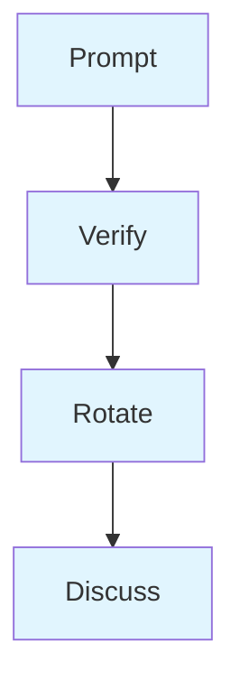

# Skills & Training for AI-DLC

> **What skills teams need and how to develop them for effective AI collaboration.**

## The Skill Shift

AI-DLC doesn't require entirely new skills—it transforms existing ones.

```mermaid
flowchart TB
    O1[⌨️ Code writing] -->|evolves| N1[💬 Prompting]
    O2[🐛 Debugging] -->|evolves| N2[📊 Criteria]
    O3[👀 Code review] -->|evolves| N3[✅ Verification]
    O4[📋 Requirements] -->|evolves| N4[🎯 Intent]

    style O1 fill:#ffcdd2
    style O2 fill:#ffcdd2
    style O3 fill:#ffcdd2
    style O4 fill:#ffcdd2
    style N1 fill:#c8e6c9
    style N2 fill:#c8e6c9
    style N3 fill:#c8e6c9
    style N4 fill:#c8e6c9
```

## Core AI-DLC Skills

### 1. Intent Articulation

The ability to express desired outcomes clearly enough for AI execution.

```mermaid
flowchart TB
    subgraph Bad["❌ Vague Intent"]
        B1["Make it faster"]
        B2["Fix the bug"]
        B3["Add a feature"]
    end

    subgraph Good["✅ Clear Intent"]
        G1["Reduce API latency below 200ms for 95th percentile"]
        G2["Handle null user.email without throwing, default to 'unknown'"]
        G3["Add CSV export with columns: name, email, created_at"]
    end

    Bad -->|"Refine"| Good

    style Bad fill:#ffcdd2
    style Good fill:#c8e6c9
```

**Practice exercises:**

- Take a vague requirement, rewrite it with specific success criteria
- Ask "how would a machine verify this is done?"
- Include edge cases in the initial intent

### 2. Criteria Engineering

Defining machine-verifiable success conditions that catch failures before they reach production.

| Weak Criteria | Strong Criteria |
|--------------|-----------------|
| "Should work correctly" | "All tests pass, coverage > 80%" |
| "Should be secure" | "No SQL injection vectors (verified by scanner)" |
| "Should be fast" | "P95 latency < 100ms under 1000 concurrent users" |
| "Should handle errors" | "Returns 4xx for client errors, 5xx for server errors, no stack traces exposed" |

**The criteria test:** Can a junior developer or automated system verify this criterion without ambiguity?

### 3. Context Curation

Providing AI with the right information to produce good output.

**Context curation skills:**

- Identify what AI needs to know vs. what's noise
- Point to similar existing code
- Specify project patterns to follow
- Highlight non-obvious constraints

### 4. Mode Selection

Knowing when to use supervised, observed, or autonomous modes.

### 5. Output Verification

Efficiently verifying AI output without reviewing every line.

**Verification hierarchy:**

1. **Automated checks** — Tests, linters, type checkers, security scanners
2. **Criteria validation** — Does it meet the defined completion criteria?
3. **Spot checks** — Sample review of critical sections
4. **Pattern matching** — Does it follow project conventions?

```mermaid
flowchart TB
    O[AI Output] --> A[Auto Checks]
    A -->|Pass| C[Criteria]
    A -->|Fail| R[Reject]
    C -->|Pass| Accept[✅]
    C -->|Fail| R

    style Accept fill:#c8e6c9
    style R fill:#ffcdd2
```

## Training Paths by Role

### For Developers → Solution Architects

| Week | Focus | Exercises |
|------|-------|-----------|
| 1 | Prompt engineering basics | Rewrite 5 tickets as AI prompts |
| 2 | Criteria definition | Add machine-verifiable criteria to existing PRs |
| 3 | Mode selection | Classify 20 past tasks by appropriate mode |
| 4 | Context curation | Practice providing minimal effective context |

### For Product Owners → Intent Architects

| Week | Focus | Exercises |
|------|-------|-----------|
| 1 | Intent articulation | Convert user stories to clear intents |
| 2 | Completion criteria | Define verifiable "done" for features |
| 3 | Mob Elaboration | Practice collaborative elaboration |
| 4 | Validation patterns | Learn to validate against original intent |

### For QA → Quality Architects

| Week | Focus | Exercises |
|------|-------|-----------|
| 1 | Quality gates | Design automated quality checkpoints |
| 2 | Criteria as tests | Convert test cases to completion criteria |
| 3 | Backpressure design | Create feedback loops for common failures |
| 4 | Standards evolution | Update quality standards for AI context |

### For Designers → Experience Curators

| Week | Focus | Exercises |
|------|-------|-----------|
| 1 | Experience criteria | Define "feel" in measurable terms |
| 2 | Design iteration | Direct AI-generated variations |
| 3 | Component criteria | Specify component behavior precisely |
| 4 | Aesthetic judgment | Practice curation over creation |

## Learning Through Practice

### Pairing Protocol

**Why this works:** Forces articulation of intent and criteria, builds shared vocabulary.

### Retrospective Questions

After each Unit, ask:

1. Was the intent clear enough? Where did AI need clarification?
2. Were criteria sufficient? What did we miss?
3. Was mode selection appropriate? Would another mode have been better?
4. What context was missing? What was unnecessary?
5. How could verification be more efficient?

### Skill Assessment Rubric

| Skill | Novice | Competent | Expert |
|-------|--------|-----------|--------|
| Intent | Vague, requires follow-up | Clear but may miss edge cases | Comprehensive, anticipates questions |
| Criteria | Manual verification needed | Mostly automatable | Fully machine-verifiable |
| Context | Too much or too little | Adequate but verbose | Minimal and sufficient |
| Mode Selection | Always uses supervised | Correct 70% of time | Optimal selection consistently |
| Verification | Reviews everything | Uses hierarchy | Efficient and effective |

## Building Team Capability

### Knowledge Sharing

- Document "prompt patterns" that work well
- Share criteria templates for common task types
- Create a "context cookbook" for your codebase
- Record mode selection decisions for reference

### Communities of Practice

## Entry Criteria

- Team has decided to adopt AI-DLC
- At least 2 hours per week available for training
- Access to AI coding tools for practice

## Exit Criteria

- [ ] Each team member has completed role-specific training path
- [ ] Team has shared prompt/criteria pattern library
- [ ] Skill assessment completed for all team members
- [ ] Pairing protocol established
- [ ] First retrospective completed with improvement items

## Common Failure Modes

### 1. Training Without Practice

**Symptom:** Reading about AI-DLC but not doing it.

**Fix:** Training should be 20% theory, 80% hands-on exercises with real work.

### 2. Individual Learning Only

**Symptom:** Each person figures it out alone.

**Fix:** Pairing, shared patterns, and regular knowledge sharing sessions.

### 3. Skipping Fundamentals

**Symptom:** Jumping to autonomous mode without building base skills.

**Fix:** Follow the progression: intent → criteria → context → mode selection → verification.

## Related Runbooks

- [Writing Completion Criteria](/papers/ai-dlc-2026/runbooks/writing-completion-criteria) — Detailed criteria engineering guide
- [Reimagining Roles](/papers/ai-dlc-2026/runbooks/reimagining-roles) — Role transformations in AI-DLC
- [Building Trust](/papers/ai-dlc-2026/runbooks/building-trust) — Trust calibration patterns
- [Incremental Adoption](/papers/ai-dlc-2026/runbooks/incremental-adoption) — Starting small and scaling
