# Managing AI Tooling Costs

> **Budget-conscious approaches to AI-DLC adoption without compromising quality.**

## The Cost Reality

AI coding tools have real costs. Ignoring this leads to either:

- Adopting expensive tools and facing budget pressure later
- Avoiding AI-DLC due to perceived cost barriers

This runbook provides practical guidance for cost-effective adoption.

```mermaid
flowchart TB
    subgraph Costs["💰 AI Tooling Cost Factors"]
        direction TB
        C1[Subscription tiers]
        C2[API usage/tokens]
        C3[Seat licenses]
        C4[Infrastructure]
    end

    subgraph Controls["🎛️ Cost Controls"]
        direction TB
        K1[Tool selection]
        K2[Usage patterns]
        K3[Mode selection]
        K4[Team sizing]
    end

    Costs --> Controls

    style Costs fill:#ffcdd2
    style Controls fill:#c8e6c9
```



## Tool Cost Comparison

### Subscription-Based Tools

| Tool | Free Tier | Paid Tier | Enterprise | Best For |
|------|-----------|-----------|------------|----------|
| GitHub Copilot | Limited | $10/mo individual, $19/mo business | Custom | IDE completion, broad language support |
| Cursor | Limited | $20/mo Pro | Custom | AI-native IDE, all-in-one |
| Claude Pro | None | $20/mo | Custom (API) | Deep reasoning, long context |
| Claude Max | None | $100/mo | Custom (API) | Heavy usage, extended thinking |

### API-Based Costs

| Provider | Cost Model | Approximate Rates | Best For |
|----------|-----------|-------------------|----------|
| Anthropic API | Per token | ~$3-15/M tokens (model dependent) | Custom integrations, high volume |
| OpenAI API | Per token | ~$2-60/M tokens (model dependent) | Broad model selection |
| Local models | Hardware + electricity | $0 marginal | Privacy-sensitive, offline work |

## Cost-Effective Adoption Strategies

### Strategy 1: Start with Free/Low-Cost Tiers

**Phase 1: Exploration (Cost: $0-20/mo/person)**


**What you can accomplish:**

- Basic code completion
- Limited chat queries
- Feel for AI-assisted workflow

**Phase 2: Pilot (Cost: $20-40/mo/person)**

Select ONE paid tool for deeper evaluation:

- If IDE-native matters: Cursor Pro ($20/mo)
- If deep reasoning matters: Claude Pro ($20/mo)
- If enterprise compliance matters: GitHub Copilot Business ($19/mo)

**Phase 3: Scale (Optimize based on usage)**

After pilot, you'll know which capabilities actually deliver value.

### Strategy 2: Role-Based Tool Allocation

Not everyone needs the same tools:

| Role | Recommended Tools | Approximate Cost |
|------|-------------------|------------------|
| Senior engineers | Full AI stack (IDE + reasoning) | $40-120/mo |
| Mid-level engineers | IDE completion + occasional reasoning | $20-40/mo |
| Junior engineers | Supervised AI with guardrails | $10-20/mo |

```mermaid
flowchart TB
    subgraph Allocation["Role-Based Allocation"]
        direction TB
        Senior["👨‍💻 Senior: Full Stack"]
        Mid["👩‍💻 Mid: IDE + Limited Reasoning"]
        Junior["🧑‍💻 Junior: IDE Completion"]
    end

    style Senior fill:#e1f5fe
    style Mid fill:#fff3e0
    style Junior fill:#c8e6c9
```



**Rationale:**

- Seniors use autonomous mode more → need powerful reasoning
- Juniors need supervision anyway → completion sufficient
- Mid-level varies by task → flexible allocation

### Strategy 3: Mode-Aware Cost Management

Different AI-DLC modes have different cost profiles:

| Mode | Token Usage | Recommended Approach |
|------|-------------|---------------------|
| Supervised | Lower (human does more) | Can use lower-cost tools |
| Observed | Medium | Balance cost and capability |
| Autonomous | Higher (AI iterates) | Need capable models |

**Cost optimization by mode:**

```markdown
## Supervised Bolt (HITL)
- Human driving, AI assisting
- Lower token usage per task
- Can use: Free tiers, basic completion
- Approximate cost: $0-10/task

## Observed Bolt
- AI executing, human watching
- Medium token usage
- Can use: Pro tiers
- Approximate cost: $10-30/task

## Autonomous Bolt (AHOTL)
- AI iterating until criteria met
- Higher token usage (multiple attempts)
- Need: Capable models, larger context
- Approximate cost: $30-100/task
```

**Implication:** Teams early in AI-DLC adoption (more Supervised) have lower costs. Costs increase as you graduate to Autonomous—but so does productivity.

### Strategy 4: Shared Resources

Not every developer needs individual subscriptions:

**Team API keys:**

- Pool API budget across team
- Set per-person quotas
- Monitor usage patterns

**Pair programming with AI:**

- Two developers, one AI subscription
- One prompts, one reviews
- Effective for training

**Time-boxed access:**

- Reserve high-capability tools for complex tasks
- Use basic tools for routine work

### Strategy 5: Build vs Buy for Heavy Users

At high volume, API costs may exceed subscriptions:

| Monthly Usage | Subscription | API (approximate) | Recommendation |
|---------------|--------------|-------------------|----------------|
| Light (<1000 queries) | $20-40 | ~$10-50 | Subscription |
| Medium (1000-5000) | $20-40 | ~$50-200 | Subscription |
| Heavy (5000+) | $100-200 | ~$200-500 | Evaluate custom setup |

**For heavy users:**

- Consider local models for simple tasks
- Use API for complex reasoning only
- Implement caching for repeated patterns

## Budget Planning Template

### Per-Developer Annual Budget

```markdown
## AI Tooling Budget: [Developer Name]

### Subscriptions
- Primary IDE tool: $[X]/mo × 12 = $[Y]
- Reasoning tool: $[X]/mo × 12 = $[Y]

### API Usage (if applicable)
- Estimated monthly tokens: [X]M
- Cost per million: $[Y]
- Annual: $[Z]

### Total: $[TOTAL]

### ROI Justification
- Hours saved per week: [X]
- Hourly rate: $[Y]
- Annual savings: [X] × [Y] × 52 = $[Z]
- Net benefit: $[Savings] - $[Cost] = $[Benefit]
```

### Team Budget Worksheet

| Team Member | Role | Primary Tool | Secondary Tool | Monthly Cost | Annual Cost |
|-------------|------|--------------|----------------|--------------|-------------|
| Alice | Senior | Claude Max | Cursor Pro | $120 | $1,440 |
| Bob | Mid | Claude Pro | Copilot | $39 | $468 |
| Carol | Junior | Copilot | None | $19 | $228 |
| **Team Total** | | | | **$178** | **$2,136** |

## Cost Tracking

### Metrics to Monitor

| Metric | How to Track | Target |
|--------|--------------|--------|
| Cost per Unit completed | Total AI cost ÷ Units | Decreasing over time |
| Cost per developer | Subscriptions + API | Within budget |
| ROI (time saved × rate) | Survey + metrics | Positive |

### Warning Signs

- Cost per Unit increasing without quality improvement
- Developers not using allocated tools
- API costs spiking unexpectedly
- Free tier sufficient for most work (may not need paid)

## Cost-Conscious Tool Selection

### Evaluation Criteria


### Decision Matrix

| Factor | Weight | Tool A | Tool B | Tool C |
|--------|--------|--------|--------|--------|
| Capability for AI-DLC | 30% | | | |
| Cost (lower is better) | 25% | | | |
| Integration ease | 20% | | | |
| Team preference | 15% | | | |
| Enterprise features | 10% | | | |
| **Weighted Score** | 100% | | | |

## Free and Low-Cost Alternatives

### Local Models (Cost: Hardware Only)

For teams with GPU resources:

| Model | Hardware Requirement | Capability |
|-------|---------------------|------------|
| Llama 3 | 16GB+ VRAM | General coding |
| CodeLlama | 8GB+ VRAM | Code completion |
| Mistral | 8GB+ VRAM | Balanced |

**Trade-offs:**

- (+) No ongoing cost
- (+) Privacy/offline capable
- (-) Less capable than frontier models
- (-) Hardware investment

**Best for:** Simple completion, privacy-sensitive environments, experimentation

### Open Source Tools

| Tool | Cost | Capability |
|------|------|------------|
| Continue.dev | Free | IDE extension, bring your own model |
| Tabby | Free | Self-hosted completion |
| Ollama | Free | Local model runner |

## Enterprise Considerations

### Volume Discounts

At scale, negotiate:

- Seat licenses (10-30% discount at 50+ seats)
- API commit discounts (20-40% with committed spend)
- Annual vs monthly billing (typically 15-20% savings)

### Compliance Costs

Factor in:

- Data residency requirements (may limit tool options)
- Audit logging (enterprise tiers often required)
- SSO/SAML integration (usually enterprise only)

## Entry Criteria

- Decision to adopt AI-DLC
- Budget constraints identified
- Tool options researched

## Exit Criteria

- [ ] Budget allocated per role/team
- [ ] Primary tools selected
- [ ] Cost tracking in place
- [ ] ROI measurement defined
- [ ] Scaling plan documented

## Related Runbooks

- [Tooling Setup](/papers/ai-dlc-2026/runbooks/tooling-setup) — Tool configuration details
- [Incremental Adoption](/papers/ai-dlc-2026/runbooks/incremental-adoption) — Phased rollout (matches cost phases)
- [Mode Selection](/papers/ai-dlc-2026/runbooks/mode-selection) — Mode impacts on cost
