# Tooling & Environment Setup

> **Infrastructure and tools needed for effective AI-DLC adoption.**

## The AI-DLC Tooling Stack

AI-DLC requires specific tooling categories. You don't need all of these to start, but you'll eventually want each layer.

```mermaid
flowchart TB
    subgraph Layer1["🏗️ Layer 1: Foundation"]
        direction TB
        L1A[🤖 AI Coding Assistant]
        L1B[📚 Version Control]
        L1C[🔄 CI/CD Pipeline]
    end

    subgraph Layer2["✅ Layer 2: Quality"]
        direction TB
        L2A[🧪 Automated Testing]
        L2B[🔍 Static Analysis]
        L2C[🔒 Security Scanning]
    end

    subgraph Layer3["📋 Layer 3: Process"]
        direction TB
        L3A[📊 Unit Tracking]
        L3B[📝 Criteria Management]
        L3C[📈 Metrics Dashboard]
    end

    subgraph Layer4["🚀 Layer 4: Advanced"]
        direction TB
        L4A[🧠 Context Management]
        L4B[📖 Knowledge Base]
        L4C[🎯 AI Orchestration]
    end

    Layer1 --> Layer2
    Layer2 --> Layer3
    Layer3 --> Layer4

    style Layer1 fill:#c8e6c9
    style Layer2 fill:#c8e6c9
    style Layer3 fill:#fff3e0
    style Layer4 fill:#e1f5fe
```



## Layer 1: Foundation (Required)

### AI Coding Assistant

The core tool for AI-DLC. Options:

| Tool | Strengths | Considerations |
|------|-----------|----------------|
| Claude Code | Deep reasoning, long context | Subscription cost |
| GitHub Copilot | IDE integration, code completion | Less autonomous |
| Cursor | AI-native IDE | Learning curve |
| Cody | Enterprise features | Self-hosted option |

**Minimum requirements:**

- Multi-file context awareness
- Ability to execute code/tests
- Conversational interface for elaboration

### Version Control Configuration

Git configuration for AI-DLC workflows:

```bash
# Recommended .gitignore additions
.ai-context/
.claude/cache/
*.ai-generated.md

# Branch naming convention
# feature/unit-{unit-id}-{brief-description}
# e.g., feature/unit-42-add-user-export
```

**Commit conventions:**

```
feat(unit-42): Add CSV export functionality

Criteria met:
- [x] Exports name, email, created_at columns
- [x] Handles 10k+ records without timeout
- [x] UTF-8 encoding for international names

Mode: Observed
AI-assisted: Yes
```

### CI/CD Pipeline Enhancements

Add AI-DLC quality gates:

```yaml
# .github/workflows/ai-dlc-quality.yml
name: AI-DLC Quality Gates

on: [push, pull_request]

jobs:
  criteria-check:
    runs-on: ubuntu-latest
    steps:
      - uses: actions/checkout@v4

      - name: Run tests
        run: npm test

      - name: Type check
        run: npm run typecheck

      - name: Lint
        run: npm run lint

      - name: Security scan
        run: npm run security-scan

      - name: Coverage threshold
        run: npm run coverage -- --threshold=80
```

## Layer 2: Quality (Required)

### Automated Testing Setup

Testing is the primary backpressure mechanism in AI-DLC.

```mermaid
flowchart TB
    subgraph Testing["🧪 Test Types"]
        direction TB
        T1[🔬 Unit Tests]
        T2[🔗 Integration Tests]
        T3[🎭 E2E Tests]
    end

    Testing --> Trigger

    subgraph Trigger["⏰ When They Run"]
        direction TB
        TR1[💾 Save/commit]
        TR2[📤 Push]
        TR3[🔀 Pre-merge]
    end

    style Testing fill:#c8e6c9
```



**Test configuration for fast feedback:**

```json
{
  "scripts": {
    "test": "vitest run",
    "test:watch": "vitest",
    "test:coverage": "vitest run --coverage",
    "test:changed": "vitest run --changed"
  }
}
```

### Static Analysis

Catches issues before tests run:

| Tool | Purpose | Configuration |
|------|---------|---------------|
| ESLint/Biome | Code style, patterns | Strict ruleset |
| TypeScript | Type safety | `strict: true` |
| Prettier/Biome | Formatting | Auto-format on save |

**Biome configuration for AI-DLC:**

```json
{
  "linter": {
    "enabled": true,
    "rules": {
      "recommended": true,
      "suspicious": {
        "noExplicitAny": "error"
      }
    }
  },
  "formatter": {
    "enabled": true
  }
}
```

### Security Scanning

Non-negotiable for AI-generated code:

| Tool | Checks | Integration |
|------|--------|-------------|
| Snyk | Dependencies, code | CI/CD, IDE |
| Semgrep | Code patterns | Pre-commit, CI |
| GitGuardian | Secrets | Pre-commit |
| npm audit | Dependencies | CI/CD |

```yaml
# Pre-commit security hooks
repos:
  - repo: https://github.com/Yelp/detect-secrets
    rev: v1.4.0
    hooks:
      - id: detect-secrets
```

## Layer 3: Process (Recommended)

### Unit Tracking

Track Units through their lifecycle:

```mermaid
flowchart TB
    subgraph States["📊 Unit States"]
        direction TB
        I[💡 Intent]
        I --> E[💬 Elaboration]
        E --> C[🔨 Construction]
        C --> V[✅ Verification]
        V --> D[🎉 Done]
    end

    style I fill:#e1f5fe
    style E fill:#fff3e0
    style C fill:#fff3e0
    style V fill:#fff3e0
    style D fill:#c8e6c9
```



**Options:**

- Jira with custom fields for mode, criteria
- Linear with AI-DLC workflow
- GitHub Projects with automation
- Custom tracking in your codebase

### Criteria Management

Store and version completion criteria:

```markdown
<!-- units/unit-42-csv-export.md -->
# Unit 42: CSV Export

## Intent
Users can export their data as CSV for backup and analysis.

## Completion Criteria
- [ ] Export includes: name, email, created_at
- [ ] Handles 10,000+ records in <5 seconds
- [ ] UTF-8 encoding with BOM for Excel compatibility
- [ ] Progress indicator for large exports
- [ ] Error handling with user-friendly messages

## Mode Selection
- Initial: Observed (moderate complexity)
- Can graduate to: Autonomous after first success

## Context
- Related code: `src/services/export/`
- Similar feature: PDF export in `src/services/pdf/`
- Constraints: Must work in Safari (no Web Workers)
```

### Metrics Dashboard

See [Metrics & Measurement](/papers/ai-dlc-2026/runbooks/metrics-measurement) for detailed dashboard design.

Quick setup with existing tools:

- **Grafana** — If you have existing observability
- **Notion/Coda** — Simple dashboards with formulas
- **Google Sheets** — Lightweight, accessible

## Layer 4: Advanced (Optional)

### Context Management

For larger codebases, manage what AI sees:

```mermaid
flowchart TB
    subgraph Context["🧠 Context Layers"]
        direction TB
        C1[📐 Project conventions]
        C2[📂 Relevant code files]
        C3[📋 Current Unit criteria]
        C4[⚠️ Error history]
    end

    subgraph Tools["🛠️ Context Tools"]
        direction TB
        T1[📄 CLAUDE.md files]
        T2[🗂️ AI context files]
        T3[📚 Knowledge bases]
    end

    Context --> Tools

    style Context fill:#e1f5fe
    style Tools fill:#c8e6c9
```



**CLAUDE.md structure:**

```markdown
# Project Context for AI

## Architecture
- Monorepo with packages/ structure
- React frontend, Node.js backend
- PostgreSQL database

## Conventions
- Use functional components with hooks
- Prefer Zod for validation
- All API endpoints in /api/v1/

## Patterns to Follow
- See src/services/user/ for service pattern
- See src/components/Button/ for component pattern

## Anti-Patterns to Avoid
- No class components
- No any types
- No console.log in production code
```

### Knowledge Base

Capture learnings for future AI interactions:

| Content Type | Purpose | Update Frequency |
|--------------|---------|-----------------|
| Prompt patterns | What works | After each Unit |
| Failure patterns | What doesn't | After each failure |
| Criteria templates | Starting points | Monthly |
| Mode selection guide | Decision support | Quarterly |

### AI Orchestration

For complex workflows with multiple AI interactions:

```mermaid
flowchart TB
    subgraph Orchestration["🎯 Orchestration Patterns"]
        direction TB
        O1[➡️ Sequential: A → B → C]
        O2[⚡ Parallel: A + B + C]
        O3[🔀 Conditional: If X then A else B]
    end

    style Orchestration fill:#e1f5fe
```



Tools: Han (this project), LangChain, AutoGen

## Minimum Viable Setup

Start with this and expand:

```
✅ AI Coding Assistant (Claude Code, Copilot, etc.)
✅ Git with good .gitignore
✅ CI/CD with test + lint + typecheck
✅ Security scanning (at minimum, dependency audit)
✅ Simple unit tracking (even a markdown file)
```

## Environment Configuration

### IDE Setup

```json
// VS Code settings.json for AI-DLC
{
  "editor.formatOnSave": true,
  "editor.codeActionsOnSave": {
    "source.fixAll": true
  },
  "typescript.tsdk": "node_modules/typescript/lib",
  "files.exclude": {
    "**/.ai-context": true
  }
}
```

### Shell Configuration

```bash
# .zshrc / .bashrc additions
export CLAUDE_PROJECT_ROOT=$(git rev-parse --show-toplevel 2>/dev/null)

# Aliases for common AI-DLC commands
alias aitest="npm run test:changed"
alias ailint="npm run lint -- --fix"
alias aicheck="npm run typecheck && npm run lint && npm test"
```

## Entry Criteria

- Team has selected an AI coding assistant
- Existing CI/CD pipeline in place
- Basic test suite exists

## Exit Criteria

- [ ] AI coding assistant configured for all developers
- [ ] CI/CD pipeline includes quality gates
- [ ] Security scanning in place
- [ ] Unit tracking system operational
- [ ] CLAUDE.md or equivalent context file created
- [ ] Team trained on tooling usage

## Common Failure Modes

### 1. Over-Engineering the Stack

**Symptom:** Spending weeks on perfect tooling before writing any code.

**Fix:** Start with minimum viable setup. Add layers as pain points emerge.

### 2. Ignoring Security Scanning

**Symptom:** AI-generated code with vulnerabilities reaches production.

**Fix:** Security scanning is Layer 2, not Layer 4. Add it early.

### 3. No Context Management

**Symptom:** AI repeatedly makes same mistakes, ignores conventions.

**Fix:** Create CLAUDE.md immediately. Update it as you learn.

### 4. Manual Quality Gates

**Symptom:** Relying on humans to catch what tools should catch.

**Fix:** If it can be automated, automate it. Save humans for judgment calls.

## Related Runbooks

- [Quality Guardrails](/papers/ai-dlc-2026/runbooks/quality-guardrails) — Quality-specific tooling
- [Incremental Adoption](/papers/ai-dlc-2026/runbooks/incremental-adoption) — When to add each layer
- [Metrics & Measurement](/papers/ai-dlc-2026/runbooks/metrics-measurement) — Dashboard setup
- [Overcoming Tech Debt](/papers/ai-dlc-2026/runbooks/overcoming-tech-debt) — Starting with limited infrastructure
