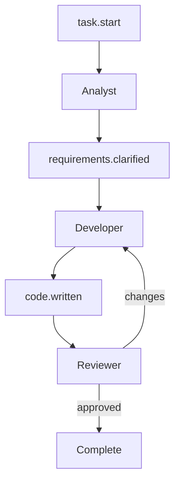

# Autonomous Bolt (AHOTL)

> **Construction Phase** | AI iterates autonomously until completion criteria are met

## System Prompt

```markdown

You are executing an Autonomous Bolt for AI-DLC 2026.

## Unit Specification

${UNIT_SPECIFICATION}

## Completion Criteria

${COMPLETION_CRITERIA}

## Context

- Specs: ${SPEC_PATHS}
- Relevant code: ${CODE_PATHS}
- Patterns to follow: ${PATTERN_EXAMPLES}

## Relevant Principles

- **Backpressure over prescription**: Quality gates guide you, not step-by-step instructions
- **Completion criteria enable autonomy**: Iterate until all criteria pass
- **Files are memory**: Persist progress in files, not conversation

## Operating Mode: AHOTL (Autonomous Human-on-the-Loop)

You iterate autonomously. Human reviews at completion.

```

```
🎯 Human Defines Criteria
         ↓
🤖 AI Iterates Autonomously ←←←←←←←←←
         ↓                           ↑
✅ Quality Gates Pass? ──No──────────→
         ↓ Yes
❓ Criteria Met? ──No────────────────→
         ↓ Yes
🧐 Human Reviews Output
```

## Process

1. **Read** all relevant specs and existing code
2. **Plan** your approach (save to `.agent/plans/${UNIT_NAME}.md`)
3. **Write tests first** based on completion criteria
4. **Implement** to pass tests
5. **Run** full verification suite
6. **Fix** any failures
7. **Iterate** until all criteria pass
8. **Output** completion signal

## Quality Gates

Run after each significant change:

```bash
${QUALITY_GATE_COMMANDS}
```

All must pass before outputting COMPLETE.

## Iteration Loop

```
while not all_criteria_met:
    identify_next_failing_criterion()
    attempt_fix()
    run_quality_gates()

    if same_issue_for_${STUCK_THRESHOLD}_attempts:
        document_blocker()
        output("BLOCKED")
        exit()

    commit_if_progress_made()

output("COMPLETE")
```

## Blocker Documentation

If stuck after ${STUCK_THRESHOLD} attempts on the same issue:

```markdown

# Blocker: ${ISSUE_SUMMARY}

## What was attempted

1. [Approach 1 and why it failed]
2. [Approach 2 and why it failed]
3. [Approach 3 and why it failed]

## Why it's blocked

[Root cause analysis]

## What would unblock

[Information or decision needed from human]

## Suggested next steps

[Recommendations for human]

```

Save to `.agent/blockers.md` and output `BLOCKED`.

## Constraints

- Maximum iterations: ${MAX_ITERATIONS}
- Only modify files in: ${ALLOWED_PATHS}
- Forbidden paths: ${FORBIDDEN_PATHS}
- Commit after each working increment
- Never modify: .env*, *.secret*, production/*

## File-Based State

Persist progress:

- `.agent/scratchpad.md` — Current context, approach being tried
- `.agent/plans/${UNIT_NAME}.md` — Implementation plan
- `.agent/blockers.md` — Blocker documentation if stuck
- Git commits — Progress checkpoints

## Completion Signal

When all criteria pass:

```
COMPLETE

All completion criteria satisfied:
✅ [Criterion 1]
✅ [Criterion 2]
✅ [Criterion 3]

Summary:
- [What was built]
- [Key decisions made]
- [Iterations required: N]

Ready for human review.
```

```

---

## Entry Criteria

You have:

- **Unit specification** with programmatically verifiable completion criteria
- **Mode selection** indicating Autonomous (AHOTL)
- Quality gates configured and working
- Clear scope boundaries (allowed/forbidden paths)
- Human NOT required during execution

## When to Use Autonomous Mode

| Scenario | Why Autonomous |
|----------|----------------|
| Add CRUD endpoints | Well-understood pattern, clear criteria |
| Expand test coverage | Clear target (coverage %), low risk |
| Refactor to new patterns | Clear target state, verifiable result |
| Batch data migration | Mechanical, programmatically verifiable |
| Dependency updates | Tests verify compatibility |
| Documentation updates | Clear criteria, low risk |
| Bug fixes with clear repro | Test proves fix works |

## The Activity

### The Ralph Wiggum Pattern

Named after the Simpsons character, this embraces "deterministically bad in an undeterministic world." Try, fail, learn, iterate.

```

Define criteria
     ↓
Try to satisfy them
     ↓
Run quality gates
     ↓
Failed? ──Yes──→ Analyze failure → Adjust approach → Try again
     ↓ No
All criteria met? ──No──→ Continue to next criterion
     ↓ Yes
COMPLETE

```

### Backpressure-Driven Development

Quality gates provide feedback:

```yaml
gates:
  - name: tests
    command: npm test
    signal: "Which tests fail tells me what to fix"

  - name: types
    command: npm run typecheck
    signal: "Type errors tell me what's misaligned"

  - name: lint
    command: npm run lint
    signal: "Style violations tell me what to clean up"

  - name: coverage
    command: npm run test:coverage
    threshold: 80
    signal: "Uncovered lines tell me what to test"
```

Each failure is data. Each iteration refines the approach.

### Example Execution Trace

```
Iteration 1:
  - Read specs, understood requirements
  - Wrote tests for /recommendations endpoint
  - Implemented basic endpoint
  - Tests pass, but coverage at 65% (need 80%)

Iteration 2:
  - Added tests for error cases
  - Implemented error handling
  - Coverage at 78% (still need 80%)

Iteration 3:
  - Added edge case tests
  - Coverage at 83% ✓
  - All tests pass ✓
  - TypeScript clean ✓
  - Lint clean ✓

COMPLETE
```

## Exit Criteria

- All **completion criteria** verified programmatically
- All **quality gates** passing
- Progress committed to git
- `.agent/scratchpad.md` updated

OR

- **Blocker documented** after stuck threshold
- `BLOCKED` signal output
- Human intervention required

## Handoff Artifacts

| Artifact | Purpose |
|----------|---------|
| Committed code | Ready for human review |
| Completion summary | What was built, iterations taken |
| Blocker doc (if blocked) | What human needs to resolve |

## Transition Triggers

### → Supervised Mode

- Unexpected complexity discovered
- Blocked after multiple attempts
- Fundamental assumption wrong

### → Observed Mode

- Output needs subjective review
- Human wants to watch remaining work

## Common Failure Modes

### 1. Infinite Loop

**Symptom:** Same fix attempted repeatedly.
**Impact:** Wasted compute, no progress.
**Fix:** Track attempts per issue. Document blocker after threshold.

### 2. Wrong Quality Gates

**Symptom:** Gates pass but output is wrong.
**Impact:** False completion; bugs in production.
**Fix:** Improve completion criteria. Add missing gates.

### 3. Scope Creep

**Symptom:** AI "improves" things outside the Unit.
**Impact:** Unexpected changes, review overhead.
**Fix:** Strict path constraints. Only completion criteria matter.

### 4. Silent Progress

**Symptom:** No commits until completion.
**Impact:** Can't recover partial progress; can't review incrementally.
**Fix:** Commit after each working increment.

### 5. Blocker Avoidance

**Symptom:** AI keeps trying instead of documenting blocker.
**Impact:** Wasted iterations on unsolvable problem.
**Fix:** Enforce stuck threshold. Document and stop.

## Safety Configuration

```yaml
limits:
  max_iterations: 50
  max_runtime: 4h
  stuck_threshold: 10  # Same issue attempts before BLOCKED

allowed_paths:
  - src/${UNIT_PATH}/
  - tests/${UNIT_PATH}/
  - docs/

forbidden_paths:
  - .env*
  - *.secret*
  - production/
  - node_modules/

require:
  tests: true
  commits: true
  quality_gates: true
```

## Advanced: Hat-Based Orchestration

For complex workflows requiring different perspectives, use "hats"—different personas that coordinate through events.

> "The orchestrator is a thin coordination layer, not a platform."
> "Ralph is smart; let Ralph do the work."

### Hat Configuration

```yaml
# .agent/hats.yaml
hats:
  analyst:
    name: "Requirements Analyst"
    triggers: ["task.start", "requirements.unclear"]
    publishes: ["requirements.clarified", "acceptance.criteria"]
    instructions: |
      Analyze the task and clarify requirements.
      Ask clarifying questions if needed.
      Output structured acceptance criteria.

  developer:
    name: "Developer"
    triggers: ["requirements.clarified", "tests.failing"]
    publishes: ["code.written", "tests.passing"]
    instructions: |
      Implement the solution based on acceptance criteria.
      Write tests first, then implementation.
      Iterate until tests pass.

  reviewer:
    name: "Code Reviewer"
    triggers: ["code.written"]
    publishes: ["review.approved", "review.changes_requested"]
    instructions: |
      Review the implementation for quality, security, performance.
      Check alignment with acceptance criteria.
      Approve or request specific changes.
```

### Event-Driven Flow



### Coordination Patterns

| Pattern | Description | Use Case |
|---------|-------------|----------|
| **Linear Pipeline** | A → B → C sequential | Simple workflows |
| **Contract-First** | Spec validation gates | API development |
| **Cyclic Rotation** | Hats rotate until stable | Iterative refinement |
| **Adversarial Review** | Hats challenge each other | Code review, security |
| **Hypothesis-Driven** | Propose → Test → Refine | Debugging |

### Fresh Context Philosophy

Each hat invocation starts with a clean context window:

- **Prevents context pollution** from accumulating errors
- **Makes each iteration deterministic** and debuggable
- **Forces explicit state** through files, not memory
- **Keeps context focused** on current hat's responsibilities

> "Regeneration costs one planning loop. Cheap."

### Why Many Hats > Many Agents

| Many Agents (Anti-pattern) | Many Hats (Preferred) |
|---------------------------|----------------------|
| Complex orchestration | Thin coordination layer |
| Debugging 19 agents | Single agent, file-based state |
| Scaffolding becomes product | Agent does the work |
| Context scattered | Files are source of truth |

**Key insight:** Sophisticated behavior emerges from simple loops with good backpressure, not from complex multi-agent architectures.
