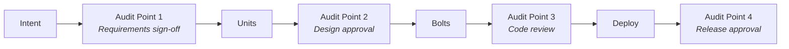

# Compliance and Audit Integration

AI-DLC can integrate with regulated environments through structured audit patterns. These patterns maintain compliance without sacrificing AI's speed benefits.

## Pattern A: Auditable Checkpoints

Insert human audit points at strategic boundaries while allowing AI to operate autonomously between them:



### Characteristics
- HITL at audit points, AHOTL/OHOTL between them
- Human signs off at each gate with audit trail
- Creates paper trail naturally through workflow
- Maps to existing compliance frameworks

### Framework Mapping

| Audit Point | SOC2 | HIPAA | PCI-DSS |
|-------------|------|-------|---------|
| Requirements sign-off | CC6.1 Change Management | Administrative Safeguards | Req 6.4 |
| Design approval | CC6.1 Change Management | Technical Safeguards | Req 6.3 |
| Code review | CC6.1, CC7.1 | Technical Safeguards | Req 6.3.2 |
| Release approval | CC6.1 Change Management | Administrative Safeguards | Req 6.4.5 |

## Pattern B: Automated Compliance Gates

Use quality gates as compliance verification - automated, non-blocking when passing, with audit logging:

```yaml
# .ai-dlc/compliance-gates.yaml
compliance_gates:
  - name: security_scan
    description: "SAST/DAST security analysis"
    command: npm run security:scan
    audit_log: true
    compliance: ["SOC2-CC6.1", "PCI-DSS-6.5"]

  - name: license_check
    description: "Open source license verification"
    command: npm run license:check
    audit_log: true
    compliance: ["SOC2-CC6.1"]

  - name: pii_detection
    description: "Sensitive data detection in code"
    command: npm run pii:scan
    audit_log: true
    compliance: ["HIPAA", "GDPR"]

  - name: access_review
    description: "Verify least-privilege access patterns"
    command: npm run access:audit
    audit_log: true
    compliance: ["SOC2-CC6.3", "PCI-DSS-7.1"]
```

### Benefits
- Compliance as backpressure - automated, non-blocking when passing
- Evidence collection for auditors happens automatically
- Human review only for exceptions/failures
- Audit trail generated without manual documentation

## Implementation Approaches

These patterns are tool-agnostic. Implement via:

### CI/CD Pipelines
```yaml
# GitHub Actions example
compliance-check:
  runs-on: ubuntu-latest
  steps:
    - name: Security Scan
      run: npm run security:scan

    - name: License Check
      run: npm run license:check

    - name: PII Detection
      run: npm run pii:scan

    - name: Upload Audit Evidence
      uses: actions/upload-artifact@v4
      with:
        name: compliance-evidence-${{ github.run_id }}
        path: .audit/
```

### Pre-commit Hooks
```bash
#!/bin/bash
# .git/hooks/pre-commit

echo "Running compliance checks..."

# PII detection
npm run pii:scan || {
  echo "PII detected in code. Commit blocked."
  exit 1
}

# License check
npm run license:check || {
  echo "License compliance issue. Commit blocked."
  exit 1
}

echo "Compliance checks passed."
```

### Dedicated Platforms
- **Drata** - Automated SOC2 evidence collection
- **Vanta** - Continuous compliance monitoring
- **Secureframe** - Security and privacy automation

## Audit Trail Structure

The workflow *is* the audit trail:

```markdown
# Audit Trail: Unit AUTH-001

## Requirements Sign-off
- Date: 2026-01-15T14:30:00Z
- Approver: @jane.smith (Security Lead)
- Evidence: [Link to elaboration doc]
- Notes: Reviewed RBAC requirements, approved scope

## Design Approval
- Date: 2026-01-16T09:00:00Z
- Approver: @john.doe (Architect)
- Evidence: [Link to ADR-042]
- Notes: JWT approach approved, noted refresh token concerns

## Code Review
- Date: 2026-01-17T16:00:00Z
- Approver: @sarah.chen (Senior Dev)
- Evidence: [PR #1234]
- Notes: Security scan passed, test coverage 92%

## Release Approval
- Date: 2026-01-18T10:00:00Z
- Approver: @mike.wilson (Release Manager)
- Evidence: [Deployment ticket DEPLOY-567]
- Notes: Canary deployment successful, no anomalies
```

## Commit Message Standards

When AI commits work, include compliance-relevant information:

```
feat(auth): implement JWT token refresh

Completion Criteria Met:
- Refresh tokens expire after 7 days
- Access tokens expire after 1 hour
- Token rotation on refresh
- Audit logging for all auth events

Security Checks: PASSED
- npm audit: 0 vulnerabilities
- SAST scan: No issues
- PII scan: No sensitive data exposed

Compliance: SOC2-CC6.1, PCI-DSS-8.1
```

## Regulated Industry Considerations

### Healthcare (HIPAA)
- Log all PHI access
- Encrypt data at rest and in transit
- Implement minimum necessary access
- Maintain audit trails for 6 years

### Financial (PCI-DSS)
- Never log cardholder data
- Implement strong access control
- Regular security assessments
- Maintain audit trails for 1 year

### General (SOC2)
- Document change management
- Implement access reviews
- Monitor for anomalies
- Maintain comprehensive logs

## AI-Specific Compliance Concerns

### AI Output Review
For regulated work, always include human review of AI output:

```yaml
# Force HITL for compliance-sensitive areas
mode_overrides:
  paths:
    - "src/auth/**"
    - "src/payment/**"
    - "src/pii/**"
  forced_mode: supervised
  reason: "Compliance-sensitive code requires human review"
```

### AI Decision Documentation
Document when AI made decisions:

```markdown
## AI-Assisted Decision Log

### Decision: Token Expiry Times
- Context: Implementing JWT refresh flow
- AI Recommendation: 1hr access, 7d refresh
- Human Review: Approved by @security-lead
- Rationale: Balances security with UX
- Date: 2026-01-16
```

## Entry Criteria
- [ ] Compliance framework identified (SOC2, HIPAA, PCI-DSS, etc.)
- [ ] Audit requirements documented
- [ ] Security tooling available (SAST, license check, etc.)

## Exit Criteria
- [ ] Audit checkpoints mapped to compliance requirements
- [ ] Automated compliance gates configured
- [ ] Audit trail template established
- [ ] Human review process defined for sensitive areas
- [ ] Evidence collection automated
