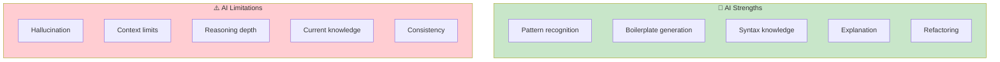
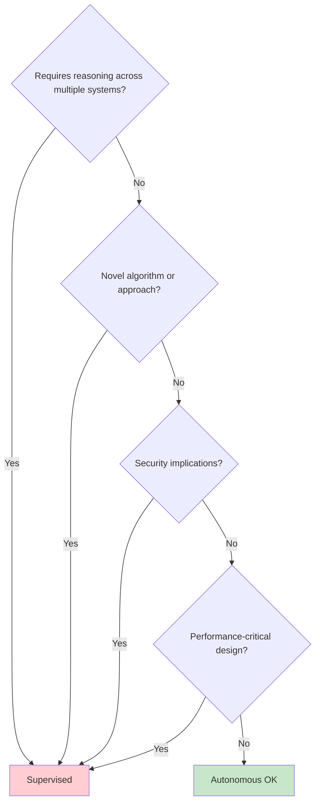
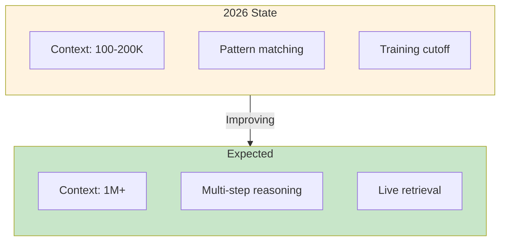

# Working with AI Limitations

> **Honest assessment of current AI capabilities and strategies for working within them.**

## The Reality Check

AI coding assistants are powerful but imperfect. Understanding their limitations helps you:

- Choose appropriate modes
- Set realistic expectations
- Design workflows that compensate for weaknesses



## Known Limitations

### 1. Hallucination

**What it is:** AI generates plausible-sounding but incorrect code, APIs, or facts.

**Common manifestations:**

- Inventing functions that don't exist in libraries
- Citing non-existent documentation
- Generating syntactically correct but logically wrong code
- Confident assertions about incorrect behavior

**AI-DLC mitigation:**

| Strategy | Implementation |
|----------|---------------|
| Backpressure | Tests catch incorrect behavior |
| Type checking | TypeScript catches non-existent APIs |
| Verification | Completion criteria require proof, not trust |
| Mode selection | Use Supervised for novel APIs/libraries |

**Practical example:**

```markdown
## Criterion: Use Redis for caching

❌ Trusting AI: "I'll use redis.cache()"
   → AI may invent this API

✅ With verification: "Tests demonstrate cache hit/miss behavior"
   → Forces AI to use real APIs that actually work
```

### 2. Context Limits

**What it is:** AI has a finite context window. Quality degrades when overloaded.

**Symptoms:**

- Forgetting earlier instructions in long conversations
- Inconsistent naming across files
- Missing relevant code that was provided earlier
- Repetitive suggestions ignoring prior feedback

**AI-DLC mitigation:**

| Strategy | Implementation |
|----------|---------------|
| Unit scoping | Keep Units small enough to fit in context |
| Context curation | Provide minimal effective context, not everything |
| Fresh sessions | Start new sessions for distinct Units |
| Memory files | Use CLAUDE.md for persistent conventions |

**Practical guidelines:**

```markdown
## Context Budget Management

### Include:
- Files being modified
- Direct dependencies
- Relevant tests
- Completion criteria

### Exclude:
- Entire codebase
- Unrelated modules
- History of failed attempts
- Verbose documentation
```

### 3. Reasoning Depth

**What it is:** AI excels at pattern matching but struggles with deep multi-step reasoning.

**Symptoms:**

- Correct implementation of wrong approach
- Missing edge cases in complex logic
- Failing to see systemic implications
- Local optimization over global correctness

**AI-DLC mitigation:**

| Strategy | Implementation |
|----------|---------------|
| Supervised mode | Human validates reasoning for complex decisions |
| Decomposition | Break complex problems into simpler Units |
| Explicit criteria | Enumerate edge cases AI might miss |
| Architectural review | Humans decide approach, AI implements |

**When to use Supervised mode:**



### 4. Knowledge Cutoff

**What it is:** AI training data has a cutoff date. It may not know about recent APIs, frameworks, or best practices.

**Symptoms:**

- Using deprecated APIs
- Not knowing about new framework features
- Outdated security practices
- Wrong version assumptions

**AI-DLC mitigation:**

| Strategy | Implementation |
|----------|---------------|
| Version specification | Include versions in context (e.g., "React 18", "Node 20") |
| Documentation links | Point AI to current docs |
| Pattern examples | Show actual code from your codebase |
| Update CLAUDE.md | Document current stack with versions |

**Context template:**

```markdown
## Project Stack (Current)

- Node.js 20.x (not 18.x)
- React 18 with Server Components
- Next.js 14 App Router (not Pages Router)
- TypeScript 5.3 with strict mode
- See package.json for exact versions

## Recent Changes to Note
- React Server Components are default
- use client directive required for client components
- Next.js App Router uses file-based routing in app/
```

### 5. Consistency Over Long Tasks

**What it is:** AI may generate inconsistent code across multiple interactions or files.

**Symptoms:**

- Different naming conventions in different files
- Inconsistent error handling patterns
- Varying code style
- Contradictory implementations

**AI-DLC mitigation:**

| Strategy | Implementation |
|----------|---------------|
| Lint enforcement | Consistent style via automated tools |
| Pattern documentation | CLAUDE.md specifies conventions |
| Atomic Units | Complete related work in single session |
| Code review | Catch inconsistencies before merge |

### 6. Overconfidence

**What it is:** AI presents uncertain information with high confidence.

**Symptoms:**

- Assertive statements about incorrect behavior
- No hedging on uncertain recommendations
- Presenting one approach as "the best" without trade-off analysis

**AI-DLC mitigation:**

| Strategy | Implementation |
|----------|---------------|
| Verification culture | "Trust but verify" as team norm |
| Criteria-based acceptance | Output must meet criteria, not just sound good |
| Request alternatives | Ask AI for trade-offs, not just recommendations |
| Skepticism for novelty | Higher scrutiny for unfamiliar patterns |

## Limitation-Aware Mode Selection

Match mode to limitation risk:

| Limitation Risk | Recommended Mode | Why |
|-----------------|------------------|-----|
| High hallucination risk (new APIs) | Supervised | Human catches invented APIs |
| Large context needed | Split into multiple Units | Each Unit fits in context |
| Deep reasoning required | Supervised | Human provides reasoning |
| Knowledge cutoff relevant | Supervised + current docs | Human verifies currency |
| Consistency critical | Single session + lint | Reduces drift |

## Designing Criteria for Imperfect AI

Completion criteria should assume AI will make mistakes:

```markdown
## Criteria That Catch AI Mistakes

### Instead of trusting AI:
- [ ] "Implement caching" (AI might invent APIs)

### Verify behavior:
- [ ] "Cache hit returns in <10ms (test: testCacheHit)"
- [ ] "Cache miss calls backend (test: testCacheMiss)"
- [ ] "Cache expires after 1 hour (test: testCacheExpiry)"

### Instead of trusting reasoning:
- [ ] "Optimize the algorithm" (AI might miss edge cases)

### Verify correctness:
- [ ] "All 50 test cases pass"
- [ ] "Performance benchmark: <100ms for 10k items"
- [ ] "Memory usage: <50MB for 10k items"
```

## When AI-DLC Isn't the Right Fit

Some tasks are poorly suited to current AI capabilities:

| Task Type | Challenge | Alternative |
|-----------|-----------|-------------|
| Novel algorithms | Requires deep reasoning | Human-led with AI assistance |
| Cutting-edge frameworks | Knowledge cutoff | Wait for AI training update |
| Security-critical logic | Overconfidence risk | Human implementation, AI review |
| Large-scale refactoring | Context limits | Break into smaller Units |
| Highly creative design | Pattern-based AI | Human creativity, AI execution |

## Improvement Trajectory

AI capabilities are improving. Current limitations may be temporary:



**Implication:** Workflows designed for current limitations may become unnecessary. Build for today, but don't over-invest in workarounds.

## Communicating Limitations

### To Stakeholders

```markdown
## AI-DLC Capability Statement

### What AI Can Do Well:
- Generate code following established patterns
- Refactor with clear criteria
- Write tests for existing code
- Explain and document code

### What Requires Human Judgment:
- Architectural decisions
- Novel algorithm design
- Security-critical implementations
- Trade-off analysis

### Our Mitigation Approach:
- Mode selection based on task risk
- Programmatic verification (tests, types, lint)
- Human review for complex decisions
```

### To Team Members

- Be explicit about why certain tasks need Supervised mode
- Share examples of AI mistakes caught by backpressure
- Celebrate good catches, not just successful completions
- Normalize skepticism without discouraging AI use

## Entry Criteria

- Understanding of AI-DLC modes
- Experience with AI coding tools
- Desire to work effectively despite limitations

## Exit Criteria

- [ ] Team understands major AI limitations
- [ ] Mode selection accounts for limitations
- [ ] Criteria designed to catch AI mistakes
- [ ] Communication plan for stakeholders

## Related Runbooks

- [Mode Selection](/papers/ai-dlc-2026/runbooks/mode-selection) — Choosing modes based on limitations
- [Writing Completion Criteria](/papers/ai-dlc-2026/runbooks/writing-completion-criteria) — Criteria that verify, not trust
- [Building Trust](/papers/ai-dlc-2026/runbooks/building-trust) — Trust calibration with imperfect AI
