# Writing Completion Criteria

> **The skill of defining machine-verifiable success conditions that enable autonomous execution.**

## Why This Matters

Completion Criteria are the foundation of AI-DLC autonomy. Without programmatically verifiable criteria, every task requires human judgment, eliminating the efficiency gains of AI-assisted development.

```mermaid
flowchart TB
    subgraph Bad["❌ Weak Criteria"]
        direction TB
        B1["Human judgment"]
        B2["Subjective"]
        B3["Debate"]
    end

    Bad -->|"Blocks"| Manual[🐌 Manual only]

    subgraph Good["✅ Strong Criteria"]
        direction TB
        G1["Machine verifiable"]
        G2["Binary pass/fail"]
        G3["Clear completion"]
    end

    Good -->|"Enables"| Auto[🚀 Autonomous]

    style Manual fill:#ffcdd2
    style Auto fill:#c8e6c9
```



## The Verifiability Test

For every criterion, ask: **"How would a machine check this?"**

If the answer requires human judgment, the criterion isn't ready for autonomous execution.

| Criterion | Machine Checkable? | Fix |
|-----------|-------------------|-----|
| "Code is clean" | ❌ Subjective | "All lint rules pass, cyclomatic complexity <10" |
| "Tests pass" | ✅ Binary | Already verifiable |
| "API is fast enough" | ❌ Vague | "P95 latency <200ms at 1000 req/s" |
| "Handles errors well" | ❌ Subjective | "Returns 4xx for client errors, 5xx for server errors, no stack traces in response" |
| "Secure" | ❌ Too broad | "Security scan: 0 critical/high, OWASP ZAP baseline passes" |

## Criteria Categories

### 1. Functional Criteria

What the code must do.

**Pattern:** `[Action] [Subject] [Condition] [Expected Result]`

```markdown
## Functional Criteria

- [ ] POST /users creates a new user record in the database
- [ ] GET /users/{id} returns 404 when user doesn't exist
- [ ] DELETE /users/{id} soft-deletes (sets deleted_at, doesn't remove row)
- [ ] User email must be unique (returns 409 on duplicate)
- [ ] Password must be at least 12 characters (returns 400 if shorter)
```

**Anti-patterns:**
- "Works correctly" — What does "correctly" mean?
- "Handles edge cases" — Which edge cases?
- "Follows the spec" — Link the spec, enumerate the checks

### 2. Quality Criteria

How well the code must be written.

```markdown
## Quality Criteria

- [ ] All tests pass (`npm test` exits 0)
- [ ] Coverage >80% for files in src/users/ (`npm run coverage`)
- [ ] No TypeScript errors (`tsc --noEmit` exits 0)
- [ ] No lint errors (`npm run lint` exits 0)
- [ ] No circular dependencies detected
```

**Quantify thresholds:**

| Metric | Weak | Strong |
|--------|------|--------|
| Coverage | "Good coverage" | ">80% line coverage for src/feature/" |
| Complexity | "Not too complex" | "Cyclomatic complexity <15 per function" |
| Bundle size | "Reasonable size" | "Bundle delta <50KB gzipped" |

### 3. Performance Criteria

Speed and resource constraints.

```markdown
## Performance Criteria

- [ ] P95 response time <200ms under 1000 concurrent users
- [ ] Memory usage <512MB under normal load
- [ ] No N+1 queries (verified by query count in tests)
- [ ] Startup time <5 seconds
```

**Include load conditions:** "Fast" means nothing without context. Always specify:
- Request rate (req/s)
- Concurrent users
- Data volume

### 4. Security Criteria

Protection requirements.

```markdown
## Security Criteria

- [ ] No SQL injection vectors (Semgrep security-audit passes)
- [ ] No secrets in code (gitleaks scan passes)
- [ ] No critical/high CVEs in dependencies (npm audit)
- [ ] Authentication required on all /api/admin/* routes
- [ ] Rate limiting: 100 requests/minute/IP on public endpoints
```

**Be specific about tools:** Different scanners find different issues. Name the tool and ruleset.

### 5. Compatibility Criteria

Integration and environment requirements.

```markdown
## Compatibility Criteria

- [ ] Works in Node.js 18+ and 20+
- [ ] All existing API tests pass (no breaking changes)
- [ ] Database migrations are reversible
- [ ] Environment variables documented in .env.example
```

## Writing Criteria: Step by Step

### Step 1: Start with the User Story

```
As a user, I want to export my data as CSV so I can analyze it offline.
```

### Step 2: Enumerate Testable Behaviors

```markdown
- User can trigger export from settings page
- Export includes: name, email, created_at columns
- Export handles 10,000+ records
- Export uses UTF-8 encoding
- Download starts within 5 seconds
```

### Step 3: Add Verifiable Thresholds

```markdown
- [ ] Export button visible on /settings page (e2e test)
- [ ] CSV contains columns: name, email, created_at (unit test)
- [ ] Export completes in <30s for 10,000 records (performance test)
- [ ] CSV file has UTF-8 BOM for Excel compatibility (unit test)
- [ ] Download response headers include Content-Disposition (integration test)
```

### Step 4: Add Quality Gates

```markdown
- [ ] All tests pass
- [ ] Coverage >80% for src/export/
- [ ] No lint errors
- [ ] Security scan passes
```

### Step 5: Specify the Verification Command

For each criterion, there should be a command that checks it:

| Criterion | Verification Command |
|-----------|---------------------|
| All tests pass | `npm test` |
| Coverage >80% | `npm run coverage -- --threshold=80` |
| No lint errors | `npm run lint` |
| P95 <200ms | `npm run perf-test -- --assert-p95=200` |

## Common Mistakes

### 1. Subjective Quality Terms

**Bad:**
```markdown
- [ ] Code is readable
- [ ] Error messages are helpful
- [ ] UI is intuitive
```

**Better:**
```markdown
- [ ] All functions have JSDoc comments
- [ ] Error responses include error code and user-facing message
- [ ] All interactive elements have aria-labels
```

### 2. Missing Thresholds

**Bad:**
```markdown
- [ ] Has good test coverage
- [ ] Performance is acceptable
```

**Better:**
```markdown
- [ ] Test coverage >80% for src/feature/
- [ ] P95 latency <200ms at 1000 req/s
```

### 3. Vague Scope

**Bad:**
```markdown
- [ ] All edge cases handled
```

**Better:**
```markdown
- [ ] Returns 400 when email is missing
- [ ] Returns 400 when email format is invalid
- [ ] Returns 409 when email already exists
- [ ] Returns 500 when database is unavailable (with retry)
```

### 4. Implementation Details as Criteria

**Bad:**
```markdown
- [ ] Uses Redis for caching
- [ ] Implements the Repository pattern
- [ ] Uses async/await instead of callbacks
```

**Better:**
```markdown
- [ ] Cache hit rate >90% for repeated queries
- [ ] Database queries are abstracted behind interface
- [ ] No callback-style code in new files
```

Criteria should describe WHAT, not HOW.

## Templates by Task Type

### API Endpoint

```markdown
## Completion Criteria: POST /api/widgets

### Functional
- [ ] Creates widget in database with provided fields
- [ ] Returns 201 with created widget (including generated ID)
- [ ] Returns 400 if required fields missing
- [ ] Returns 401 if not authenticated
- [ ] Returns 403 if user lacks create permission

### Quality
- [ ] Tests pass with >80% coverage
- [ ] No lint errors
- [ ] OpenAPI spec updated

### Performance
- [ ] Response time <100ms p95

### Security
- [ ] Input validated with Zod schema
- [ ] SQL injection scan passes
```

### UI Component

```markdown
## Completion Criteria: UserCard Component

### Functional
- [ ] Displays user name, email, avatar
- [ ] Shows "No avatar" placeholder when avatar URL is null
- [ ] Clicking card navigates to user profile

### Quality
- [ ] Tests pass with >80% coverage
- [ ] Storybook story exists
- [ ] No TypeScript errors

### Accessibility
- [ ] Lighthouse accessibility score >90
- [ ] All interactive elements keyboard-accessible
- [ ] Screen reader announces user name
```

### Database Migration

```markdown
## Completion Criteria: Add user_preferences table

### Functional
- [ ] Migration creates user_preferences table
- [ ] Table has columns: id, user_id, key, value, created_at
- [ ] Foreign key to users table
- [ ] Index on (user_id, key)

### Quality
- [ ] Migration is reversible (down migration works)
- [ ] Integration tests pass with new schema

### Safety
- [ ] Migration tested against production-size dataset
- [ ] Estimated migration time <5 minutes
- [ ] No data loss (additive only)
```

## Criteria for Creative/Subjective Work

Some work genuinely requires human judgment. For these, use **Observed mode** instead of Autonomous, and write criteria that capture the objective aspects:

```markdown
## Completion Criteria: Landing Page Redesign

### Verifiable (Autonomous can check)
- [ ] Page loads in <3 seconds (Lighthouse performance >90)
- [ ] Responsive at 320px, 768px, 1024px, 1440px breakpoints
- [ ] All images have alt text
- [ ] No accessibility errors (axe-core)
- [ ] All links functional (no 404s)

### Human Review (Observed mode)
- Brand alignment (human judgment)
- Visual hierarchy effectiveness (human judgment)
- Copy tone and clarity (human judgment)
```

## Criteria Evolution

Criteria improve over time. After each Unit:

1. **What criteria were missing?** Add them for next time.
2. **What criteria were too strict/loose?** Adjust thresholds.
3. **What was hard to verify?** Automate the verification.

Build a **criteria library** for your organization:

```markdown
# Criteria Library

## Standard API Criteria
- Tests pass with >80% coverage
- No lint errors
- OpenAPI spec updated
- P95 <200ms
- Security scan passes

## Standard UI Criteria
- Tests pass
- Storybook story exists
- Lighthouse accessibility >90
- No TypeScript errors
```

## Entry Criteria

- You have a task or User Story to specify
- You understand the domain well enough to enumerate behaviors
- You have tools to verify the criteria (test framework, linter, etc.)

## Exit Criteria

- [ ] All criteria answer "how would a machine check this?"
- [ ] Thresholds are specific numbers, not vague terms
- [ ] Verification commands exist for each criterion
- [ ] Criteria describe WHAT, not HOW
- [ ] Team agrees criteria capture "done"

## Related Runbooks

- [Mob Elaboration](/papers/ai-dlc-2026/runbooks/mob-elaboration) — Writing criteria during inception
- [Mode Selection](/papers/ai-dlc-2026/runbooks/mode-selection) — Choosing mode based on criteria quality
- [Skills Training](/papers/ai-dlc-2026/runbooks/skills-training) — Developing criteria engineering skills
- [Quality Guardrails](/papers/ai-dlc-2026/runbooks/quality-guardrails) — Automating criteria verification
