# Aider

> **Terminal-based AI pair programming with deep git integration.**

## Overview

Aider is an open-source AI coding assistant that runs in your terminal with tight git integration. It automatically commits changes with sensible messages, making it ideal for developers who live in the terminal and want a transparent, git-native workflow.

```mermaid
flowchart LR
    subgraph Strengths["💪 Strengths"]
        direction TB
        S1[📚 Git-native workflow]
        S2[🔓 Open source]
        S3[💻 Terminal-first]
        S4[🔄 Automatic commits]
    end

    subgraph BestFor["🎯 Best For"]
        direction TB
        B1[Terminal users]
        B2[Git-heavy workflows]
        B3[Open source projects]
        B4[Transparent AI usage]
    end

    style Strengths fill:#c8e6c9
    style BestFor fill:#e1f5fe
```



## Installation & Setup

### Installation

```bash
# Via pip
pip install aider-chat

# Via pipx (recommended)
pipx install aider-chat

# Via Homebrew
brew install aider
```

### API Configuration

```bash
# Set API key
export OPENAI_API_KEY=your-key

# Or use Claude
export ANTHROPIC_API_KEY=your-key

# Or use local models via Ollama
ollama serve
```

### Model Selection

```bash
# Use GPT-4
aider --model gpt-4-turbo

# Use Claude
aider --model claude-3-sonnet

# Use local model
aider --model ollama/codellama
```

### Configuration File

Create `.aider.conf.yml`:

```yaml
model: claude-3-sonnet
auto-commits: true
git-commit-prefix: "aider: "
dark-mode: true
vim: false  # or true for vim keybindings
```

## AI-DLC Mode Mapping

```mermaid
flowchart TB
    subgraph Modes["🎯 Aider for AI-DLC Modes"]
        direction TB
        M1[👀 Supervised: Add files explicitly, review each change]
        M2[👁️ Observed: Let Aider work, review commits]
        M3[🤖 Autonomous: Trust auto-commits]
    end

    style Modes fill:#e1f5fe
```



### Supervised Mode (HITL)

Tight control over what Aider can modify:

```bash
# Start with specific files
aider src/auth.py src/models/user.py

# Aider can only modify these files
# Review each change before committing
```

**Workflow:**

1. Add only relevant files
2. Make request
3. Review proposed changes
4. Approve or reject
5. Aider commits if approved

**Best for:** Security-critical code, learning, novel problems

### Observed Mode

Let Aider work with post-hoc review:

```bash
# Add files as needed
aider
> /add src/services/*.py
> "Refactor all services to use dependency injection"

# Review commits afterward
git log --oneline -10
git diff HEAD~3
```

**Best for:** Moderate complexity, building trust

### Autonomous Mode (AHOTL)

Full trust with auto-commits:

```bash
# Let Aider auto-commit all changes
aider --auto-commits
> "Fix all type errors in the codebase"

# Review via git history later
```

**Best for:** Routine tasks, well-defined scope

## Key Features

### 1. Git Integration


**Commit features:**

- Automatic commits with meaningful messages
- Easy rollback with `git reset`
- Transparent change history
- Clean separation of AI changes

### 2. File Management

```bash
# Add files to context
/add src/utils.py

# Remove files from context
/drop src/utils.py

# Show current files
/ls

# Add all files matching pattern
/add src/**/*.ts
```

### 3. In-Context Chat

```bash
# Ask questions about code
> "What does the process_payment function do?"

# Request changes
> "Add error handling to process_payment"

# Combine understanding and action
> "The validate_email function has a bug - emails with + are rejected. Fix it."
```

### 4. Voice Mode

```bash
# Use voice input
aider --voice

# Speak your requests
# Aider transcribes and acts
```

## Effective Prompting Patterns

### Pattern 1: Explicit File Scoping

```bash
# ❌ Vague scope
aider
> "Fix the authentication bug"

# ✅ Explicit scope
aider src/auth/*.py tests/test_auth.py
> "Fix the bug where passwords with special characters fail validation"
```

### Pattern 2: Iterative Refinement

```bash
# Make incremental requests
> "Add a User class with name and email"
# Review commit

> "Add validation for email format"
# Review commit

> "Add a method to serialize to JSON"
# Review commit

# Each change is a separate commit
```

### Pattern 3: Reference Existing Code

```bash
# Use existing patterns
> "Create a ProductService following the pattern in UserService"

# Reference specific lines
> "Refactor lines 45-60 in utils.py to use list comprehension"
```

## Integration with Quality Gates

### Pre-Commit Hooks

```bash
# Aider respects pre-commit hooks
# Configure in .pre-commit-config.yaml

repos:
  - repo: local
    hooks:
      - id: test
        name: Run tests
        entry: pytest
        language: system
        pass_filenames: false
```

### Test-Driven Workflow

```bash
> "Write a test for user email validation"
# Test added and committed

> "Now implement the validation to make the test pass"
# Implementation committed

# Each step is a clear commit
```

### Lint Integration

```bash
# Run lint after changes
> "Fix all linting errors in src/"

# Aider can run commands
> /run npm run lint
```

## Best Practices

### 1. Use Meaningful File Sets

| Task | Files to Add |
|------|--------------|
| Fix a bug | Bug file + tests |
| Add feature | Feature files + tests + related |
| Refactor | Target files only |
| Documentation | Doc files + code reference |

### 2. Leverage Git History

```mermaid
flowchart TB
    subgraph GitWorkflow["📚 Git Workflow"]
        direction TB
        G1[🔍 Review commits frequently]
        G2[🔙 Rollback if needed]
        G3[📊 Track AI contributions]
        G4[🔀 Branch for experiments]
    end

    style GitWorkflow fill:#c8e6c9
```



```bash
# Review recent Aider commits
git log --oneline --grep="aider:"

# Rollback last change
git reset --soft HEAD~1

# Create branch for experimentation
git checkout -b aider-experiment
```

### 3. Use Architect Mode

For planning without code changes:

```bash
# Architect mode - discuss without changes
aider --architect

> "How should I structure the caching layer?"
# Get architectural advice without code changes
```

### 4. Commit Message Customization

```yaml
# .aider.conf.yml
git-commit-prefix: "feat(ai): "
attribute-author: true
attribute-committer: false
```

## Common Patterns

### Bug Fixing

```bash
aider src/auth.py tests/test_auth.py
> "Fix: Users with apostrophes in names can't register.
   The error is in validate_name function."
```

### Feature Development

```bash
aider src/services/export.py src/routes/export.py tests/test_export.py
> "Add CSV export functionality:
   - Endpoint: GET /export/users
   - Include: name, email, created_at
   - Stream large datasets"
```

### Refactoring

```bash
aider src/services/*.py
> "Refactor all services to use async/await instead of callbacks"
```

### Code Review Fixes

```bash
# Address PR feedback
aider src/utils.py
> "Add error handling as requested in PR review comment #42"
```

## When to Use Aider

```mermaid
flowchart TB
    Q1{Prefer terminal?}
    Q1 -->|Yes| Aider[✅ Aider]
    Q1 -->|GUI preferred| Other[Consider IDE tools]

    Q2{Value git integration?}
    Q2 -->|Yes| Aider
    Q2 -->|Don't care| Other

    Q3{Open source preference?}
    Q3 -->|Yes| Aider
    Q3 -->|No preference| Other

    style Aider fill:#c8e6c9
```



**Use Aider when:**

- You prefer terminal-first workflows
- Git history clarity is important
- You want transparent AI attribution
- Open source tools preferred
- Working on open source projects

**Consider alternatives when:**

- You prefer GUI/IDE integration
- Need visual diff review
- Want proactive context gathering

## Aider vs Claude Code

| Aspect | Aider | Claude Code |
|--------|-------|-------------|
| Git integration | Automatic commits | Manual commits |
| Open source | Yes | No |
| Model flexibility | Many models | Claude only |
| Context management | Explicit file adding | CLAUDE.md + auto |
| Agentic execution | Limited | Extensive |

## Configuration Reference

```yaml
# .aider.conf.yml full example
model: claude-3-sonnet
auto-commits: true
git-commit-prefix: "aider: "
dark-mode: true
show-diffs: true
vim: false
stream: true
pretty: true
voice-language: en
auto-lint: true
lint-cmd: "npm run lint"
auto-test: true
test-cmd: "npm test"
```

## Troubleshooting

| Issue | Cause | Solution |
|-------|-------|----------|
| Wrong files modified | Scope too broad | Add specific files only |
| Commit failed | Pre-commit hook | Fix issues manually |
| Model errors | API rate limit | Wait or switch model |
| Large context | Too many files | Drop unnecessary files |

## Related Runbooks

- [Claude Code](/papers/ai-dlc-2026/runbooks/claude-code) — Alternative terminal tool
- [Mode Selection](/papers/ai-dlc-2026/runbooks/mode-selection) — Choosing oversight level
- [Tooling Setup](/papers/ai-dlc-2026/runbooks/tooling-setup) — Infrastructure setup
