# Claude Code

> **Anthropic's agentic AI coding assistant that lives in your terminal.**

## Overview

Claude Code is a command-line tool that brings Claude's reasoning capabilities directly into your development workflow. Unlike inline completion tools, Claude Code operates as a delegation-based assistant—you describe what you want, and it executes multi-step plans autonomously.

```mermaid
flowchart LR
    subgraph Strengths["💪 Strengths"]
        direction TB
        S1[🧠 Deep reasoning]
        S2[📁 Multi-file operations]
        S3[🔧 Agentic execution]
        S4[🎯 Complex refactoring]
    end

    subgraph BestFor["🎯 Best For"]
        direction TB
        B1[Large refactors]
        B2[Architecture changes]
        B3[Complex debugging]
        B4[Code exploration]
    end

    style Strengths fill:#c8e6c9
    style BestFor fill:#e1f5fe
```



## Installation & Setup

### Prerequisites

- Node.js 18+ or Bun
- Anthropic API key or Claude Pro/Max subscription

### Installation

```bash
# Via npm
npm install -g @anthropic-ai/claude-code

# Via Homebrew
brew install anthropic/tap/claude-code
```

### Authentication

```bash
# Login with Anthropic account
claude login

# Or use API key
export ANTHROPIC_API_KEY=your-key-here
```

### Project Configuration

Create a `CLAUDE.md` file in your project root:

```markdown
# Project Context

## Architecture
- Monorepo with packages/ structure
- React frontend, Node.js backend
- PostgreSQL database

## Conventions
- Use functional components with hooks
- Prefer Zod for validation
- All API endpoints in /api/v1/

## Anti-Patterns to Avoid
- No class components
- No any types
- No console.log in production
```

## AI-DLC Mode Mapping

```mermaid
flowchart TB
    subgraph Modes["🎯 Claude Code for AI-DLC Modes"]
        direction TB
        M1[👀 Supervised: Use plan mode + approval]
        M2[👁️ Observed: Use with hooks for validation]
        M3[🤖 Autonomous: Trust criteria-based execution]
    end

    style Modes fill:#e1f5fe
```



### Supervised Mode (HITL)

```bash
# Use plan mode for oversight
claude --plan "Refactor auth to use JWT"

# Review plan before execution
# Approve or modify each step
```

**Best for:** Novel problems, security-critical code, architectural decisions

### Observed Mode

```bash
# Execute with validation hooks
claude "Add CSV export feature"

# Hooks run automatically:
# - Tests
# - Linting
# - Type checking
```

**Best for:** Moderate complexity, established patterns, building trust

### Autonomous Mode (AHOTL)

```bash
# Full delegation with criteria
claude "Fix all TypeScript errors in src/utils"

# AI executes, you verify output meets criteria
```

**Best for:** Routine tasks, well-defined criteria, high trust

## Effective Prompting Patterns

### Pattern 1: Intent with Criteria

```bash
# ❌ Vague
claude "Make it faster"

# ✅ Clear with criteria
claude "Reduce API response time for /users endpoint.
Criteria: P95 latency under 200ms, no breaking changes to response schema"
```

### Pattern 2: Context Provision

```bash
# Reference similar code
claude "Add pagination to /products endpoint.
Follow the pattern in src/routes/users.ts lines 45-80"

# Specify constraints
claude "Refactor the auth module.
Constraint: Must maintain backward compatibility with v1 API"
```

### Pattern 3: Decomposition

```bash
# Break complex tasks into Units
claude "Let's plan the migration to TypeScript strict mode.
First, identify all files with 'any' types"

# Then execute incrementally
claude "Fix any types in src/utils/ only"
```

## Integration with Quality Gates

### Pre-commit Hooks

```yaml
# .claude/hooks.json
{
  "hooks": {
    "Stop": [
      {
        "command": "npm run typecheck && npm test",
        "description": "Verify changes before completion"
      }
    ]
  }
}
```

### Continuous Verification

```mermaid
flowchart LR
    Claude[🤖 Claude Code] --> Change[📝 Code Change]
    Change --> Hook[🪝 Stop Hook]
    Hook --> Tests[🧪 Tests]
    Hook --> Types[📋 TypeCheck]
    Hook --> Lint[🧹 Lint]
    Tests -->|Pass| Done[✅ Complete]
    Tests -->|Fail| Feedback[🔙 Backpressure]
    Feedback --> Claude

    style Done fill:#c8e6c9
    style Feedback fill:#ffcdd2
```



## Best Practices

### 1. Use CLAUDE.md Effectively

| Content Type | Purpose | Update Frequency |
|--------------|---------|------------------|
| Architecture overview | Ground Claude in your system | Quarterly |
| Coding conventions | Ensure consistent output | As needed |
| Anti-patterns | Prevent common mistakes | After failures |
| Example code paths | Guide pattern following | Per feature area |

### 2. Leverage Plan Mode

```bash
# For complex changes, always plan first
claude --plan "Implement user authentication with OAuth"

# Review the plan
# Modify if needed
# Then execute
```

### 3. Incremental Execution

```mermaid
flowchart TB
    subgraph Approach["📈 Incremental Approach"]
        direction TB
        A1[🎯 Start with small scope]
        A2[✅ Verify success]
        A3[📈 Expand scope]
        A4[🔄 Repeat]
    end

    A1 --> A2 --> A3 --> A4
    A4 --> A1

    style Approach fill:#c8e6c9
```



### 4. Trust Calibration

| Trust Level | Approach | Example |
|-------------|----------|---------|
| Low | Plan mode, step-by-step approval | New team member |
| Medium | Execute with hooks, spot check | Building confidence |
| High | Full delegation, criteria verification | Routine tasks |

## Common Patterns

### Exploration

```bash
# Understand codebase
claude "Explain how authentication works in this codebase"

# Find code
claude "Where is the payment processing logic?"
```

### Refactoring

```bash
# With safety constraints
claude "Refactor UserService to use dependency injection.
Ensure all existing tests still pass."
```

### Bug Fixing

```bash
# With reproduction context
claude "Fix the bug where users can't login with special characters.
Error occurs in src/auth/validate.ts. See issue #123 for details."
```

### Feature Development

```bash
# With acceptance criteria
claude "Add email notification for order confirmation.
Criteria:
- Uses existing EmailService
- Includes order number and items
- Has unsubscribe link
- Template in src/templates/"
```

## Troubleshooting

| Issue | Cause | Solution |
|-------|-------|----------|
| Wrong file modified | Ambiguous context | Specify exact file paths |
| Incomplete changes | Scope too large | Break into smaller Units |
| Style inconsistency | Missing conventions | Update CLAUDE.md |
| Test failures | Missing context | Include test requirements in prompt |

## When to Use Claude Code

```mermaid
flowchart TB
    Q1{Task type?}
    Q1 -->|Complex reasoning| CC[✅ Claude Code]
    Q1 -->|Quick completion| Other[Consider Copilot/Cursor]
    Q1 -->|Multi-file refactor| CC
    Q1 -->|Single line fix| Other

    Q2{Working style?}
    Q2 -->|Terminal-first| CC
    Q2 -->|IDE-embedded| Other

    style CC fill:#c8e6c9
```



**Use Claude Code when:**

- You need to delegate complex, multi-step tasks
- The work spans multiple files
- Deep reasoning about architecture is required
- You prefer terminal-based workflows
- You want agentic execution with quality gates

**Consider alternatives when:**

- You need inline completions while typing
- Quick, single-file edits
- You prefer staying in your IDE

## Related Runbooks

- [Mode Selection](/papers/ai-dlc-2026/runbooks/mode-selection) — Choosing appropriate oversight level
- [Tooling Setup](/papers/ai-dlc-2026/runbooks/tooling-setup) — Infrastructure for AI-DLC
- [Quality Guardrails](/papers/ai-dlc-2026/runbooks/quality-guardrails) — Verification patterns
