# Claude Cowork

> **Anthropic's autonomous AI agent for non-coding work tasks—"Claude Code for the rest of your work."**

## Overview

Claude Cowork is Anthropic's agentic AI tool designed to handle everyday office work with the same autonomy as Claude Code. Unlike traditional conversational AI, Cowork's core positioning is "collaboration" not "chatting"—the experience is more like assigning tasks to a colleague than interacting with a chatbot.

```mermaid
flowchart TB
    subgraph Strengths["💪 Strengths"]
        S1[File management]
        S2[Document creation]
        S3[Autonomous execution]
    end

    subgraph BestFor["🎯 Best For"]
        B1[Office tasks]
        B2[Document processing]
        B3[Report drafting]
    end

    style Strengths fill:#c8e6c9
    style BestFor fill:#e1f5fe
```



## How It Works

```mermaid
flowchart TB
    subgraph Cowork["🤝 Claude Cowork Model"]
        direction TB
        C1[📂 Grant folder access]
        C2[📋 Assign task]
        C3[🤖 Claude plans & executes]
        C4[📊 Progress updates]
        C5[✅ Task complete]
    end

    C1 --> C2 --> C3 --> C4 --> C5

    style Cowork fill:#e1f5fe
```



**Key difference from chat:** Cowork reads, edits, and creates files while updating you on progress—rather than waiting for step-by-step prompts.

## Installation & Setup

### Availability

| Plan | Access | Platform |
|------|--------|----------|
| Claude Max ($100-200/mo) | Full access | macOS |
| Claude Pro ($20/mo) | Available | macOS |
| Free | Not available | — |
| Windows | Coming soon | — |

### Setup

1. Subscribe to Claude Pro or Max
2. Open Claude desktop app
3. Navigate to Cowork feature
4. Grant folder permissions

### Security Model

```mermaid
flowchart TB
    subgraph Security["🔒 Security Architecture"]
        direction TB
        S1[📂 Folder-permission model]
        S2[🖥️ Virtual machine isolation]
        S3[🍎 Apple Virtualization Framework]
        S4[🛡️ Sandboxed execution]
    end

    style Security fill:#e1f5fe
```



**Important:** Cowork runs in an isolated VM, separate from your host OS. You explicitly grant access to specific folders only.

## AI-DLC Mode Mapping

While Cowork is designed for non-coding tasks, its autonomous execution model maps well to AI-DLC principles.

```mermaid
flowchart TB
    subgraph Modes["🎯 Cowork for AI-DLC Modes"]
        direction TB
        M1[👀 Supervised: Small folders, watch progress]
        M2[👁️ Observed: Assign task, review results]
        M3[🤖 Autonomous: Full delegation with criteria]
    end

    style Modes fill:#e1f5fe
```



### Supervised Mode (HITL)

For learning and sensitive tasks:

```
Task: "Organize my downloads folder"
Folder: ~/Downloads (small subset)
Approach: Watch progress updates, intervene if needed
```

**Best for:** Learning Cowork capabilities, sensitive documents

### Observed Mode

Standard workflow—assign and review:

```
Task: "Create a summary report from these meeting notes"
Folder: ~/Projects/quarterly-review/
Approach: Let Cowork execute, review output
```

**Best for:** Most everyday tasks, moderate trust

### Autonomous Mode (AHOTL)

Full delegation for routine tasks:

```
Task: "Extract expenses from all receipt screenshots and create a spreadsheet"
Folder: ~/Receipts/2026/
Criteria: Include date, vendor, amount, category
Approach: Trust Cowork to complete, verify final output
```

**Best for:** Well-defined tasks, high trust, routine operations

## Key Use Cases

### 1. Document Processing

```mermaid
flowchart TB
    Input[📄 Notes] --> Cowork[🤖 Cowork]
    Cowork --> Output[📊 Report]

    style Output fill:#c8e6c9
```



**Examples:**

- Create report drafts from scattered notes
- Summarize multiple documents
- Extract key information from PDFs
- Consolidate meeting notes

### 2. File Organization

```mermaid
flowchart TB
    Messy[📁 Messy] --> Cowork[🤖 Cowork]
    Cowork --> Organized[📂 Organized]

    style Organized fill:#c8e6c9
```



**Examples:**

- Rename files based on content
- Sort into appropriate folders
- Clean up downloads folder
- Archive old documents

### 3. Data Extraction

```mermaid
flowchart TB
    Screenshots[📸 Images] --> Cowork[🤖 Cowork]
    Cowork --> Data[📊 Data]

    style Data fill:#c8e6c9
```



**Examples:**

- Extract expenses from receipt photos
- Pull data from screenshots
- Compile information from images
- Create structured data from unstructured input

### 4. Content Creation

**Examples:**

- Draft emails from bullet points
- Create presentations from outlines
- Generate documentation
- Write summaries

## Effective Task Assignment

### Pattern 1: Clear Outcome

```
# ❌ Vague
"Clean up my files"

# ✅ Clear
"Organize my Downloads folder:
- Create subfolders by file type (Documents, Images, Archives)
- Rename files to be descriptive based on content
- Move anything older than 30 days to an Archive folder"
```

### Pattern 2: Include Criteria

```
"Create an expense report from the receipts in this folder.

Criteria:
- Spreadsheet with columns: Date, Vendor, Amount, Category
- Categories: Travel, Meals, Software, Office Supplies
- Total at the bottom
- Sort by date descending"
```

### Pattern 3: Provide Context

```
"Summarize these meeting notes for stakeholder update.

Context:
- Audience is executive team
- They care about: timeline, budget, risks
- Keep it to one page
- Use bullet points, not paragraphs"
```

## Best Practices

### 1. Start with Limited Scope

| Phase | Folder Access | Task Complexity |
|-------|---------------|-----------------|
| Learning | Single small folder | Simple organization |
| Building Trust | Project folders | Document processing |
| Confident | Broader access | Multi-step tasks |

### 2. Use Specific Folders

```mermaid
flowchart TB
    subgraph FolderStrategy["📂 Folder Strategy"]
        direction TB
        F1[🎯 Create dedicated work folders]
        F2[📋 Copy files to staging area]
        F3[✅ Review before moving to final location]
    end

    style FolderStrategy fill:#c8e6c9
```



### 3. Review Progress Updates

Cowork provides progress updates—use them:

- Watch for unexpected actions
- Intervene early if direction is wrong
- Learn patterns for future tasks

### 4. Define Success Criteria

| Task Type | Good Criteria |
|-----------|---------------|
| Organization | Folder structure, naming convention |
| Document creation | Format, length, sections required |
| Data extraction | Columns, data types, validation rules |
| Summarization | Length, audience, key topics |

## Security Considerations

```mermaid
flowchart TB
    subgraph Risks["⚠️ Security Considerations"]
        direction TB
        R1[🎣 Prompt injection in files]
        R2[📄 Sensitive document exposure]
        R3[🔗 Malicious links in content]
    end

    subgraph Mitigations["🛡️ Mitigations"]
        direction TB
        M1[📂 Limit folder access]
        M2[🔍 Review before granting access]
        M3[🖥️ VM isolation protects host]
    end

    R1 --> M1
    R2 --> M2
    R3 --> M3

    style Risks fill:#ffcdd2
    style Mitigations fill:#c8e6c9
```



**Best practices:**

- Don't grant access to folders with untrusted content
- Review folder contents before assigning tasks
- Use dedicated work folders, not your entire home directory
- Be cautious with files from unknown sources

## When to Use Cowork

```mermaid
flowchart TB
    Q1{Task type?}
    Q1 -->|Document/file work| Cowork[✅ Cowork]
    Q1 -->|Coding| CC[Claude Code]

    Q2{Need file access?}
    Q2 -->|Yes| Cowork
    Q2 -->|No, just chat| Claude[Regular Claude]

    Q3{Autonomous execution?}
    Q3 -->|Yes| Cowork
    Q3 -->|Step-by-step| Claude

    style Cowork fill:#c8e6c9
```



**Use Cowork when:**

- Tasks involve reading/writing files
- You want autonomous execution
- Document processing or organization
- Data extraction from files
- Report or content creation from source materials

**Use Claude Code instead when:**

- Coding or development tasks
- Need terminal access
- Working with code repositories

**Use regular Claude when:**

- Just need conversation/answers
- No file system access needed
- Quick questions

## Cowork + Claude Code Combo

For development workflows, combine both:

| Task | Tool |
|------|------|
| Write code | Claude Code |
| Create documentation | Cowork |
| Implement feature | Claude Code |
| Organize project files | Cowork |
| Debug code | Claude Code |
| Draft release notes | Cowork |

## Troubleshooting

| Issue | Cause | Solution |
|-------|-------|----------|
| Can't access files | Permissions not granted | Re-grant folder access |
| Wrong output | Unclear task | Add specific criteria |
| Unexpected changes | Scope too broad | Use dedicated folders |
| Slow execution | Large folder | Work in batches |

## Related Runbooks

- [Claude Code](/papers/ai-dlc-2026/runbooks/claude-code) — For coding tasks
- [Mode Selection](/papers/ai-dlc-2026/runbooks/mode-selection) — Choosing oversight levels
- [Building Trust](/papers/ai-dlc-2026/runbooks/building-trust) — Trust calibration patterns

---

**Sources:**

- [TechCrunch - Anthropic's new Cowork tool](https://techcrunch.com/2026/01/12/anthropics-new-cowork-tool-offers-claude-code-without-the-code/)
- [Fortune - Anthropic launches Cowork](https://fortune.com/2026/01/13/anthropic-claude-cowork-ai-agent-file-managing-threaten-startups/)
- [Axios - AI at work: Anthropic's Claude moves into the cubicle](https://www.axios.com/2026/01/12/ai-anthropic-claude-jobs)
- [Simon Willison - First impressions of Claude Cowork](https://simonwillison.net/2026/Jan/12/claude-cowork/)
