# Cody (Sourcegraph)

> **AI assistant with deep codebase understanding through enterprise-grade code intelligence.**

## Overview

Cody from Sourcegraph excels at understanding large, complex codebases. It indexes your entire project and provides context-aware answers by leveraging Sourcegraph's code intelligence platform. Ideal for enterprise teams working with massive monorepos.

```mermaid
flowchart LR
    subgraph Strengths["💪 Strengths"]
        direction TB
        S1[🔍 Deep code search]
        S2[📚 Large codebase understanding]
        S3[🏢 Enterprise features]
        S4[🔗 Cross-repo context]
    end

    subgraph BestFor["🎯 Best For"]
        direction TB
        B1[Large codebases]
        B2[Enterprise teams]
        B3[Code exploration]
        B4[Legacy understanding]
    end

    style Strengths fill:#c8e6c9
    style BestFor fill:#e1f5fe
```



## Installation & Setup

### Pricing

| Plan | Cost | Features |
|------|------|----------|
| Free | $0 | Limited usage, public repos |
| Pro | $9/month | Unlimited, private repos |
| Enterprise | Custom | Self-hosted, advanced security |

### IDE Extensions

**VS Code:**

1. Open Extensions
2. Search "Cody AI"
3. Install and authenticate

**JetBrains:**

1. Settings → Plugins
2. Search "Sourcegraph Cody"
3. Install and sign in

### Enterprise Setup

```bash
# Self-hosted Sourcegraph
docker run -d \
  --publish 7080:7080 \
  --volume ~/.sourcegraph/config:/etc/sourcegraph \
  --volume ~/.sourcegraph/data:/var/opt/sourcegraph \
  sourcegraph/server:latest
```

### Repository Indexing

```yaml
# .sourcegraph/config.yaml
index:
  - pattern: "**/*.ts"
  - pattern: "**/*.tsx"
  - pattern: "**/*.py"
exclude:
  - node_modules/
  - dist/
  - .git/
```

## AI-DLC Mode Mapping

```mermaid
flowchart TB
    subgraph Modes["🎯 Cody for AI-DLC Modes"]
        direction TB
        M1[👀 Supervised: Chat-based exploration]
        M2[👁️ Observed: Generate + review code]
        M3[🤖 Autonomous: Batch operations]
    end

    style Modes fill:#e1f5fe
```



### Supervised Mode (HITL)

Use Cody chat for exploration and guidance:

```
You: "Explain how user authentication works in this codebase"
Cody: [Searches codebase, provides explanation with references]

You: "What would I need to change to add OAuth support?"
Cody: [Identifies files, suggests approach]
```

**Best for:** Understanding unfamiliar code, architectural decisions

### Observed Mode

Generate code with review:

1. Ask Cody to generate implementation
2. Review suggested code
3. Apply with modifications
4. Test changes

**Best for:** Implementing features in understood patterns

### Autonomous Mode (AHOTL)

Use for batch operations:

```
"Add TypeScript types to all functions in src/utils/"
"Update all deprecated API calls to v2"
"Add JSDoc comments to exported functions"
```

**Best for:** Repetitive changes across large codebases

## Key Features

### 1. Deep Code Search

```mermaid
flowchart LR
    Query[🔍 Search Query] --> Index[📚 Code Index]
    Index --> Results[📋 Ranked Results]
    Results --> Context[🧠 AI Context]
    Context --> Answer[💬 Informed Answer]

    style Answer fill:#c8e6c9
```



**Search capabilities:**

- Semantic code search
- Symbol navigation
- Cross-repository search
- Historical code versions

### 2. Context-Aware Chat

Cody automatically includes relevant context:

| Context Type | Source |
|--------------|--------|
| Current file | Editor buffer |
| Related files | Import/export analysis |
| Similar code | Semantic search |
| Documentation | README, comments |

### 3. Code Intelligence

Built on Sourcegraph's code intelligence:

- Precise definitions
- Find all references
- Cross-repository navigation
- Dependency analysis

### 4. Commands

Pre-built commands for common tasks:

| Command | Description |
|---------|-------------|
| `/explain` | Explain selected code |
| `/test` | Generate tests |
| `/doc` | Add documentation |
| `/smell` | Identify code smells |
| `/fix` | Suggest fixes |

## Effective Prompting Patterns

### Pattern 1: Exploration Queries

```
# Understanding architecture
"How does the payment processing flow work? Start from the API endpoint."

# Finding patterns
"Show me examples of how we handle authentication in this codebase."

# Identifying dependencies
"What services depend on UserService?"
```

### Pattern 2: Contextual Generation

```
# With codebase context
"Create a new service for handling notifications, following the pattern used in src/services/email-service.ts"

# With constraints
"Implement rate limiting middleware using the same approach as our existing cache middleware"
```

### Pattern 3: Cross-Repository Questions

```
# For monorepos or multiple repos
"How does the frontend call the backend API for user authentication? Show me both sides."

# Dependency analysis
"Which packages depend on our internal utils library?"
```

## Integration with Quality Gates

### Code Review Integration

```mermaid
flowchart LR
    PR[🔀 Pull Request] --> Cody[🤖 Cody Review]
    Cody --> Issues[⚠️ Potential Issues]
    Cody --> Suggestions[💡 Suggestions]
    Cody --> Questions[❓ Questions]

    style Cody fill:#e1f5fe
```



### Batch Linting

Use Cody for large-scale improvements:

```
"Find all places where we're not handling errors properly in async functions"
"Identify deprecated patterns that should be updated"
"Find potential security issues in our API handlers"
```

### Documentation Generation

```
"Add JSDoc comments to all exported functions in src/api/ that are missing documentation"
```

## Best Practices

### 1. Leverage Code Intelligence

```mermaid
flowchart TB
    subgraph Intelligence["🧠 Code Intelligence"]
        direction TB
        I1[🔍 Search before asking]
        I2[🔗 Use symbol navigation]
        I3[📊 Understand dependencies]
        I4[📜 Read generated context]
    end

    style Intelligence fill:#c8e6c9
```



### 2. Provide Context Hints

Even with automatic context, hints help:

```
"How do we handle user sessions?
Hint: I think the relevant code is in src/auth/ and src/middleware/"
```

### 3. Use for Onboarding

| Task | Cody Query |
|------|------------|
| Understand architecture | "Explain the high-level architecture of this codebase" |
| Find entry points | "Where is the main entry point for the API server?" |
| Understand patterns | "What patterns do we use for database access?" |
| Learn conventions | "What are the coding conventions used in this project?" |

### 4. Cross-Repository Workflows

For organizations with multiple repositories:

```
"How does service A communicate with service B?"
"Find all consumers of the shared authentication library"
"Show me how the API contract is defined and used"
```

## Common Patterns

### Codebase Exploration

```
# Starting a new project
"Give me an overview of this codebase structure and main components"

# Understanding a feature
"Walk me through how the checkout process works, from cart to payment"

# Finding relevant code
"Where is the logic for calculating shipping costs?"
```

### Safe Refactoring

```
# Impact analysis
"If I change the User interface, what else will break?"

# Migration planning
"What would need to change to migrate from Express to Fastify?"

# Dependency updates
"Show me all usages of the deprecated lodash.get function"
```

### Code Generation

```
# Following patterns
"Create a new API endpoint for products following the pattern in users.ts"

# With full context
"Add a caching layer to ProductService similar to how we cache in UserService"
```

### Bug Investigation

```
# Tracing issues
"Where could a null pointer exception occur in the checkout flow?"

# Finding root causes
"This error happens in OrderService. What could cause order.items to be undefined?"
```

## When to Use Cody

```mermaid
flowchart TB
    Q1{Codebase size?}
    Q1 -->|Large/Enterprise| Cody[✅ Cody]
    Q1 -->|Small| Consider[Consider simpler tools]

    Q2{Need cross-repo context?}
    Q2 -->|Yes| Cody
    Q2 -->|No| Other[Other tools work too]

    Q3{Exploring unfamiliar code?}
    Q3 -->|Yes| Cody
    Q3 -->|Writing new code| Other

    style Cody fill:#c8e6c9
```



**Use Cody when:**

- Working with large, complex codebases
- Need to understand unfamiliar code
- Cross-repository context is important
- Enterprise security requirements
- Deep code search is valuable

**Consider alternatives when:**

- Small codebase (simpler tools work)
- Primary need is inline completions
- You want agentic task execution

## Cody vs Other Tools

| Aspect | Cody | Copilot | Claude Code |
|--------|------|---------|-------------|
| Codebase understanding | Excellent | Good | Good |
| Large monorepos | Excellent | Limited | Good |
| Inline completion | Good | Excellent | N/A |
| Agentic execution | Limited | Limited | Excellent |
| Enterprise features | Excellent | Good | Limited |

## Troubleshooting

| Issue | Cause | Solution |
|-------|-------|----------|
| Missing context | Indexing incomplete | Wait for index, check config |
| Slow responses | Large codebase | Optimize index scope |
| Wrong answers | Outdated index | Re-index repository |
| Auth issues | Token expired | Re-authenticate |

## Related Runbooks

- [Skills Training](/papers/ai-dlc-2026/runbooks/skills-training) — Context curation skills
- [Building Trust](/papers/ai-dlc-2026/runbooks/building-trust) — Trust calibration
- [Organizational Adoption](/papers/ai-dlc-2026/runbooks/organizational-adoption) — Enterprise rollout
