# Cursor

> **AI-native IDE built for flow state coding with intelligent inline assistance.**

## Overview

Cursor is a VS Code fork rebuilt around AI. It provides the closest experience to having an AI pair programmer that understands your project context. Unlike delegation-based tools, Cursor excels at "flow state" coding—fast, inline edits while you type.

```mermaid
flowchart TB
    subgraph Strengths["💪 Strengths"]
        S1[Inline completions]
        S2[Chat in context]
        S3[Codebase awareness]
    end

    subgraph BestFor["🎯 Best For"]
        B1[Flow state coding]
        B2[Quick iterations]
        B3[IDE-native workflow]
    end

    style Strengths fill:#c8e6c9
    style BestFor fill:#e1f5fe
```



## Installation & Setup

### Download

1. Visit [cursor.com](https://cursor.com)
2. Download for your platform
3. Import VS Code settings (optional)

### Configuration

```json
// settings.json
{
  "cursor.ai.enabled": true,
  "cursor.ai.model": "claude-3.5-sonnet",
  "cursor.autocomplete.enabled": true,
  "cursor.chat.contextLength": "long"
}
```

### Project Setup

Create a `.cursorrules` file for project-specific context:

```markdown
# Project Rules

## Stack
- Next.js 14 with App Router
- TypeScript strict mode
- Tailwind CSS
- Prisma ORM

## Conventions
- Use server components by default
- Client components only when needed
- Zod for all validation
- React Query for data fetching

## Patterns
- See src/components/Button for component pattern
- See src/app/api/users for API route pattern
```

## AI-DLC Mode Mapping

```mermaid
flowchart TB
    subgraph Modes["🎯 Cursor for AI-DLC Modes"]
        direction TB
        M1[👀 Supervised: Chat + manual apply]
        M2[👁️ Observed: Tab completion + review]
        M3[🤖 Autonomous: Composer for multi-file]
    end

    style Modes fill:#e1f5fe
```



### Supervised Mode (HITL)

Use **Chat** (Cmd/Ctrl + L) for step-by-step collaboration:

```
You: "Help me implement user authentication"
Cursor: [Explains approach, shows code]
You: [Review, ask questions, apply selectively]
```

**Best for:** Learning, complex decisions, security-critical code

### Observed Mode

Use **Tab completion** with review:

1. Start typing code
2. Review AI suggestions (gray text)
3. Tab to accept, Esc to reject
4. Periodic review of accumulated changes

**Best for:** Routine coding, established patterns, moderate trust

### Autonomous Mode (AHOTL)

Use **Composer** (Cmd/Ctrl + I) for multi-file changes:

```
Prompt: "Add pagination to all list endpoints"
Cursor: [Generates changes across multiple files]
You: [Review diff, accept all or selectively]
```

**Best for:** Refactoring, repetitive changes, high trust in patterns

## Key Features

### 1. Tab Completion

```mermaid
flowchart TB
    Type[⌨️ Type] --> Suggest[💭 AI suggests]
    Suggest --> Tab[Tab ✅]
    Suggest --> Esc[Esc ❌]

    style Tab fill:#c8e6c9
    style Esc fill:#ffcdd2
```



**Tips:**

- Write descriptive function names—AI uses them for context
- Add comments before complex code for better suggestions
- Use partial implementations to guide direction

### 2. Chat (Cmd/Ctrl + L)

Contextual conversation about your code:

```
# Good patterns
"Explain what this function does"
"How can I optimize this query?"
"What's wrong with this test?"

# With selection
[Select code] → "Refactor to use async/await"
```

### 3. Composer (Cmd/Ctrl + I)

Multi-file intelligent editing:

```
# Effective prompts
"Add error handling to all API routes"
"Convert these components to TypeScript"
"Implement the User interface across the codebase"
```

### 4. @ References

Reference specific context in chat:

| Reference | Purpose |
|-----------|---------|
| `@file` | Reference a specific file |
| `@folder` | Reference a directory |
| `@codebase` | Search entire codebase |
| `@docs` | Reference documentation |
| `@web` | Search the web |

## Effective Prompting Patterns

### Pattern 1: Context-Rich Requests

```
# ❌ Vague
"Make a button component"

# ✅ With context
"Create a Button component following the pattern in @file:src/components/Input.tsx
Should support: primary, secondary, danger variants
Include loading state with spinner"
```

### Pattern 2: Incremental Building

```mermaid
flowchart TB
    subgraph Build["🏗️ Incremental Building"]
        direction TB
        B1[📝 Describe intent in comment]
        B2[⌨️ Start implementation]
        B3[💭 Let AI complete]
        B4[✅ Review and refine]
    end

    B1 --> B2 --> B3 --> B4
    B4 --> B1

    style Build fill:#c8e6c9
```



### Pattern 3: Selection-Based Edits

1. Select code block
2. Press Cmd/Ctrl + K
3. Describe transformation
4. Review and apply

```
[Select function] → "Add JSDoc comments"
[Select component] → "Convert to TypeScript with proper types"
[Select test] → "Add edge case for null input"
```

## Integration with Quality Gates

### Terminal Integration

```bash
# Run tests from integrated terminal
npm test

# Cursor shows test results inline
# Use chat to debug failures
```

### Problems Panel

- Cursor highlights TypeScript errors
- Chat can explain and fix errors
- Composer can fix errors across files

### Git Integration

```mermaid
flowchart TB
    Code[💻 Changes] --> Diff[📊 Diff]
    Diff --> Commit[📝 Commit]

    style Commit fill:#c8e6c9
```



## Best Practices

### 1. Configure .cursorrules

| Section | Content | Example |
|---------|---------|---------|
| Stack | Technologies used | "Next.js 14, TypeScript, Prisma" |
| Conventions | Code style rules | "Use functional components" |
| Patterns | Reference implementations | "See src/components/Button" |
| Anti-patterns | What to avoid | "Never use any type" |

### 2. Use Codebase Indexing

```json
// settings.json
{
  "cursor.codebaseIndexing.enabled": true,
  "cursor.codebaseIndexing.ignore": [
    "node_modules",
    "dist",
    ".git"
  ]
}
```

### 3. Keyboard-First Workflow

| Action | Shortcut | When to Use |
|--------|----------|-------------|
| Tab | Accept suggestion | Flow state coding |
| Cmd/Ctrl + L | Open chat | Need explanation |
| Cmd/Ctrl + K | Inline edit | Quick transforms |
| Cmd/Ctrl + I | Composer | Multi-file changes |

### 4. Review Discipline

```mermaid
flowchart TB
    subgraph Review["👀 Review Discipline"]
        direction TB
        R1[🔍 Read AI suggestions carefully]
        R2[❓ Question unfamiliar patterns]
        R3[🧪 Test changes immediately]
        R4[📝 Commit incrementally]
    end

    style Review fill:#e1f5fe
```



## Common Patterns

### Exploration

```
@codebase "How does authentication work?"
@folder:src/auth "Explain the auth flow"
```

### Refactoring

```
[Select file] Cmd+I "Convert to TypeScript strict mode"
```

### Bug Fixing

```
[Select failing test] "Why is this test failing?"
[With error message] "Fix this error: [paste error]"
```

### Feature Development

```
"Create a new API endpoint for user preferences
Following pattern in @file:src/app/api/users/route.ts
Include: GET, POST, validation with Zod"
```

## When to Use Cursor


**Use Cursor when:**

- You prefer IDE-native workflow
- Quick iterations and flow state coding
- Tab completion improves your speed
- You want VS Code extension ecosystem
- Visual diff review is important

**Consider alternatives when:**

- Complex multi-step reasoning needed
- Heavy terminal/CLI usage
- You want to fully delegate tasks

## Cursor + Claude Code Combo

Many developers use both tools:

| Task | Tool | Why |
|------|------|-----|
| Writing new code | Cursor | Flow state, inline help |
| Complex refactoring | Claude Code | Agentic execution |
| Quick fixes | Cursor | Inline editing |
| Architecture decisions | Claude Code | Deep reasoning |
| Learning codebase | Either | Both excel here |

## Related Runbooks

- [Mode Selection](/papers/ai-dlc-2026/runbooks/mode-selection) — Choosing appropriate oversight level
- [Building Trust](/papers/ai-dlc-2026/runbooks/building-trust) — Trust calibration patterns
- [Skills Training](/papers/ai-dlc-2026/runbooks/skills-training) — Developing AI collaboration skills
