# GitHub Copilot

> **The industry standard AI coding assistant with deep IDE integration.**

## Overview

GitHub Copilot is trained on billions of lines of code and integrates directly into your editor. It suggests completions as you type, making it the most frictionless AI coding experience. Copilot excels at everyday coding tasks and has the broadest IDE support.

```mermaid
flowchart LR
    subgraph Strengths["💪 Strengths"]
        direction TB
        S1[🔌 Broad IDE support]
        S2[⚡ Fast completions]
        S3[🏢 Enterprise features]
        S4[📚 Trained on vast codebase]
    end

    subgraph BestFor["🎯 Best For"]
        direction TB
        B1[Daily coding tasks]
        B2[Boilerplate code]
        B3[Enterprise teams]
        B4[Multi-IDE workflows]
    end

    style Strengths fill:#c8e6c9
    style BestFor fill:#e1f5fe
```



## Installation & Setup

### Pricing

| Plan | Cost | Features |
|------|------|----------|
| Individual | $10/month | Core features |
| Business | $19/month | Admin controls, policy management |
| Enterprise | $39/month | Fine-tuning, advanced security |
| Student | Free | Full individual features |

### Installation

**VS Code:**

1. Open Extensions (Cmd/Ctrl + Shift + X)
2. Search "GitHub Copilot"
3. Install and sign in

**JetBrains IDEs:**

1. Settings → Plugins
2. Search "GitHub Copilot"
3. Install and authenticate

**Neovim:**

```lua
-- Using lazy.nvim
{
  "github/copilot.vim",
  config = function()
    vim.g.copilot_no_tab_map = true
  end
}
```

### Configuration

```json
// VS Code settings.json
{
  "github.copilot.enable": {
    "*": true,
    "markdown": true,
    "plaintext": false
  },
  "github.copilot.editor.enableAutoCompletions": true
}
```

## AI-DLC Mode Mapping

```mermaid
flowchart TB
    subgraph Modes["🎯 Copilot for AI-DLC Modes"]
        direction TB
        M1[👀 Supervised: Review every suggestion]
        M2[👁️ Observed: Accept + periodic review]
        M3[🤖 Autonomous: Trust for boilerplate]
    end

    style Modes fill:#e1f5fe
```



### Supervised Mode (HITL)

Review every suggestion before accepting:

1. See gray suggestion text
2. Read carefully
3. Accept (Tab) or reject (Esc)
4. Modify if needed

**Best for:** Security-critical code, complex logic, learning patterns

### Observed Mode

Accept completions with periodic review:

1. Accept routine suggestions quickly
2. Review accumulated changes before commit
3. Run tests to verify

**Best for:** Day-to-day coding, established patterns

### Autonomous Mode (AHOTL)

Trust completions for well-understood patterns:

1. Accept boilerplate without deep review
2. Trust test generation for coverage
3. Verify via quality gates

**Best for:** Boilerplate, tests, documentation

## Key Features

### 1. Inline Suggestions

```mermaid
flowchart LR
    Type[⌨️ Type code] --> Ghost[👻 Ghost text appears]
    Ghost --> Tab[Tab to accept]
    Ghost --> Esc[Esc to dismiss]
    Ghost --> Alt[Alt+] to cycle]

    style Tab fill:#c8e6c9
```

**Trigger tips:**

- Write descriptive function signatures
- Add comments describing intent
- Start with type annotations

### 2. Copilot Chat

Conversational AI in your IDE:

```
/explain - Explain selected code
/fix - Suggest a fix for problems
/tests - Generate unit tests
/doc - Add documentation
```

### 3. Copilot Edits (Preview)

Multi-file editing capabilities:

1. Select files to edit
2. Describe changes
3. Review and apply

### 4. CLI Integration

```bash
# Install Copilot CLI
gh extension install github/gh-copilot

# Use in terminal
gh copilot suggest "list all docker containers"
gh copilot explain "git rebase -i HEAD~3"
```

## Effective Prompting Patterns

### Pattern 1: Comment-Driven Development

```typescript
// Function to validate email address
// Returns true if valid, false otherwise
// Should handle edge cases: empty string, missing @, missing domain
function validateEmail(email: string): boolean {
  // Copilot completes based on comment
}
```

### Pattern 2: Signature-First

```typescript
// Write the signature, let Copilot fill the body
async function fetchUserWithRetry(
  userId: string,
  maxRetries: number = 3,
  delayMs: number = 1000
): Promise<User> {
  // Copilot understands intent from signature
}
```

### Pattern 3: Example-Guided

```typescript
// If you show Copilot one example, it extrapolates
const userSchema = z.object({
  name: z.string().min(1),
  email: z.string().email(),
});

// Now start typing another schema...
const productSchema = z.object({
  // Copilot follows the pattern
});
```

## Integration with Quality Gates

### Test Generation

```typescript
// In test file, Copilot generates tests based on implementation
describe('validateEmail', () => {
  it('should return true for valid email', () => {
    // Copilot suggests: expect(validateEmail('test@example.com')).toBe(true)
  });

  it('should return false for invalid email', () => {
    // Copilot suggests test cases
  });
});
```

### Documentation

```typescript
/**
 * | <- Start typing JSDoc, Copilot completes
 */
function processPayment(amount: number, currency: string): Promise<Receipt> {
  // ...
}
```

### Code Review

Use Copilot Chat in PR review:

```
"Review this PR for security issues"
"Suggest improvements for this function"
"Are there any edge cases not handled?"
```

## Best Practices

### 1. Provide Context

| Method | Example | Effectiveness |
|--------|---------|---------------|
| Comments | `// Sort by date descending` | High |
| Function name | `sortUsersByDateDescending` | High |
| Type annotations | `(users: User[]): User[]` | Medium |
| Surrounding code | Existing patterns | Medium |

### 2. Iterate on Suggestions

```mermaid
flowchart TB
    subgraph Iterate["🔄 Iteration Loop"]
        direction TB
        I1[👀 Review suggestion]
        I2[❌ Reject if wrong]
        I3[📝 Add more context]
        I4[🔄 Get new suggestion]
    end

    I1 --> I2 --> I3 --> I4 --> I1

    style Iterate fill:#c8e6c9
```



### 3. Use Keyboard Shortcuts

| Action | VS Code | JetBrains |
|--------|---------|-----------|
| Accept | Tab | Tab |
| Reject | Esc | Esc |
| Next suggestion | Alt + ] | Alt + ] |
| Previous suggestion | Alt + [ | Alt + [ |
| Accept word | Cmd + → | Ctrl + → |
| Open Copilot Chat | Cmd + I | Alt + C |

### 4. Configure for Your Workflow

```json
// Disable for sensitive files
{
  "github.copilot.enable": {
    "*": true,
    "env": false,
    "secrets": false
  }
}
```

## Common Patterns

### Boilerplate Generation

```typescript
// React component boilerplate
// UserProfile component with name, email, avatar props
export const UserProfile: React.FC<{
  // Copilot completes props and implementation
}
```

### API Integration

```typescript
// Fetch users from /api/users endpoint
// Handle loading, error, and success states
async function fetchUsers() {
  // Copilot generates fetch logic
}
```

### Data Transformation

```typescript
// Transform API response to UI model
// Input: { user_name: string, user_email: string }
// Output: { name: string, email: string }
function transformUser(apiUser: APIUser): User {
  // Copilot maps fields
}
```

### Test Cases

```typescript
describe('CartService', () => {
  // Test adding item to empty cart
  it('should add item to empty cart', () => {
    // Copilot generates test
  });

  // Test adding duplicate item increases quantity
  // Copilot continues the pattern
});
```

## When to Use Copilot

```mermaid
flowchart TB
    Q1{IDE preference?}
    Q1 -->|Any IDE| Copilot[✅ Copilot]
    Q1 -->|VS Code only| Consider[Consider Cursor too]

    Q2{Task type?}
    Q2 -->|Boilerplate| Copilot
    Q2 -->|Complex reasoning| Other[Add Claude Code]
    Q2 -->|Daily coding| Copilot

    Q3{Team size?}
    Q3 -->|Enterprise| Copilot
    Q3 -->|Individual| Any[Any tool works]

    style Copilot fill:#c8e6c9
```



**Use Copilot when:**

- You want broad IDE support
- Daily coding acceleration is the goal
- Enterprise features are needed
- You already use GitHub ecosystem
- Quick boilerplate generation

**Consider alternatives when:**

- Complex multi-step reasoning needed
- You want agentic task execution
- VS Code-only workflow (Cursor may be better)

## Copilot + Other Tools

| Combination | Use Case |
|-------------|----------|
| Copilot + Claude Code | Copilot for typing, Claude for thinking |
| Copilot + Cursor | Different projects, different tools |
| Copilot alone | Enterprise standardization |

## Troubleshooting

| Issue | Cause | Solution |
|-------|-------|----------|
| Poor suggestions | Lack of context | Add comments, types |
| Slow completions | Network/server | Check status.github.com |
| Wrong language | File not detected | Set language mode |
| Security concerns | Sensitive code | Disable for specific files |

## Related Runbooks

- [Tooling Setup](/papers/ai-dlc-2026/runbooks/tooling-setup) — Infrastructure for AI-DLC
- [Quality Guardrails](/papers/ai-dlc-2026/runbooks/quality-guardrails) — Verification patterns
- [Building Trust](/papers/ai-dlc-2026/runbooks/building-trust) — Trust calibration
