# Han

> **A plugin marketplace for Claude Code that implements AI-DLC natively.**

## Overview

Han brings AI-DLC 2026 methodology directly into Claude Code through plugins. The `ai-dlc` plugin provides iteration support, state persistence, and multi-hat workflows without external orchestration.

```mermaid
flowchart LR
    subgraph Strengths["💪 Strengths"]
        direction TB
        S1[🔄 Native iteration loops]
        S2[💾 State persistence]
        S3[🎭 Multi-hat workflows]
        S4[🔧 Backpressure hooks]
    end

    subgraph BestFor["🎯 Best For"]
        direction TB
        B1[Long-running tasks]
        B2[Context-limited work]
        B3[Multi-perspective reviews]
        B4[Autonomous Bolts]
    end

    style Strengths fill:#c8e6c9
    style BestFor fill:#e1f5fe
```



## Installation

**In Claude Code:**

```bash
# 1. Add the Han marketplace
/plugin marketplace add thebushidocollective/han

# 2. Install core plugin
/plugin install core@thebushidocollective-han

# 3. Install the AI-DLC plugin
/plugin install ai-dlc@thebushidocollective-han

# 4. Install backpressure plugins for your stack
/plugin install typescript@thebushidocollective-han
/plugin install biome@thebushidocollective-han
```

**Or via CLI:**

```bash
# Install Han CLI
curl -fsSL https://han.guru/install.sh | bash

# Install plugins
han plugin install core
han plugin install ai-dlc
han plugin install typescript biome  # For TypeScript projects
```

## Quick Start

### The Basic Workflow

**1. Start with Elaboration**

```
/elaborate
```

Work collaboratively with Claude to define:

- **Workflow** - Which development pattern to use (default, tdd, adversarial, hypothesis)
- **Intent** - What you're building
- **Units** - How to break down the work (with dependencies forming a DAG)
- **Completion Criteria** - How you'll know it's done

**2. Run the Construction Loop**

```
/construct
```

Claude autonomously:

- Creates a branch following conventions
- Executes the current hat's responsibilities
- Uses backpressure (tests, lint, types) to guide work
- Manages hat transitions internally

**3. Continue After Each Session**

When the Stop hook fires:

```
Stop hook: "Run /clear to continue"
```

Run `/clear`, then `/construct` to continue from where you left off.

**4. When Done**

```
/reset
```

Clears all AI-DLC state for next task.

## Commands

| Command | Purpose | When to Use |
|---------|---------|-------------|
| `/elaborate` | Mob elaboration - define intent, workflow, and criteria | Start of new task |
| `/construct` | Continue the autonomous build loop | After `/elaborate`, after `/clear` |
| `/reset` | Clear all AI-DLC state | Task complete or abandon |
| `/methodology [question]` | Ask about AI-DLC (spawns agent, doesn't bloat context) | Anytime |

**Note:** Hat transitions (`/advance`, `/fail`, `/done`) are called internally by Claude during `/construct`. Users don't call these directly.

## Workflows

Select a workflow during `/elaborate`:

| Workflow | Description | Hat Sequence |
|----------|-------------|--------------|
| **default** | Standard development | elaborator → planner → builder → reviewer |
| **tdd** | Test-Driven Development | test-writer → implementer → refactorer |
| **adversarial** | Security-focused | builder → red-team → blue-team → reviewer |
| **hypothesis** | Scientific debugging | observer → hypothesizer → experimenter → analyst |

```mermaid
flowchart TB
    E["🎯 /elaborate"] --> I["📄 Define intent + criteria"]
    I --> W["📋 Select workflow"]
    W --> C["🔨 /construct"]
    C --> B["🌿 Create branch"]
    B --> L["🔄 Hat rotation (automatic)"]
    L --> |"✅ criteria met"| Done["🎉 Task Complete!"]
    L --> |"🔁 needs work"| S["🛑 Stop hook"]
    S --> CL["🧹 /clear"]
    CL --> C
```



## Hats

### Default Workflow

| Hat | Mode | Focus |
|-----|------|-------|
| **elaborator** | HITL | Define intent and criteria with user |
| **planner** | HITL | Plan what to tackle this iteration |
| **builder** | OHOTL | Implement according to plan and criteria |
| **reviewer** | HITL | Verify implementation meets criteria |

### TDD Workflow

| Hat | Mode | Focus |
|-----|------|-------|
| **test-writer** | OHOTL | Write failing tests first |
| **implementer** | OHOTL | Make tests pass with minimal code |
| **refactorer** | OHOTL | Improve code while keeping tests green |

### Adversarial Workflow

| Hat | Mode | Focus |
|-----|------|-------|
| **builder** | OHOTL | Implement to spec |
| **red-team** | OHOTL | Attack - find vulnerabilities |
| **blue-team** | OHOTL | Defend - fix vulnerabilities |
| **reviewer** | HITL | Final security review |

### Hypothesis Workflow

| Hat | Mode | Focus |
|-----|------|-------|
| **observer** | OHOTL | Gather data about the bug |
| **hypothesizer** | HITL | Form theories about the cause |
| **experimenter** | OHOTL | Test hypotheses systematically |
| **analyst** | HITL | Evaluate results and implement fix |

## State Management

### Committed Artifacts (`.ai-dlc/`)

Persisted across sessions, branches, and team members:

```
.ai-dlc/
└── add-oauth-login/              # Intent (slugified name)
    ├── INTENT.md                 # Intent definition
    ├── unit-01-setup-provider.md # Unit 1
    ├── unit-02-callback-handler.md
    └── unit-03-session-management.md
```

### Ephemeral State (`han keep`)

Session-scoped, cleared on `/reset`:

| Key | Purpose |
|-----|---------|
| `iteration.json` | Current hat, iteration count, workflow, status |
| `scratchpad.md` | Learnings and progress notes |
| `blockers.md` | Documented blockers |

**Inspect state:**

```bash
han keep load --branch iteration.json
han keep load --branch scratchpad.md
```

## Unit Dependencies (DAG)

Units can declare dependencies on other units, forming a Directed Acyclic Graph:

```
unit-01-setup-provider ──────────────────┐
                                         ├──→ unit-04-auth-integration
unit-02-callback-handler ──→ unit-03-session ─┘
```

**Unit frontmatter with dependencies:**

```yaml
---
status: pending
depends_on: [unit-01-setup-provider, unit-03-session]
branch: ai-dlc/add-oauth-login/04-auth-integration
---
# Unit 04: Auth Integration

## Description
Integrate all authentication components into the main application.

## Completion Criteria
- [ ] Login button triggers OAuth flow
- [ ] Session persists across page refreshes
- [ ] All auth tests pass
```

**Execution rules:**

- **Fan-out:** Units with no dependencies (or satisfied dependencies) start in parallel
- **Fan-in:** Units wait for ALL their dependencies to complete
- **Ready check:** A unit is ready when all its `depends_on` units have `status: completed`

**Example DAG execution:**

1. unit-01 and unit-02 start in parallel (no dependencies)
2. unit-03 starts when unit-02 completes
3. unit-04 starts when BOTH unit-01 AND unit-03 complete (fan-in)

During `/construct`, Claude checks unit readiness and selects the next ready unit to work on.

## Integration with Quality Gates

### Backpressure Hooks

Han plugins provide Stop hooks that validate work:

```yaml
# typescript - Type checking
# biome - Linting
# vitest - Test validation
```

These create backpressure: if tests fail, lint fails, or types fail, the hook returns `action_needed` and Claude iterates.

### SessionStart Injection

The AI-DLC plugin injects context on every `/clear`:

```
## AI-DLC Context
**Iteration:** 3 | **Status:** active | **Hat:** 🔨 Builder

### Intent
Add OAuth login with Google provider...

### Completion Criteria
- [ ] OAuth flow redirects to provider
- [ ] Callback handles token exchange
...
```

## Example Session

```
[Session 1]
User: /elaborate
Claude: What workflow fits this task? (default: **default**)
User: tdd
Claude: What are we building?
User: Add OAuth login with Google
...collaborative discussion...
Claude: Intent and criteria saved! Run /construct to start.

User: /construct
Claude: Now in test-writer phase. Writing failing tests...
...writes tests...
Claude: Tests written. Advancing to implementer...
Claude: Making tests pass...
Stop hook: "Run /clear to continue"

[Session 2]
User: /clear
User: /construct
Claude: Continuing implementer phase...
Claude: All tests passing! Advancing to refactorer...
Claude: Refactoring complete. All tests still green.
Claude: ✅ Task complete! All criteria satisfied.

User: /reset
```

## Customization

### Custom Hats

Create `.ai-dlc/hats/` in your project to override or add hats:

```markdown
<!-- .ai-dlc/hats/researcher.md -->
---
name: "🔍 Researcher"
mode: HITL
---

# Researcher

## Overview
Investigate before implementing. Research existing solutions.

## Steps
1. Research existing solutions
   - You MUST search for prior art
   - **Validation**: Options documented

2. Evaluate trade-offs
   - You MUST compare against requirements
   - **Validation**: Recommendation made
```

### Custom Workflows

Create `.ai-dlc/workflows.yml` to define custom workflows:

```yaml
workflows:
  research-first:
    description: Research before building
    hats: [elaborator, researcher, planner, builder, reviewer]
```

## Troubleshooting

| Issue | Cause | Solution |
|-------|-------|----------|
| "No AI-DLC state found" | Didn't run elaboration | Run `/elaborate` first |
| State not injected after `/clear` | Plugin not installed | Run `/plugin install ai-dlc@thebushidocollective-han` |
| Stuck in wrong hat | State corrupted | Run `/reset` and start over |
| Lost context | Session ended unexpectedly | Run `/construct` to continue |

### Manual State Inspection

```bash
# View current iteration state
han keep load --branch iteration.json

# View scratchpad
han keep load --branch scratchpad.md

# Clear all ephemeral state (same as /reset)
han keep clear --branch
```

## Recommended Plugin Stack

AI-DLC works best with backpressure from validation plugins:

**Minimal (any project):**

```bash
han plugin install core
han plugin install ai-dlc
han plugin install biome      # Lint + format backpressure
```

**TypeScript Projects:**

```bash
han plugin install core
han plugin install ai-dlc
han plugin install typescript # Type checking backpressure
han plugin install biome      # Lint backpressure
```

**Full TDD Stack:**

```bash
han plugin install core
han plugin install ai-dlc
han plugin install typescript
han plugin install biome
han plugin install vitest     # Test backpressure
```

## Related Runbooks

- [Autonomous Bolt](/papers/ai-dlc-2026/runbooks/autonomous-bolt) — When to go fully autonomous
- [Mode Selection](/papers/ai-dlc-2026/runbooks/mode-selection) — Choosing HITL/OHOTL/AHOTL
- [Claude Code](/papers/ai-dlc-2026/runbooks/claude-code) — Claude Code without Han
