# Windsurf

> **AI-enhanced IDE with the autonomous Cascade agent for multi-step task execution.**

## Overview

Windsurf (originally Codeium, now part of OpenAI) is an AI-enhanced IDE built around Cascade—an autonomous agent that proactively pulls in context and executes multi-step tasks. Unlike reactive assistants, Cascade anticipates what you need and works ahead.

```mermaid
flowchart TB
    subgraph Strengths["💪 Strengths"]
        S1[Autonomous agent]
        S2[Proactive context]
        S3[Multi-file execution]
    end

    subgraph BestFor["🎯 Best For"]
        B1[Autonomous workflows]
        B2[Multi-step tasks]
        B3[Codebase exploration]
    end

    style Strengths fill:#c8e6c9
    style BestFor fill:#e1f5fe
```



## Installation & Setup

### Download

1. Visit [windsurf.ai](https://windsurf.ai)
2. Download for your platform
3. Sign in with account

### Pricing

| Plan | Cost | Features |
|------|------|----------|
| Free | $0 | Limited Cascade runs |
| Pro | $15/month | Unlimited Cascade, priority |
| Team | $25/user/month | Admin controls, analytics |

### Configuration

```json
// settings.json
{
  "windsurf.cascade.enabled": true,
  "windsurf.cascade.autoContext": true,
  "windsurf.cascade.confirmBeforeExecute": true
}
```

### Project Context

Create a `.windsurfrules` file:

```markdown
# Windsurf Project Rules

## Technology Stack
- Python 3.11 with FastAPI
- PostgreSQL with SQLAlchemy
- React frontend with TypeScript

## Code Style
- Use type hints everywhere
- Follow PEP 8
- Docstrings for all public functions

## Cascade Preferences
- Always run tests after code changes
- Use existing patterns from src/services/
- Never modify database migrations directly
```

## AI-DLC Mode Mapping

```mermaid
flowchart TB
    subgraph Modes["🎯 Windsurf for AI-DLC Modes"]
        direction TB
        M1[👀 Supervised: Confirm each Cascade step]
        M2[👁️ Observed: Let Cascade run, review results]
        M3[🤖 Autonomous: Full delegation to Cascade]
    end

    style Modes fill:#e1f5fe
```



### Supervised Mode (HITL)

Enable step-by-step confirmation:

```json
{
  "windsurf.cascade.confirmBeforeExecute": true,
  "windsurf.cascade.showPlanBeforeRun": true
}
```

**Workflow:**

1. Describe task to Cascade
2. Review proposed plan
3. Approve or modify each step
4. Watch execution

**Best for:** Learning Cascade, security-critical code, novel problems

### Observed Mode

Let Cascade execute with post-hoc review:

1. Describe task
2. Cascade executes autonomously
3. Review changes in diff view
4. Accept or rollback

**Best for:** Moderate complexity, building trust, established patterns

### Autonomous Mode (AHOTL)

Full delegation with criteria:

```
"Implement the user preferences feature.
Criteria:
- API endpoints: GET/POST /api/preferences
- Store in PostgreSQL
- Include validation
- Add tests with >80% coverage"
```

**Best for:** Well-defined tasks, routine work, high trust

## Key Features

### 1. Cascade Agent

```mermaid
flowchart TB
    subgraph Cascade["🌊 Cascade Agent"]
        direction TB
        C1[📝 Receive task]
        C2[🔍 Gather context automatically]
        C3[📋 Create execution plan]
        C4[⚡ Execute steps]
        C5[✅ Verify results]
    end

    C1 --> C2 --> C3 --> C4 --> C5

    style Cascade fill:#e1f5fe
```



**Cascade capabilities:**

- Reads and understands entire codebase
- Plans multi-step implementations
- Writes code across multiple files
- Runs tests and fixes failures
- Iterates until success

### 2. Proactive Context

Unlike other tools that wait for you to provide context, Cascade:

- Analyzes your codebase structure
- Identifies relevant files automatically
- Understands dependencies
- Finds similar patterns to follow

### 3. Flows

Pre-built workflows for common tasks:

| Flow | Description |
|------|-------------|
| Implement Feature | End-to-end feature development |
| Fix Bug | Debug and resolve issues |
| Refactor | Safe code restructuring |
| Add Tests | Generate comprehensive tests |
| Document | Add documentation |

### 4. Terminal Integration

Cascade can execute terminal commands:

```
"Run the test suite and fix any failures"
"Deploy to staging environment"
"Update dependencies and resolve conflicts"
```

## Effective Prompting Patterns

### Pattern 1: Outcome-Focused

```
# ❌ Implementation-focused
"Create a function that loops through users and sends emails"

# ✅ Outcome-focused
"Send welcome emails to all new users from the last 24 hours.
Use the existing EmailService.
Log results to the audit table."
```

### Pattern 2: Criteria-Driven

```
"Add pagination to the products API.

Criteria:
- Support offset and limit parameters
- Default limit: 20, max: 100
- Include total count in response
- Add tests for edge cases
- Follow existing API patterns in src/routes/"
```

### Pattern 3: Context Hints

```
"Implement user authentication.

Context hints:
- Similar feature: see src/auth/ for patterns
- Use existing UserService
- JWT tokens stored in Redis
- Follow security guidelines in SECURITY.md"
```

## Integration with Quality Gates

### Automatic Test Running

```json
// Cascade can run tests automatically
{
  "windsurf.cascade.runTestsAfterChange": true,
  "windsurf.cascade.testCommand": "pytest",
  "windsurf.cascade.fixTestFailures": true
}
```

### CI Integration

```mermaid
flowchart TB
    Cascade[🌊 Cascade] --> Code[📝 Code]
    Code --> Tests[🧪 Tests]
    Tests -->|Pass| PR[🔀 PR]
    Tests -->|Fail| Cascade
    PR --> CI[⚙️ CI]

    style PR fill:#c8e6c9
```



### Linting and Formatting

Cascade automatically:

- Runs linters after changes
- Fixes lint errors
- Applies formatters
- Maintains code style

## Best Practices

### 1. Trust Incrementally

| Phase | Cascade Setting | Your Role |
|-------|-----------------|-----------|
| Learning | Confirm all steps | Watch and learn |
| Building Trust | Confirm critical only | Review diffs |
| Confident | Auto-execute | Verify criteria |

### 2. Define Clear Boundaries

```markdown
# .windsurfrules

## Cascade Boundaries
- DO NOT modify: migrations/, .env, secrets/
- ALWAYS run: tests after code changes
- REQUIRE APPROVAL: database schema changes
- AUTO-APPROVE: formatting, imports, types
```

### 3. Use Flows Effectively

```mermaid
flowchart TB
    subgraph FlowSelection["🔄 Flow Selection"]
        direction TB
        F1[🆕 New feature → Implement Flow]
        F2[🐛 Bug report → Fix Bug Flow]
        F3[🔧 Tech debt → Refactor Flow]
        F4[📝 Missing docs → Document Flow]
    end

    style FlowSelection fill:#c8e6c9
```



### 4. Review Cascade Plans

Before execution, review:

- Files to be modified
- Approach being taken
- Potential side effects
- Test strategy

## Common Patterns

### Feature Implementation

```
"Implement user profile editing.

Requirements:
- Endpoint: PATCH /api/users/:id
- Fields: name, email, avatar
- Validation: email format, name length
- Authorization: users can only edit own profile

Following patterns in:
- src/routes/users.py for routing
- src/services/user_service.py for logic
- src/schemas/user.py for validation"
```

### Bug Fixing

```
"Fix: Users seeing other users' data on dashboard.

Reproduction:
- Login as user A
- Navigate to /dashboard
- Sometimes shows user B's data

Likely cause: caching issue in UserService
Related files: src/services/user_service.py, src/cache/"
```

### Refactoring

```
"Refactor authentication to use dependency injection.

Goals:
- Make AuthService injectable
- Update all usages
- Maintain test coverage
- No breaking changes to API"
```

## When to Use Windsurf

```mermaid
flowchart TB
    Q1{Need autonomous execution?}
    Q1 -->|Yes| Windsurf[✅ Windsurf]
    Q1 -->|No| Consider[Consider other tools]

    Q2{Multi-step tasks?}
    Q2 -->|Yes| Windsurf
    Q2 -->|Simple edits| Other[Copilot/Cursor]

    Q3{Want proactive context?}
    Q3 -->|Yes| Windsurf
    Q3 -->|Manual is fine| Other

    style Windsurf fill:#c8e6c9
```



**Use Windsurf when:**

- You want autonomous multi-step execution
- Tasks span multiple files
- You prefer proactive context gathering
- End-to-end feature implementation
- You want AI to run tests and fix failures

**Consider alternatives when:**

- Quick inline completions needed
- Terminal-first workflow preferred
- You want more manual control

## Windsurf vs Claude Code

| Aspect | Windsurf | Claude Code |
|--------|----------|-------------|
| Interface | GUI (IDE) | Terminal (CLI) |
| Execution | Proactive | On-demand |
| Context | Automatic gathering | Manual + CLAUDE.md |
| Best for | Visual workflows | Terminal users |

## Troubleshooting

| Issue | Cause | Solution |
|-------|-------|----------|
| Cascade stuck | Ambiguous task | Add more criteria |
| Wrong files modified | Missing boundaries | Update .windsurfrules |
| Tests not running | Config issue | Check test command |
| Slow context loading | Large codebase | Configure indexing excludes |

## Related Runbooks

- [Mode Selection](/papers/ai-dlc-2026/runbooks/mode-selection) — Choosing oversight levels
- [Autonomous Bolt](/papers/ai-dlc-2026/runbooks/autonomous-bolt) — Full delegation patterns
- [Quality Guardrails](/papers/ai-dlc-2026/runbooks/quality-guardrails) — Verification strategies
